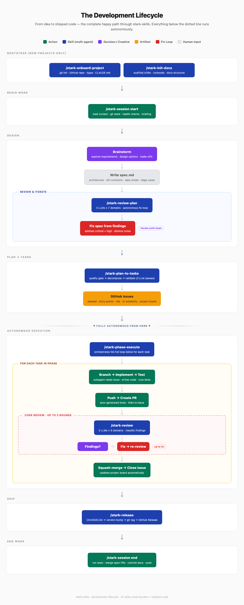

# stark-skills

AI-powered development workflow system for Claude Code. 18 skills covering the full development lifecycle — from planning through code review, shipping, and maintenance. Claude and Codex are enabled by default, with optional Gemini support available through config.

## Quick Start

```bash
# Install the plugins from the marketplace (in Claude Code)
/plugin marketplace add 21-Stark-AI/stark-marketplace
/plugin install stark-analyze@stark-marketplace   # + stark-plan, stark-implement, stark-gh, stark-ops, ...

# Start a work session (context loading, health checks, briefing)
/stark-session start

# PR review (1 LLM × 6 domains, triage-selected)
/stark-review 42

# End the session (tests, cleanup, push)
/stark-session end
```

All skills are available as `/slash-commands` in Claude Code after installing the plugins. Each plugin is self-contained — it vendors the `tools/` and `global/` (config + prompts) it needs, so there is nothing to symlink and no local install step.

---

## The Development Lifecycle

[](docs/skills/index.md)

The human provides the idea and writes the spec. Everything after `/stark-plan-to-tasks` runs autonomously — branching, implementation, PRs, multi-agent review with up to 3 fix rounds, merge, and release. The system closes GitHub issues as PRs merge and updates project boards automatically.

---

## Skills

> Every skill supports `--help` (`/stark-<skill> --help`) — prints its purpose, usage, and arguments without running anything.

### Quality Gates

Review artifacts before they ship. Each review skill dispatches the enabled LLM agents in parallel, classifies findings as real issues vs. noise, and applies fixes autonomously.

| Skill | What it reviews | When to use |
|-------|----------------|-------------|
| `/stark-review` | PR code changes | Triage-selected domains, 1 LLM × N domains — fast, cheap, default agent configurable per domain. |
| [`/stark-review-spec`](skill/stark-review-spec/SKILL.md) | Architecture and design docs | Before committing to a design. Reviews across 8 domains (completeness, security, scope, etc.). |
| [`/stark-review-plan`](docs/skills/stark-review-plan/usage.md) | Execution plans and deployment plans | Before executing. Adversarial SRE review across 4 failure vectors (completeness, security, sequencing, viability) — assumes the plan will break. |
| [`/stark-review-improvement`](docs/skills/stark-review-improvement/usage.md) | Review prompt effectiveness | After reviews produce too many false positives. Tunes agent prompts based on assessment data. |
| [`/stark-review-spec-improvement`](skill/stark-review-spec-improvement/SKILL.md) | Design review prompt effectiveness | After design reviews produce too many false positives. Wraps `/stark-review-improvement` with design-review prompts. |

**Best practice:** Run `/stark-review-plan` on specs *before* implementation starts. It's cheaper to fix a plan than to fix code. Use `/stark-review` on every PR.

### Planning and Execution

Turn ideas into tracked, phased GitHub issues, then execute them autonomously.

| Skill | What it does | When to use |
|-------|-------------|-------------|
| [`/stark-spec-to-plan`](docs/skills/stark-spec-to-plan/usage.md) | Generate implementation plan from design doc | Starting a new feature. Enabled agents generate plans from a brainstormed design, then cross-review one another before synthesis. |
| [`/stark-plan-to-tasks`](docs/skills/stark-plan-to-tasks/usage.md) | Decompose a spec into phased GitHub issues | After a spec/plan is reviewed and approved. 3 LLM passes: quality gate → decomposition → validation. |
| [`/stark-phase-execute`](docs/skills/stark-phase-execute/usage.md) | Autonomously implement all tasks in a phase | When you have GitHub issues ready. Branches, implements, PRs, reviews, merges — zero intervention. |
| [`/stark-copilot`](skill/stark-copilot/SKILL.md) | Autonomous implementation with paired lead/wing agents | When you want a paired lead/wing build loop — lead implements, wing reviews diff, fix-loop until approved. |

**Best practice:** The full pipeline is: brainstorm a design (`superpowers:brainstorming`) → `/stark-review-spec` → `/stark-spec-to-plan` → `/stark-review-plan` → `/stark-plan-to-tasks` → `/stark-phase-execute`. Each step feeds the next. Don't skip the review steps — unreviewed plans produce ambiguous issues that block autonomous execution.

### Refactoring

Plan a restructure of an existing codebase before touching it.

| Skill | What it does | When to use |
|-------|-------------|-------------|
| [`/stark-refactor-plan`](skill/stark-refactor-plan/SKILL.md) | Inspect any repo and emit `REFACTOR_PLAN.md` + `REFACTOR_BACKLOG.json` | Before a refactor. Planning-only — produces an evidence-based, phased, file-by-file plan another agent can execute. Never modifies source. |

**Best practice:** Run `/stark-refactor-plan` first, review the plan and backlog, then hand the backlog to `/stark-copilot` or `/stark-plan-to-tasks` to execute one low-risk PR at a time. The plan changes nothing but the two artifacts, so it's always safe to run.

### PR and Shipping

Move code from branch to production.

| Skill | What it does | When to use |
|-------|-------------|-------------|
| [`/stark-release`](docs/skills/stark-release/usage.md) | CHANGELOG → version bump → tag → GitHub Release | When a set of changes is ready to ship. Reads CHANGELOG.md to determine bump type. |

**Best practice:** Always run `/stark-release` when shipping — never tag manually.

### Session Management

Start and end your work sessions with consistent context loading and cleanup.

| Skill | What it does | When to use |
|-------|-------------|-------------|
| [`/stark-session start`](docs/skills/stark-session/usage.md) | Load context, git state, health checks, briefing | Beginning of every work session. Catches stale branches, failing tests, open PRs. |
| [`/stark-session end`](docs/skills/stark-session/usage.md) | Tests, merge PRs, commit docs, push | End of every work session. Ensures nothing is left dangling. |
| [`/stark-persona`](skill/stark-persona/SKILL.md) | Session character voices | Adds personality to sessions. Weighted selection, date-aware combos, catchphrases, feedback loop. |

**Best practice:** Make `/stark-session start` and `/stark-session end` habitual — like opening and closing a shift. The start briefing catches context you'd otherwise miss (someone pushed to your branch, CI is red, a PR needs your review).

### Documentation

| Skill | What it does | When to use |
|-------|-------------|-------------|
| [`/stark-init-docs`](docs/skills/stark-init-docs/usage.md) | Scaffold docs structure (ADRs, runbooks, etc.) | When starting a new project or adding docs to an existing one. Modes: template, backfill, upgrade, clean. |

### Project Management

| Skill | What it does | When to use |
|-------|-------------|-------------|
| [`/stark-housekeeping`](skill/stark-housekeeping/SKILL.md) | Audit stale issues, merged branches, and worktree remnants | When the repo or project board needs a cleanup pass. Supports dry-run and aggressive modes. |

---

## Typical Workflows

### Starting a new feature (full lifecycle)

```
/stark-session start                          # context + briefing
                                              # write spec.md
/stark-review-plan docs/specs/my-feature.md   # lead/wing adversarial review
                                              # fix spec based on findings
/stark-plan-to-tasks docs/specs/my-feature.md # decompose into GitHub issues
/stark-phase-execute my-feature               # autonomous implementation
/stark-session end                            # cleanup + push
```

### Reviewing someone else's PR

```
/stark-review 42                    # PR review: 1 agent × triage-selected domains
```

### Monthly maintenance

```
/stark-housekeeping                 # close stale issues, prune dead branches
```

---

## Architecture

The core engine dispatches the enabled AI agents across the configured review domains:

```
Default install:
├── claude × {architecture, behavior, type-safety, security, test-coverage, spec-conformance}
└── codex  × {same 6 domains}

Optional:
└── gemini × {same 6 domains} when `models.gemini.enabled` is true
```

Each agent posts a consolidated review via its own GitHub App bot:
- **stark-claude** — architecture, accessibility, spec conformance focus
- **stark-codex** — correctness, type safety, test coverage focus
- **stark-gemini** — security, regression prevention, UI conformance focus

## Repo Structure

```
stark-skills/
├── skill/                        ← one dir per skill (stark-*/SKILL.md)
│   ├── stark-review/SKILL.md
│   ├── stark-persona/SKILL.md
│   └── ...
├── scripts/                      ← automation-fleet trigger registration + JSON schemas
│   ├── register_triggers.sh
│   └── *.{sh,json}
├── tools/                        ← TypeScript dispatch infra, agent CLIs, meta-tooling
│   ├── multi_review.ts           ← PR review orchestrator
│   └── ...
├── global/                       ← config + prompts vendored into each plugin
│   ├── config.json               ← global defaults
│   └── prompts/{claude,codex,gemini}/  ← per-agent × per-domain review prompts (6 domains)
├── plugins/stark-gh/             ← local plugin source (packaged by the marketplace)
├── data/                         ← persona roster, review coverage, showcase pages
├── automation/                   ← CCR automation fleet (11 triggers, logs, costs)
├── .github/workflows/            ← GitHub Actions (project sync, gate checks, marketplace-sync)
├── org/evinced/                  ← org config overrides
├── docs/
│   ├── skills/                   ← generated skill docs (Markdown, Mermaid, JSON, and PNG artifacts)
│   ├── adr/                      ← architectural decision records
│   └── specs/                    ← design specs
└── standards/                    ← org-wide doc templates and workflows
```

## Distribution

This repo is the **source of truth** for the skills + tools; they ship as self-contained Claude Code plugins via the [stark-marketplace](https://github.com/21-Stark-AI/stark-marketplace).

- The marketplace `catalog/` is **generated from this repo** by `stark sync`, and its engine vendors `tools/` + `global/` (config + prompts) into each plugin — so an install needs no symlinks and no local setup step.
- CI auto-publishes: `.github/workflows/marketplace-sync.yml` regenerates the marketplace and opens a PR on every push to `main` touching a vendored asset root — `skill/`, `tools/`, `global/`, `scripts/`, `standards/`, or `plugins/stark-gh/`.

```
/plugin marketplace add 21-Stark-AI/stark-marketplace
/plugin install stark-analyze@stark-marketplace   # then stark-plan, stark-implement, stark-gh, stark-ops, ...
/plugin update  stark-analyze@stark-marketplace   # pull the latest published version
```

Immutable assets (tools/prompts/config) resolve from the installed plugin root (`${CLAUDE_PLUGIN_ROOT}`) via `tools/asset_root_lib.ts`; mutable state (`history/`, `sessions/`, `locks/`, …) lives under `~/.claude/code-review/` (`stateRoot()`).

## Config Hierarchy

Same merge pattern as CLAUDE.md — most specific wins:

```
~/.claude/code-review/config.json          ← global (from this repo)
~/Code/.code-review/config.json     ← org override (from this repo)
~/Code/some-repo/.code-review/      ← repo override (in each repo)
  ├── config.json
  ├── prompts/                             ← per-agent prompt overrides
  └── domains/                             ← repo-specific domains (shared)
```

Repos can override: agents, domains, severity calibration, test/build commands, and individual prompts.

## Adding a Domain

Add a numbered markdown file to each agent's prompts directory:

```bash
# Global domain (all repos)
touch global/prompts/claude/07-performance.md
touch global/prompts/codex/07-performance.md
touch global/prompts/gemini/07-performance.md

# Repo-specific domain (shared across agents)
mkdir -p ~/Code/some-repo/.code-review/domains
touch ~/Code/some-repo/.code-review/domains/07-db-migrations.md
```

Domains are auto-discovered at startup.

## Prerequisites

- macOS (keychain-based auth)
- `claude`, `codex`, `gemini` CLI tools in PATH
- Node.js (TS tooling runs via `node --experimental-strip-types`)
- GitHub App private keys in macOS Keychain

## Skill Documentation

Every skill has auto-generated documentation with visual workflow diagrams:

- **[Skill Routing Guide](docs/skills/README.md)** — Mermaid decision trees: "which skill do I use?"
- **[Skill Index](docs/skills/index.md)** — Full list with links to usage and internals docs
- **Per-skill docs** — Each skill has `usage.md` (how to use) and `internals.md` (how it works), plus HTML visualizations and PNG screenshots

## Design Specs

- `docs/specs/2026-03-16-multi-agent-code-review-system-design.md` — code review engine design
- `docs/superpowers/specs/` — design specs for individual skills
