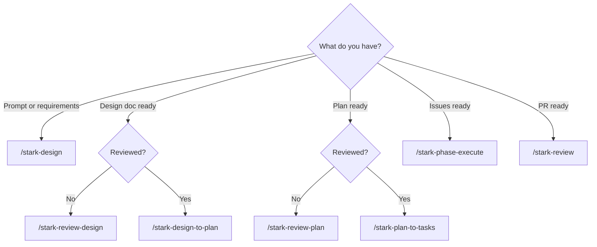
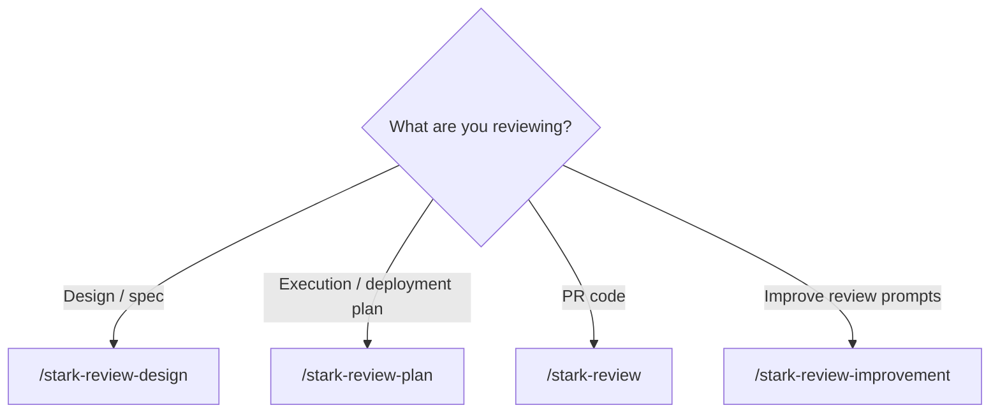
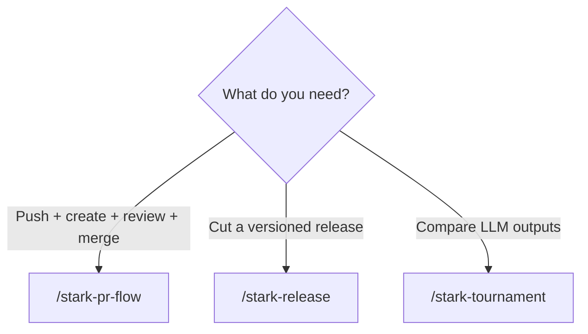
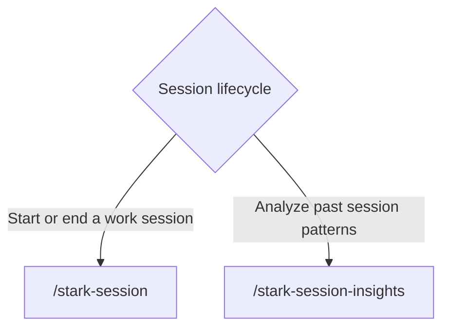
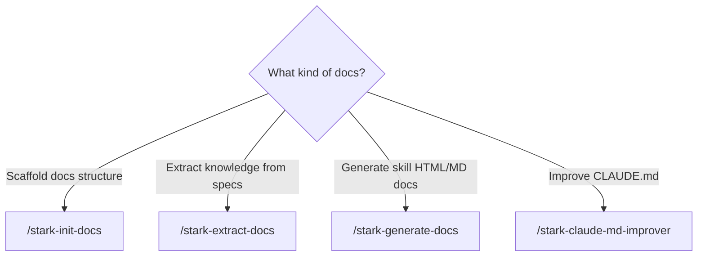
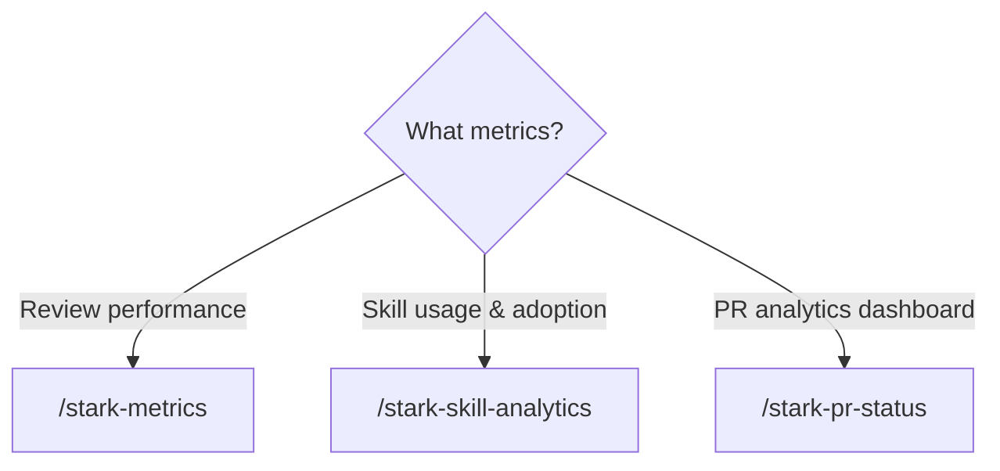

# stark-skills — Skill Documentation

## The Pipeline

From idea to production in 7 steps. Each skill feeds into the next.

```mermaid
graph LR
    subgraph "Design"
        A["/stark-design"] -->|design doc| B["/stark-review-design"]
    end
    subgraph "Planning"
        B -->|reviewed design| C["/stark-design-to-plan"]
        C -->|impl plan| D["/stark-review-plan"]
        D -->|reviewed plan| E["/stark-plan-to-tasks"]
    end
    subgraph "Execution"
        E -->|GitHub issues| F["/stark-phase-execute"]
        F -->|PRs| G["/stark-review"]
    end

    style A fill:#4a9eff,color:#fff
    style B fill:#f5a623,color:#fff
    style C fill:#4a9eff,color:#fff
    style D fill:#f5a623,color:#fff
    style E fill:#7b68ee,color:#fff
    style F fill:#50c878,color:#fff
    style G fill:#f5a623,color:#fff
```

**Blue** = generate (multi-agent, 3 compete + 6 cross-review)
**Orange** = review (multi-agent, N agents × M domains)
**Purple** = decompose (plan → GitHub issues)
**Green** = execute (autonomous implementation)

| Step | Skill | Input | Output | Pattern |
|------|-------|-------|--------|---------|
| 1 | `/stark-design` | Requirements/prompt | Design document | 3 generate + 6 cross-review |
| 2 | `/stark-review-design` | Design document | Reviewed design (fixes applied) | N agents × 10 domains |
| 3 | `/stark-design-to-plan` | Design document | Implementation plan | 3 generate + 6 cross-review |
| 4 | `/stark-review-plan` | Implementation plan | Reviewed plan (fixes applied) | N agents × 10 domains |
| 5 | `/stark-plan-to-tasks` | Implementation plan | Phased GitHub issues | 3 LLM passes |
| 6 | `/stark-phase-execute` | GitHub issues | PRs (implemented, reviewed, merged) | Autonomous loop |
| 7 | `/stark-review` | PR | Review comments posted | 3 agents × 6 domains |

## Skill Routing

### I have an idea / requirements

### I want to review something

### I want to ship

### Session & Workflow

### Documentation

### Project Management

### Analytics

## All Skills

| Skill | Docs |
|-------|------|
| `/stark-design` | [usage](stark-design/usage.md) · [internals](stark-design/internals.md) |
| `/stark-review-design` | [usage](stark-review-design/usage.md) · [internals](stark-review-design/internals.md) |
| `/stark-design-to-plan` | [usage](stark-design-to-plan/usage.md) · [internals](stark-design-to-plan/internals.md) |
| `/stark-review-plan` | [usage](stark-review-plan/usage.md) · [internals](stark-review-plan/internals.md) |
| `/stark-plan-to-tasks` | [usage](stark-plan-to-tasks/usage.md) · [internals](stark-plan-to-tasks/internals.md) |
| `/stark-phase-execute` | [usage](stark-phase-execute/usage.md) · [internals](stark-phase-execute/internals.md) |
| `/stark-review` | [usage](stark-review/usage.md) · [internals](stark-review/internals.md) |
| `/stark-review-improvement` | [usage](stark-review-improvement/usage.md) · [internals](stark-review-improvement/internals.md) |
| `/stark-pr-flow` | [usage](stark-pr-flow/usage.md) · [internals](stark-pr-flow/internals.md) |
| `/stark-session` | [usage](stark-session/usage.md) · [internals](stark-session/internals.md) |
| `/stark-release` | [usage](stark-release/usage.md) · [internals](stark-release/internals.md) |
| `/stark-tournament` | [usage](stark-tournament/usage.md) · [internals](stark-tournament/internals.md) |
| `/stark-init-docs` | [usage](stark-init-docs/usage.md) · [internals](stark-init-docs/internals.md) |
| `/stark-extract-docs` | [usage](stark-extract-docs/usage.md) · [internals](stark-extract-docs/internals.md) |
| `/stark-generate-docs` | [usage](stark-generate-docs/usage.md) · [internals](stark-generate-docs/internals.md) |
| `/stark-onboard-project` | [usage](stark-onboard-project/usage.md) · [internals](stark-onboard-project/internals.md) |
| `/stark-rename-project` | [usage](stark-rename-project/usage.md) · [internals](stark-rename-project/internals.md) |
| `/stark-update-deps` | [usage](stark-update-deps/usage.md) · [internals](stark-update-deps/internals.md) |
| `/stark-claude-md-improver` | [usage](stark-claude-md-improver/usage.md) · [internals](stark-claude-md-improver/internals.md) |
| `/stark-metrics` | [usage](stark-metrics/usage.md) · [internals](stark-metrics/internals.md) |
| `/stark-skill-analytics` | [usage](stark-skill-analytics/usage.md) · [internals](stark-skill-analytics/internals.md) |
| `/stark-pr-status` | [usage](stark-pr-status/usage.md) · [internals](stark-pr-status/internals.md) |
| `/stark-session-insights` | [usage](stark-session-insights/usage.md) · [internals](stark-session-insights/internals.md) |
