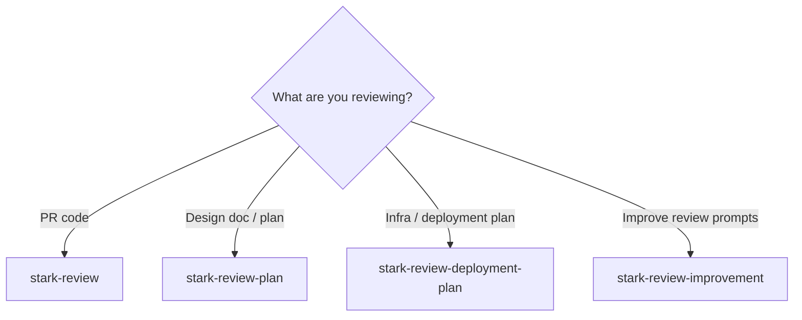
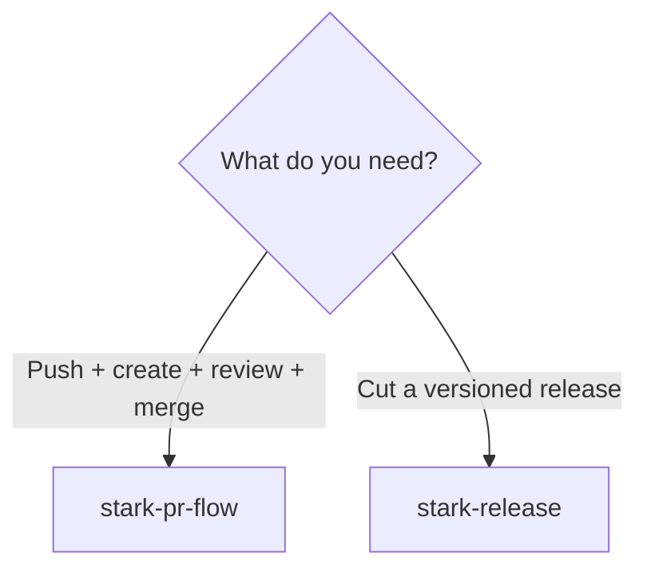
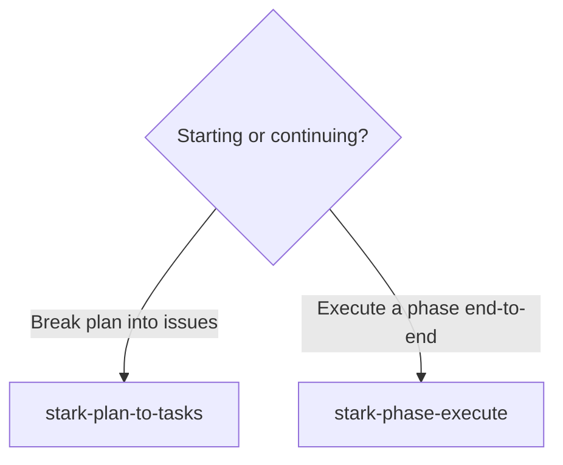
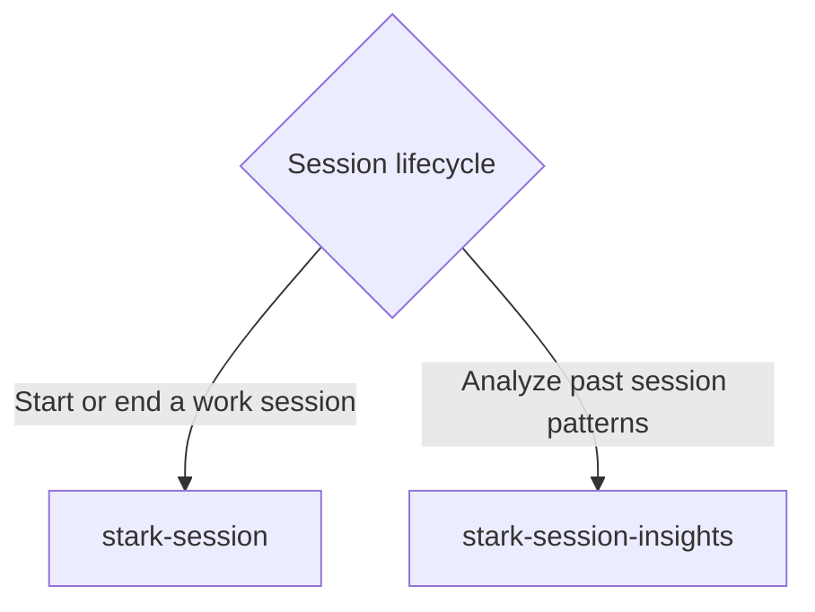
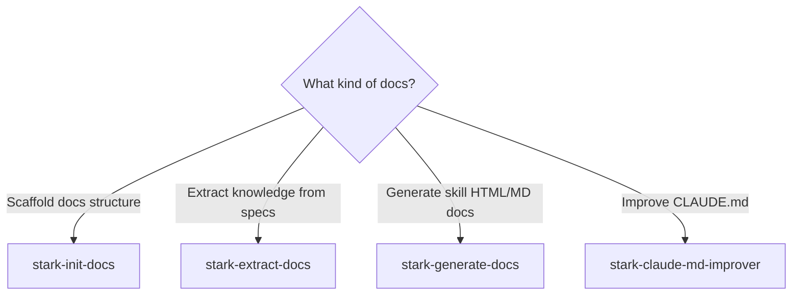
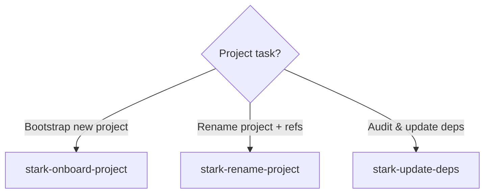
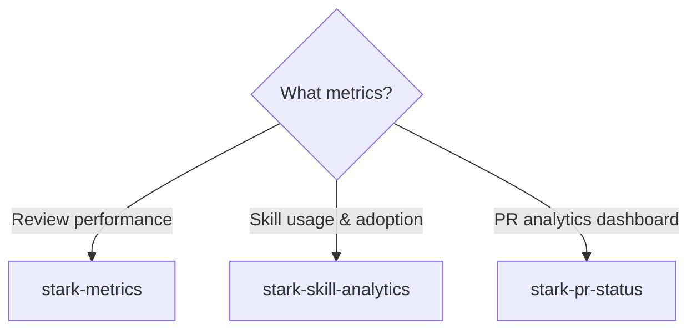

# Skill Routing Guide

Which skill should I use? Follow the decision trees below.

## Code Review

### I want to...

- **`/stark-review`** — *(not installed)*
- **`/stark-review-plan`** — *(not installed)*
- **`/stark-review-deployment-plan`** — *(not installed)*
- **`/stark-review-improvement`** — *(not installed)*

## PR & Shipping

### I want to...

- **`/stark-pr-flow`** — *(not installed)*
- **`/stark-release`** — *(not installed)*

## Planning

### I want to...

- **`/stark-plan-to-tasks`** — *(not installed)*
- **`/stark-phase-execute`** — *(not installed)*

## Session

### I want to...

- **`/stark-session`** — *(not installed)*
- **`/stark-session-insights`** — *(not installed)*

## Documentation

### I want to...

- **`/stark-init-docs`** — *(not installed)*
- **`/stark-extract-docs`** — *(not installed)*
- **`/stark-generate-docs`** — *(not installed)*
- **`/stark-claude-md-improver`** — *(not installed)*

## Project Management

### I want to...

- **`/stark-onboard-project`** — *(not installed)*
- **`/stark-rename-project`** — *(not installed)*
- **`/stark-update-deps`** — *(not installed)*

## Analytics

### I want to...

- **[`/stark-metrics`](stark-metrics/usage.md)** — Aggregate performance metrics across all stark skill runs. Agent scorecards, finding quality, duration trends, prompt improvement impact, and actionable recommendations. Use when the user says "show metrics", "how are reviews performing", "agent stats", "review quality", or invokes /stark-metrics.
- **`/stark-skill-analytics`** — *(not installed)*
- **`/stark-pr-status`** — *(not installed)*
