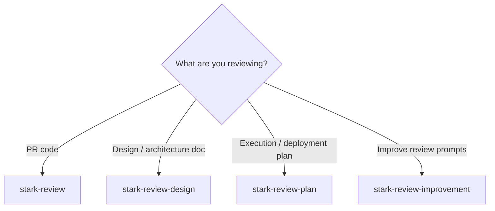
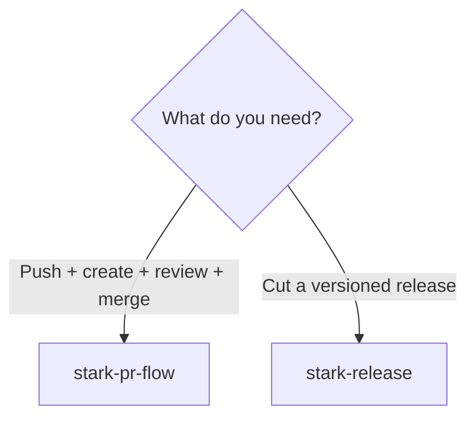
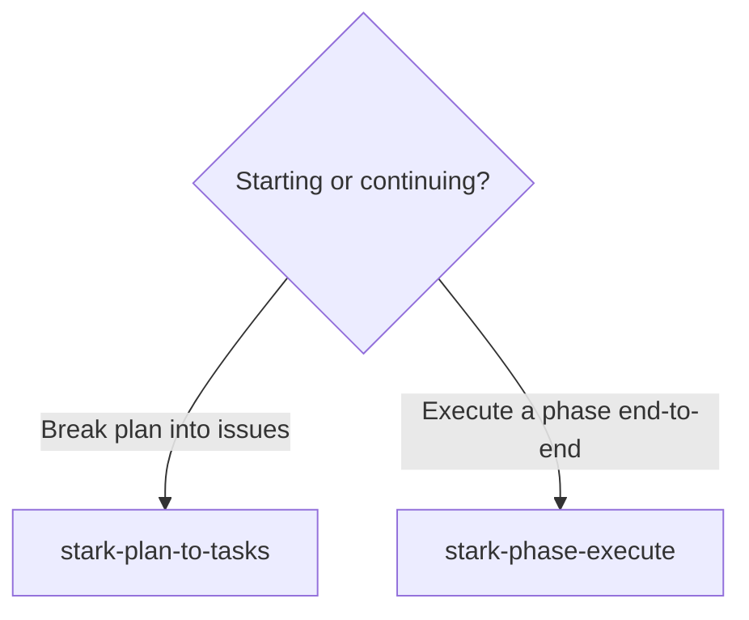
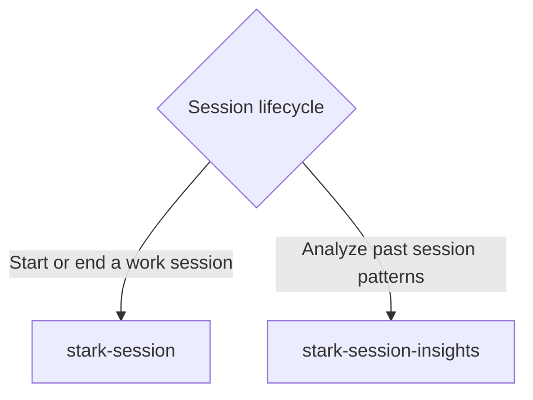
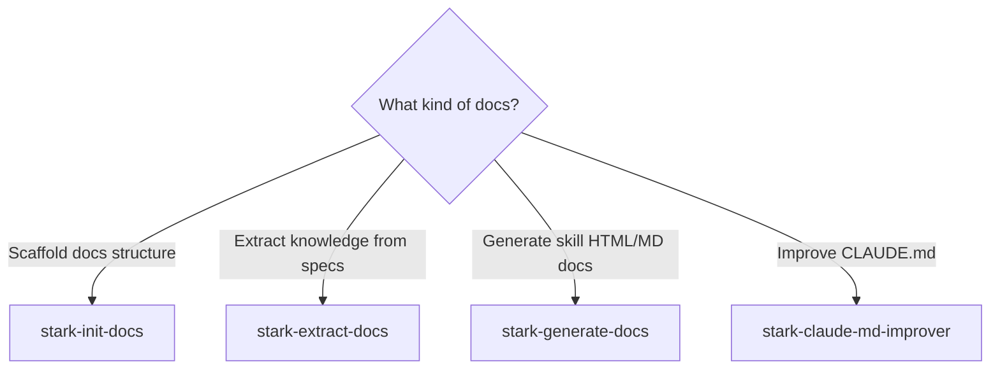
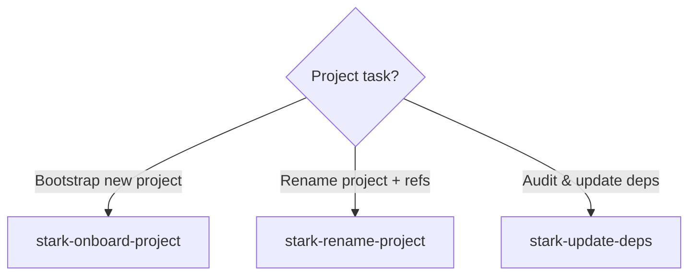
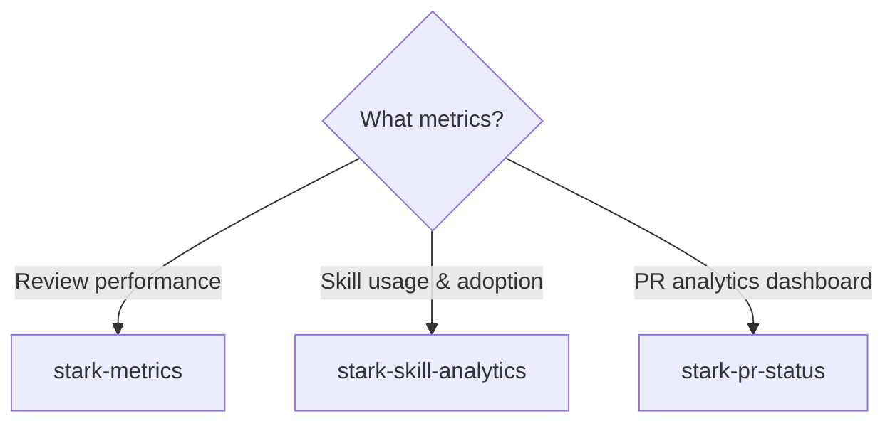

# Skill Routing Guide

Which skill should I use? Follow the decision trees below.

## Code Review

### I want to...

- **`/stark-review`** — *(not installed)*
- **`/stark-review-design`** — *(not installed)*
- **`/stark-review-plan`** — *(not installed)*
- **`/stark-review-improvement`** — *(not installed)*

## PR & Shipping

### I want to...

- **`/stark-pr-flow`** — *(not installed)*
- **`/stark-release`** — *(not installed)*

## Planning

### I want to...

- **`/stark-plan-to-tasks`** — *(not installed)*
- **`/stark-phase-execute`** — *(not installed)*

## Session

### I want to...

- **`/stark-session`** — *(not installed)*
- **`/stark-session-insights`** — *(not installed)*

## Documentation

### I want to...

- **`/stark-init-docs`** — *(not installed)*
- **`/stark-extract-docs`** — *(not installed)*
- **`/stark-generate-docs`** — *(not installed)*
- **`/stark-claude-md-improver`** — *(not installed)*

## Project Management

### I want to...

- **`/stark-onboard-project`** — *(not installed)*
- **`/stark-rename-project`** — *(not installed)*
- **`/stark-update-deps`** — *(not installed)*

## Analytics

### I want to...

- **`/stark-metrics`** — *(not installed)*
- **`/stark-skill-analytics`** — *(not installed)*
- **`/stark-pr-status`** — *(not installed)*

## Other Skills

- **[`/stark-design`](stark-design/usage.md)** — Use this skill when the user wants to create a design document, spec, or architecture doc from requirements, a feature description, or a high-level prompt. Triggers whenever someone needs to go from an idea or set of requirements to a formal design. Covers requests like "design this feature", "write a spec for", "create an architecture doc", "I need a design document for", or any variation where input is requirements/prompt and desired output is a design/spec document. Also triggers on `/stark-design <prompt-or-path>`. Works by dispatching 3 independent AI agents to each produce a design, then cross-reviewing all designs to synthesize the best one. This is the natural first step before design review (`/stark-review-design`).
