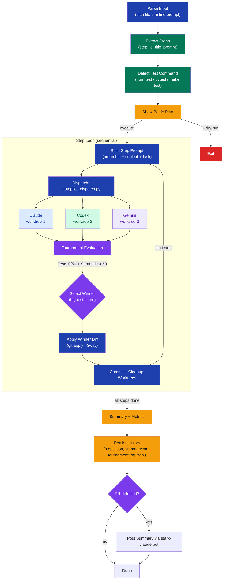

# stark-autopilot — Internals

Autonomous multi-agent implementation with tournament at every step. Claude leads, dispatching Claude + Codex + Gemini to compete on each implementation step in parallel git worktrees. Best implementation wins via tournament evaluation, gets merged, and the next step begins. Use when the user wants to build something end-to-end with all 3 agents competing, says "autopilot", "build this with all agents", "tournament implementation", "let all 3 agents compete on building this", or invokes /stark-autopilot. This is the most powerful execution mode — use it for significant features, not one-line fixes.

## Architecture

![Architecture diagram for stark-autopilot showing a four-phase orchestration flow: Phase 1 parses input and detects test commands; Phase 2 loops over steps sequentially, dispatching Claude, Codex, and Gemini into parallel git worktrees, running a tournament evaluation with test scores (0-50) plus semantic scores across 5 dimensions (0-50), applying the winner's diff and committing; Phase 3 produces summary metrics; Phase 4 persists history files and optionally posts to a PR. Includes a worktree architecture diagram showing main branching into three agent worktrees and merging back, a scoring model table, failure mode recovery strategies, and configuration extension points for adding agents and customizing prompts.](internals.png)

## Phases

Phase 1 (Setup): Parses the input — either a plan file (extracting ## Phase / ### Task headings into ordered steps) or an inline prompt (auto-decomposed into 3-5 steps). Each step gets a step_id slug, title, and full implementation prompt. The test command is auto-detected from package.json, pyproject.toml, or Makefile, or provided via --test-command. A battle plan summary is displayed; --dry-run stops here.

Phase 2 (Execute Steps — sequential loop): For each step: (2a) builds a combined prompt from the agent's preamble (global/prompts/autopilot/{agent}/implement.md), context from prior winners, the step's task, and test command; (2b) dispatches via autopilot_dispatch.py which creates 3 parallel git worktrees and runs Claude, Codex, and Gemini simultaneously; (2c) evaluates with a tournament — tests (pass=50, fail=0) plus semantic scoring on 5 dimensions (correctness, quality, completeness, integration, simplicity, each 1-10) for a total 0-100 score; (2d) applies the winner's diff to main via git apply --3way; (2e) commits with a message noting the winner and score; (2f) cleans up worktrees. The next step starts from the updated HEAD.

Phase 3 (Summary): Displays per-step winners, per-agent win rates, average scores, test pass rates, and code output statistics (files changed, lines added/removed, commits).

Phase 4 (Persist): Writes steps.json, summary.md, and tournament-log.jsonl to ~/.claude/code-review/history/autopilot/{slug}/. If a PR is detected, posts the summary as a PR comment via stark-claude bot.

## Config

CLI arguments:
- <plan-or-prompt> (required): Path to implementation plan markdown file, or inline task description string.
- --test-command CMD: Override auto-detected test runner. Used to validate each agent's output.
- --agents LIST: Comma-separated agent IDs. Default: 'claude,codex,gemini'. Can be subset (e.g., 'claude,codex').
- --timeout N: Per-agent timeout in seconds. Default: 900 (15 minutes).
- --dry-run: Display battle plan and exit without executing.

Constants:
- SCRIPTS = ~/.claude/code-review/scripts
- PYTHON = $SCRIPTS/.venv/bin/python3
- REPO_ROOT = $(git rev-parse --show-toplevel)

Prompt paths: global/prompts/autopilot/{agent}/implement.md — per-agent preambles that customize how each agent approaches implementation.

History path: ~/.claude/code-review/history/autopilot/{task-slug}/ — steps.json, summary.md, tournament-log.jsonl.

## Failure Modes

0/3 agents succeed: Abort the step, report the error, ask the user how to proceed (no automatic retry).
1/3 agents succeed: Use the sole survivor's output directly, warn that no tournament comparison was possible.
2/3 agents succeed: Run tournament between the 2 survivors, warn about reduced competition.
All tests fail: Fall back to semantic-only scoring (max 50 points), warn 'no agent passed tests'.
Diff apply failure: git apply --3way fails — fall back to copying files directly from the winner's worktree.
Worktree creation fails: Fall back to sequential execution on the same branch (no parallelism).
Agent timeout: Disqualify the timed-out agent, continue tournament with surviving agents.
User Ctrl+C: Catch SIGINT, clean up all worktrees before exiting to avoid orphaned worktrees.

## How to Modify This Skill

Adding a new agent: (1) Create global/prompts/autopilot/{new-agent}/implement.md with the agent's preamble. (2) Add dispatch logic in scripts/autopilot_dispatch.py to handle the new agent's CLI invocation. (3) If the agent needs GitHub bot identity for PR comments, register it in github_app.py. (4) Invoke with --agents claude,codex,gemini,new-agent.

Changing scoring weights: The tournament evaluation is performed by Claude as orchestrator in Phase 2c. Modify the 5 semantic dimensions or their weights by editing the evaluation logic in the SKILL.md itself (the scoring rubric in section 2c). Test score weight (50pts) vs semantic weight (50pts) can be adjusted there.

Customizing per-agent behavior: Edit global/prompts/autopilot/{agent}/implement.md to change how a specific agent approaches implementation tasks.

Changing step extraction: The plan parsing logic (## Phase / ### Task heading extraction) is in Phase 1.2. To support different plan formats, modify the parsing rules there.

Disabling tests: Omit --test-command and ensure no auto-detectable test runner exists. Tournament will use semantic-only scoring (max 50pts).
