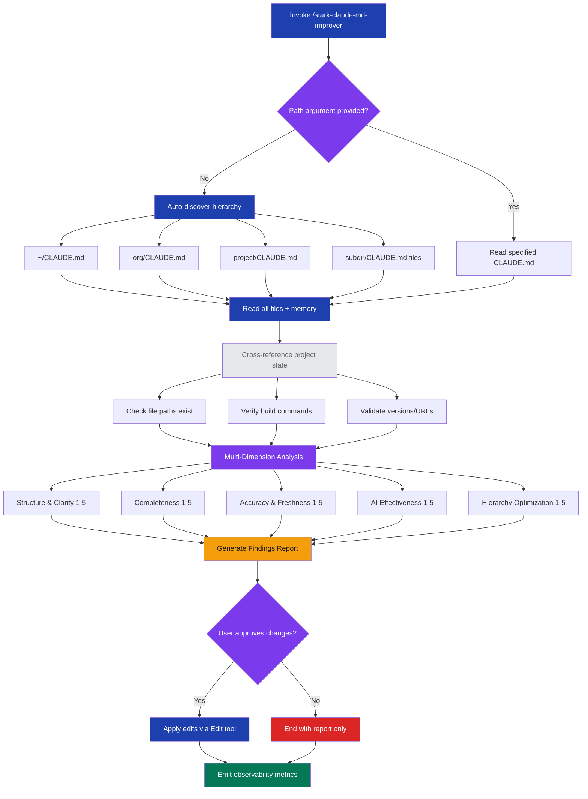

# stark-claude-md-improver — Internals

Analyze and improve CLAUDE.md files for completeness, accuracy, and effectiveness. Use when the user says "improve claude.md", "review claude.md", "audit claude.md", "update claude.md", or "stark-claude-md-improver".

## Architecture

![Architecture diagram for the stark-claude-md-improver skill showing an 8-step vertical flow: Discovery walks the CLAUDE.md hierarchy, Full Read loads all files plus memory, Cross-Reference validates claims against project state, Multi-Dimension Analysis scores each file across 5 dimensions (Structure, Completeness, Accuracy, AI Effectiveness, Hierarchy), Findings Report presents issues with file:line references, User Approval Gate asks before editing, Apply Changes modifies files via Edit tool, and Metrics Emission reports observability data. Below the flow, card grids detail the 5 analysis dimensions, a table shows the CLAUDE.md hierarchy levels from home to subdir with their typical content, output report categories (issues, additions, removals, moves), extension points for contributors, and design rules constraining the skill's behavior.](internals.png)

## Phases

Phase 1 — Discovery: Walks the CLAUDE.md hierarchy from home (~/) through org and project directories, plus any subdirectory CLAUDE.md files. Also discovers .claude/projects/*/memory/ files for supplementary context. Accepts an optional path argument to target a specific file.

Phase 2 — Full Read: Reads every discovered file completely using the Read tool, capturing content and line numbers for later reference in findings.

Phase 3 — Cross-Reference: Verifies claims in CLAUDE.md against actual project state. Checks that referenced file paths exist (Glob), build/deploy commands work (Bash), version numbers are current (package.json, pyproject.toml), and URLs are valid. This is where stale content gets flagged.

Phase 4 — Multi-Dimension Analysis: Scores each file 1–5 across five dimensions: Structure & Clarity (organization, scanability, no cross-level redundancy), Completeness (missing sections that would genuinely help), Accuracy & Freshness (verified against project state), AI Effectiveness (actionable, specific, non-conflicting instructions), and Hierarchy Optimization (content at the right level).

Phase 5 — Findings Report: Presents per-file results with file:line references. Four categories: issues found, suggested additions (with draft text), suggested removals, and suggested moves between hierarchy levels.

Phase 6 — User Approval Gate: Asks 'Want me to apply these improvements?' — no edits happen without explicit consent.

Phase 7 — Apply Changes: If approved, uses the Edit tool to modify CLAUDE.md files directly, matching existing style and tone.

Phase 8 — Metrics Emission: Reports observability metrics via the Skill Observability Protocol: file count, per-file scores, issue/addition/removal/move counts, and changes applied.

## Config

This skill has no external configuration file. All behavior is defined inline in the SKILL.md prompt.

Key implicit settings:
- Discovery scope: Full hierarchy (~/CLAUDE.md → org → project → subdirs + memory). Not configurable; always walks the full tree.
- Scoring scale: 1–5 per dimension, 5 dimensions. Fixed.
- Completeness checklist: 9 section types checked (project overview, tech stack, architecture, key files, dev workflow, env vars, conventions, gotchas, don'ts). Extend by editing the skill's '### 2. Completeness' section.
- Observability: Follows ~/.claude/code-review/standards/observability.md protocol. Custom metrics: files_discovered, per_file_scores, issues_found, additions_suggested, removals_suggested, moves_suggested, changes_applied.

## Failure Modes

1. No CLAUDE.md files found: If the hierarchy walk finds nothing, the skill has nothing to analyze. It should report this and exit gracefully.

2. Stale cross-reference data: If the project has been heavily refactored, many paths/commands may be flagged as broken — producing a noisy report. The user can selectively apply fixes.

3. False positives on completeness: The skill may flag missing sections (e.g., 'env vars') when they're genuinely not needed. The 'don't add for completeness' rule mitigates this, but LLM judgment varies.

4. User denies approval: The skill ends at the report phase. No edits are made. This is the designed safe path.

5. Style mismatch in suggestions: Draft text may not perfectly match the user's voice. The rule to 'write in the same style' helps, but complex tonal requirements may need user revision.

6. Memory files unreadable: If .claude/projects/ memory files are missing or corrupted, the skill proceeds without them — memory is supplementary context, not required.

## How to Modify This Skill

The skill is a single SKILL.md file at skill/stark-claude-md-improver/SKILL.md (~85 lines).

To add an analysis dimension: Add a new ### heading under '## Analysis Dimensions' with evaluation criteria. Update the '## Output' section to include it in the scoring table.

To change the completeness checklist: Edit the bullet list under '### 2. Completeness'. Add or remove section names (e.g., add 'Security' or remove 'Gotchas').

To change scoring scale: The 1–5 scale is mentioned in '## Output'. Change it there and in the dimension descriptions.

To add custom metrics: Add entries to the 'Additional skill-specific metrics' list under '## Observability'.

To change the approval gate: The prompt text is in '## Output' — modify the question or make auto-apply the default (not recommended).

To modify design rules: Edit the '## Rules' section at the end of the skill. These constrain LLM behavior during both analysis and editing.
