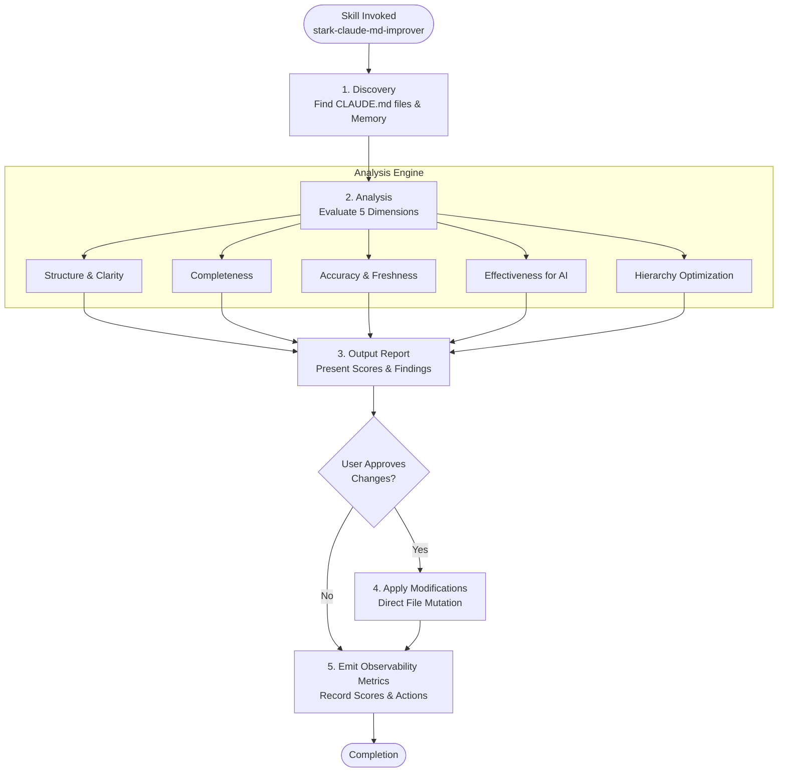
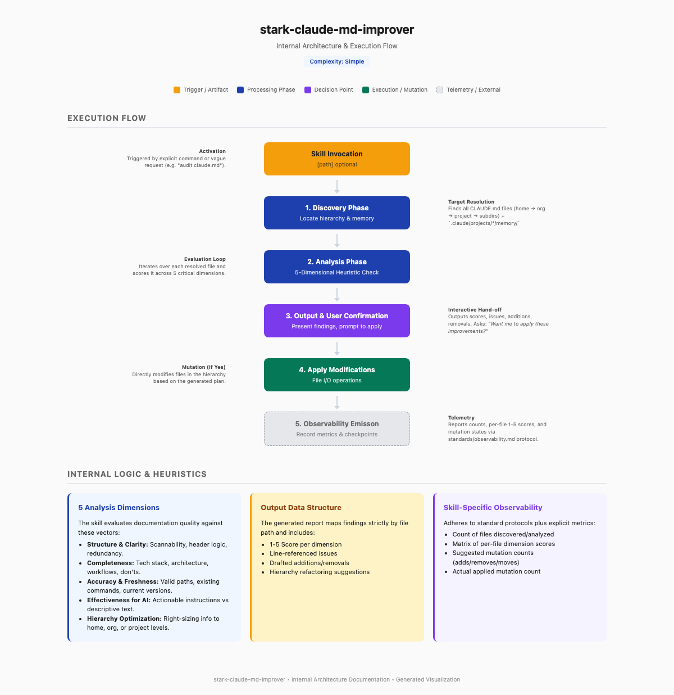

# stark-claude-md-improver — Internals

Analyze and improve CLAUDE.md files for completeness, accuracy, and effectiveness. Use when the user says "improve claude.md", "review claude.md", "audit claude.md", "update claude.md", or "stark-claude-md-improver".

## Architecture

## Phases

*See SKILL.md*

## Config

*No config*

## Failure Modes

*See SKILL.md*

## How to Modify This Skill

Edit `skill/stark-claude-md-improver/SKILL.md`, then run `/stark-generate-docs --skill stark-claude-md-improver` to regenerate documentation.
