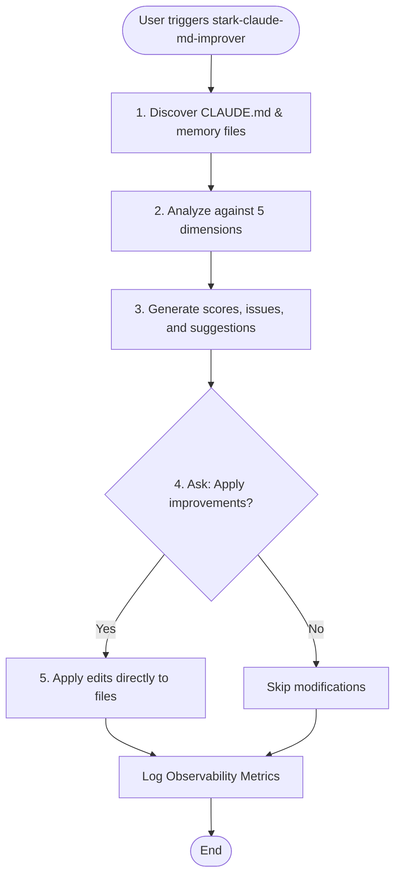
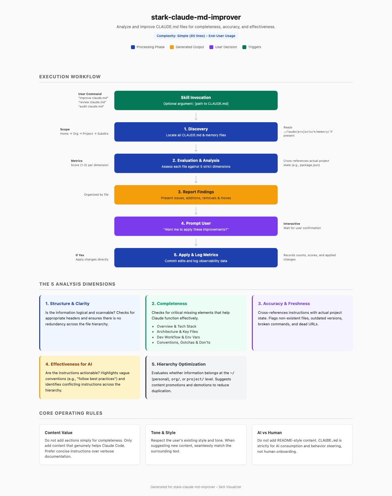

# stark-claude-md-improver

Analyze and improve CLAUDE.md files for completeness, accuracy, and effectiveness. Use when the user says "improve claude.md", "review claude.md", "audit claude.md", "update claude.md", or "stark-claude-md-improver".

## Workflow Overview

## When to Use

Analyze and improve CLAUDE.md files for completeness, accuracy, and effectiveness. Use when the user says "improve claude.md", "review claude.md", "audit claude.md", "update claude.md", or "stark-claude-md-improver".

## Prerequisites

*See SKILL.md*

## Arguments

`[path to CLAUDE.md] (optional — auto-discovers all CLAUDE.md files in project hierarchy)`

## Quick Start

/stark-claude-md-improver

## Common Patterns

## Troubleshooting

## Related Skills

