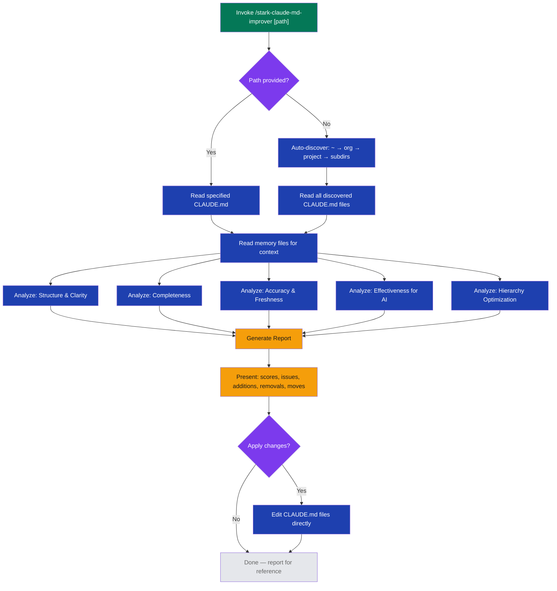

# stark-claude-md-improver

Analyze and improve CLAUDE.md files for completeness, accuracy, and effectiveness. Use when the user says "improve claude.md", "review claude.md", "audit claude.md", "update claude.md", or "stark-claude-md-improver".

## Workflow Overview

![Usage diagram for stark-claude-md-improver skill showing a vertical workflow: invoke the skill with an optional path, discover CLAUDE.md files across the hierarchy, analyze each file across five dimensions (structure, completeness, accuracy, AI effectiveness, hierarchy optimization), generate a report with scores and suggestions, then optionally apply changes. Includes cards describing each analysis dimension, a table of report output sections, invocation triggers, and key rules about not over-adding content.](usage.png)

## When to Use

Analyze and improve CLAUDE.md files for completeness, accuracy, and effectiveness. Use when the user says "improve claude.md", "review claude.md", "audit claude.md", "update claude.md", or "stark-claude-md-improver".

## Prerequisites

No special prerequisites. Works in any project with at least one CLAUDE.md file. The skill auto-discovers CLAUDE.md files across the hierarchy (home, org, project, subdirectories).

## Arguments

`[path to CLAUDE.md] (optional — auto-discovers all CLAUDE.md files in project hierarchy)`

| Argument | Required | Description |
|----------|----------|-------------|
| `[path]` | No | Path to a specific CLAUDE.md file. If omitted, auto-discovers all CLAUDE.md files in the project hierarchy. |

## Quick Start

/stark-claude-md-improver

## Common Patterns

**Audit all CLAUDE.md files in a project:**
`/stark-claude-md-improver` — discovers and analyzes the full hierarchy.

**Target a specific file:**
`/stark-claude-md-improver ~/git/myproject/CLAUDE.md` — analyzes only that file.

**After onboarding a new project:**
Run after `/stark-onboard-project` to verify the generated CLAUDE.md is complete and effective.

## Troubleshooting

**No CLAUDE.md files found:** Ensure you're in a project directory or provide an explicit path. The skill searches ~ → org → project → subdirs.

**Stale references flagged:** The skill cross-references actual file paths and commands. If it flags something as missing, verify the file exists — it may have been renamed or moved.

**Low accuracy score:** Usually means build commands or file paths in CLAUDE.md are outdated. Update them to match current project state.

## Related Skills

`/stark-onboard-project`, `/stark-session`, `/stark-init-docs`
