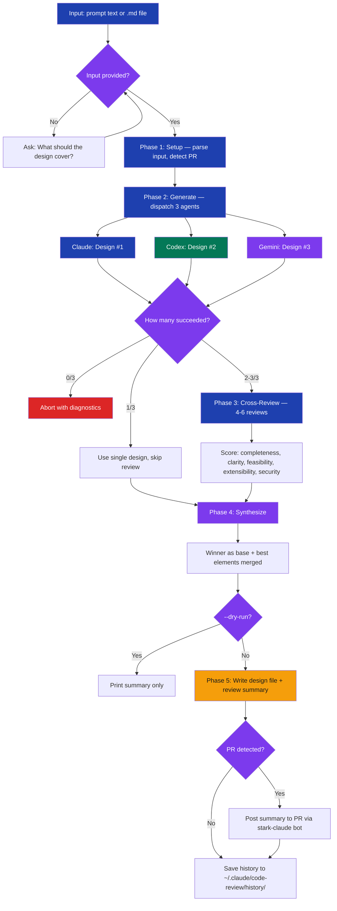

# stark-design

Use this skill when the user wants to create a design document, spec, or architecture doc from requirements, a feature description, or a high-level prompt. Triggers whenever someone needs to go from an idea or set of requirements to a formal design. Covers requests like "design this feature", "write a spec for", "create an architecture doc", "I need a design document for", or any variation where input is requirements/prompt and desired output is a design/spec document. Also triggers on `/stark-design <prompt-or-path>`. Works by dispatching 3 independent AI agents to each produce a design, then cross-reviewing all designs to synthesize the best one. This is the natural first step before design review (`/stark-review-design`).

## Workflow Overview

![Usage guide for the stark-design skill showing a pipeline position indicator highlighting stark-design as the first step in a six-stage workflow, a terminal-style quick start section with three invocation examples, an arguments reference table, a vertical flowchart of the five phases (Setup, Generate with three parallel agents, Cross-Review with an example bar-chart scorecard showing Claude winning at 8.2, Synthesize, and Output), four common usage pattern cards, a failure recovery table, and three next-step cards pointing to stark-review-design, stark-design-to-plan, and stark-plan-to-tasks.](usage.png)

## When to Use

Use this skill when the user wants to create a design document, spec, or architecture doc from requirements, a feature description, or a high-level prompt. Triggers whenever someone needs to go from an idea or set of requirements to a formal design. Covers requests like "design this feature", "write a spec for", "create an architecture doc", "I need a design document for", or any variation where input is requirements/prompt and desired output is a design/spec document. Also triggers on `/stark-design <prompt-or-path>`. Works by dispatching 3 independent AI agents to each produce a design, then cross-reviewing all designs to synthesize the best one. This is the natural first step before design review (`/stark-review-design`).

## Prerequisites

stark-skills installed via `install.sh` (symlinks scripts and prompts to `~/.claude/code-review/`). Python venv at `~/.claude/code-review/scripts/.venv/` with dependencies. GitHub App `stark-claude` configured (only needed if posting to PRs).

## Arguments

`'"prompt" | <path-to-requirements> [--agents claude,codex,gemini] [--timeout N] [--dry-run] [--output PATH]'`

| Argument | Type | Default | Description |
|----------|------|---------|-------------|
| `"prompt"` | Positional | — | Inline requirements text (quoted) |
| `<path>` | Positional | — | Path to requirements markdown file |
| `--agents LIST` | Option | claude,codex,gemini | Comma-separated agent IDs |
| `--timeout N` | Option | 600 | Per-agent timeout in seconds |
| `--dry-run` | Flag | off | Generate without writing files |
| `--output PATH` | Option | auto | Override output file path |

## Quick Start

/stark-design "Add a webhook notification system for build events"

## Common Patterns

**Quick inline design:** `/stark-design "Add rate limiting to the public API"` — best for small features without a formal requirements doc.

**From requirements file:** `/stark-design docs/requirements/auth-rewrite.md` — sends full file content to all 3 agents.

**Dry run preview:** `/stark-design "migrate to event sourcing" --dry-run` — see designs and scorecard without writing files.

## Troubleshooting

**"Script not found" error:** Run `./install.sh` in the stark-skills repo to create symlinks.

**Only 1 agent succeeds:** The skill degrades gracefully — uses the single design and skips cross-review. Check agent availability and timeout settings.

**File not found:** The skill auto-searches `docs/` for partial matches. Provide the full path if the search doesn't find it.

**PR comment not posted:** Ensure `stark-claude` GitHub App is installed on the repo and the private key is in macOS Keychain.

## Related Skills

`/stark-review-design`, `/stark-design-to-plan`, `/stark-review-plan`, `/stark-plan-to-tasks`, `/stark-phase-execute`
