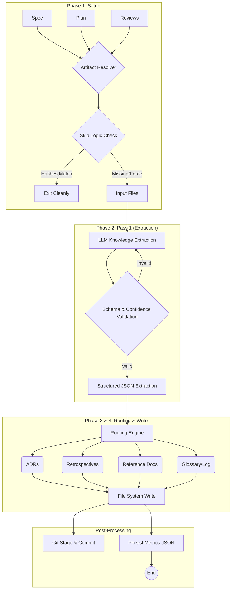

# stark-extract-docs — Internals

Extract durable knowledge from specs, plans, and reviews into project documentation — ADRs, retrospectives, reference docs, glossary, and a learning log. Use when the user says "extract docs", "generate ADRs", "extract knowledge", "create retrospective", "docs from spec", or invokes /stark-extract-docs.

## Architecture

## Phases

*See SKILL.md*

## Config

*No config*

## Failure Modes

*See SKILL.md*

## How to Modify This Skill

Edit `skill/stark-extract-docs/SKILL.md`, then run `/stark-generate-docs --skill stark-extract-docs` to regenerate documentation.
