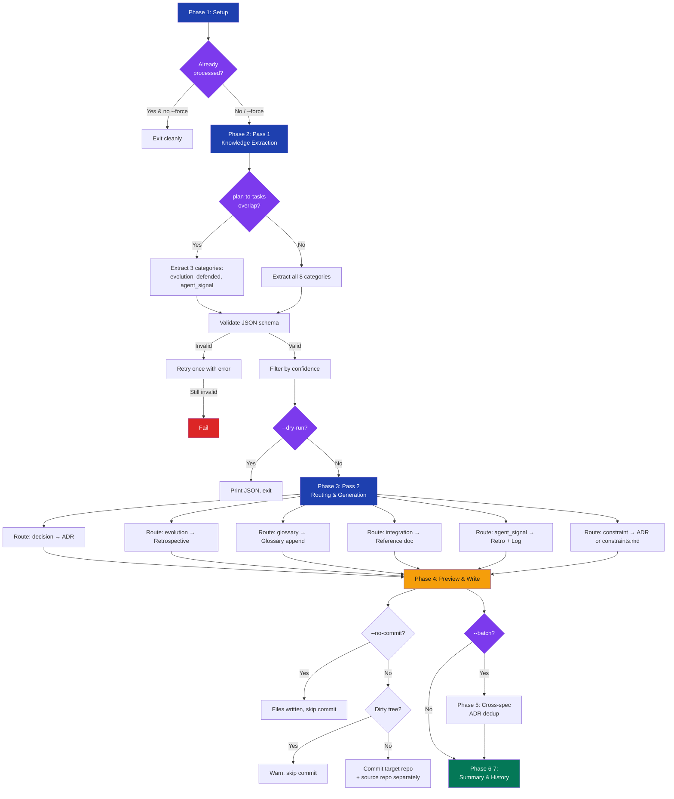

# stark-extract-docs — Internals

Extract durable knowledge from specs, plans, and reviews into project documentation — ADRs, retrospectives, reference docs, glossary, and a learning log. Use when the user says "extract docs", "generate ADRs", "extract knowledge", "create retrospective", "docs from spec", or invokes /stark-extract-docs.

## Architecture

![Architecture diagram for stark-extract-docs showing a 7-phase vertical pipeline. Phase 1 (Setup) validates inputs and resolves the target repo, with a decision diamond for skip logic based on SHA-256 hash comparison. Phase 2 (Pass 1) extracts knowledge from specs and reviews into 8 categories shown in a color-coded grid: decision, decision_defended, constraint, integration, data_model, evolution, agent_signal, and glossary. A routing table maps each category to output types: ADRs, retrospectives, reference docs, glossary, constraints, and learning log. Phase 3 (Pass 2) generates documents with per-type dedup strategies. Phase 4 writes files and commits to target and source repos separately. Phase 5 handles batch mode with cross-spec ADR deduplication. Phases 6-7 print summaries and persist history JSON. Extension point cards explain how to add categories, output types, and cross-tool integrations. A failure modes table covers 9 scenarios with recovery strategies. The dual-repo commit strategy card explains how outputs split between source repo (retrospectives) and target repo (ADRs, reference docs).](internals.png)

## Phases

Phase 1 (Setup): Validates the spec path exists and is .md, locates sibling artifacts by path convention (plan, spec review, plan review), checks skip logic by comparing SHA-256 hashes of all inputs against the history file, resolves the target repo (explicit flag → spec content parsing → git remote), reads the target project's docs/ structure to detect ADR directory variant and next ADR number. Phase 2 (Pass 1 — Extraction): Reads all found artifacts and extracts knowledge into 8 categories (decision, decision_defended, constraint, integration, data_model, evolution, agent_signal, glossary). If plan-to-tasks history indicates overlap, narrows to 3 review-derived categories only. Produces a structured JSON intermediate format with schema_version, input_hashes, and extractions array. Validates required fields, retries once on invalid JSON. Filters out low-confidence items unless --include-low. Phase 3 (Pass 2 — Routing): Routes each extraction to its target doc type: decisions and constraints-with-alternatives become ADRs, evolution and agent_signal become retrospectives, integration and data_model become reference docs, glossary terms are appended to glossary.md, constraints without alternatives go to constraints.md, agent_signal entries also append to the learning log. Each generator has its own dedup strategy. Phase 4 (Preview & Write): Prints a manifest of files to create/update, creates necessary directories, writes files using Write (new) or Edit (append), then commits to target repo and source repo separately (unless --no-commit or dirty tree). Phase 5 (Batch only): Iterates all *-design.md files sequentially, preserving next_adr_number across specs. After all specs, performs cross-spec ADR deduplication keeping the more detailed version. Phase 6-7 (Summary & History): Prints extraction counts by category and output counts by type. Persists history JSON for skip logic and stark-metrics aggregation. Fires improvement flags for empty extractions, high dedup rates, missing reviews, or slow extraction.

## Config

No external config file — all behavior is controlled via CLI flags. --batch <dir>: process all *-design.md files in directory. --dry-run: extract and print JSON, don't write. --no-commit: write files but skip git commit. --force: re-extract even if history exists (surgical overwrite of previous outputs). --include-low: include low-confidence extractions (normally filtered). --target-repo <path>: override target repo auto-detection. Constants: SCRIPTS=~/.claude/code-review/scripts, PYTHON=$SCRIPTS/.venv/bin/python3. History storage: ~/.claude/code-review/history/extract-docs/{org/repo}/{slug}.json. ADR template: uses {adr_dir}/0000-template.md if it exists, otherwise built-in template.

## Failure Modes

Spec doesn't exist or not .md → error and abort. Target repo not found locally → error with clone suggestion. Pass 1 extracts nothing → clean exit, not an error. Pass 1 invalid JSON → retry once with validation error, then fail. ADR number undetermined → fall back to 0001 with warning. File write fails → report partial success (what succeeded, what failed). Target repo dirty tree → warn, skip commit, files still written. Batch: one spec fails → continue to next, report all failures at end. Git commit fails → files already on disk, suggest manual commit. Multiple repo references in spec → warn and use first match.

## How to Modify This Skill

Adding a new extraction category: Add to the 8-category table in Phase 2 SKILL.md with source location and extraction rules, add a routing rule in Phase 3.1, implement a generator step (Phase 3.x), add category-specific fields to the extraction JSON schema, update validation in step 2.1. Adding a new output type: Add a generation step (Phase 3.x), implement dedup logic, include in Phase 4 preview manifest, add to history file's created_artifacts for --force tracking, handle cleanup in --force re-run logic. Changing artifact path conventions: Modify the path derivation logic in Phase 1.2 — the convention maps spec path to plan/review paths. Changing target repo resolution: Modify the 3-step resolution in Phase 1.4 (flag → spec parsing → git remote). Changing ADR template: Place a 0000-template.md in the ADR directory, or modify the built-in template in Phase 3.2. Integration with new tools: History files follow the {org/repo}/{slug}.json convention under ~/.claude/code-review/history/ — new tools can read these for cross-tool correlation.
