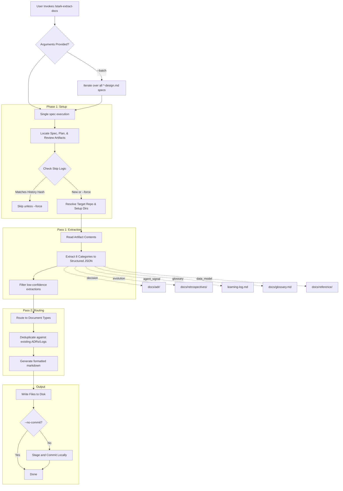
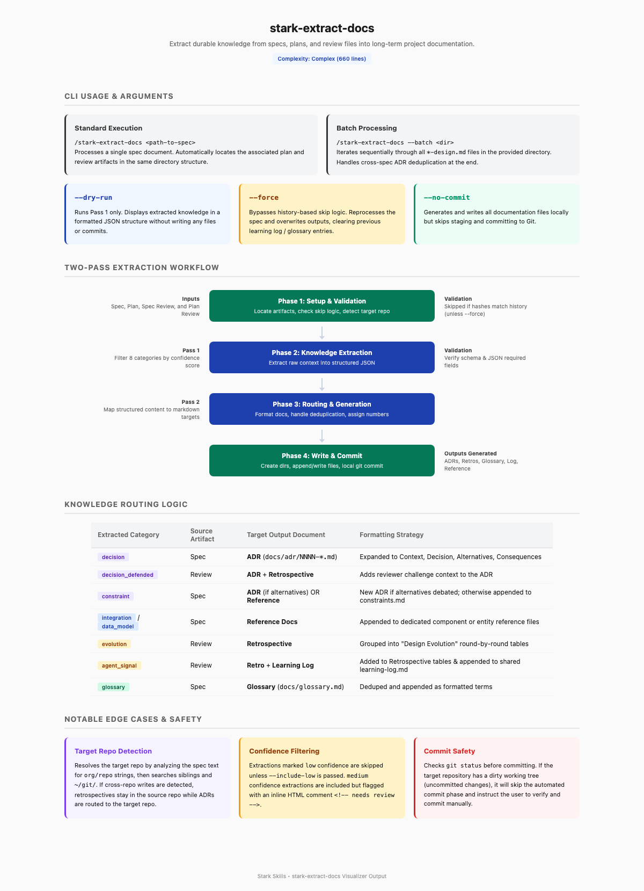

# stark-extract-docs

Extract durable knowledge from specs, plans, and reviews into project documentation — ADRs, retrospectives, reference docs, glossary, and a learning log. Use when the user says "extract docs", "generate ADRs", "extract knowledge", "create retrospective", "docs from spec", or invokes /stark-extract-docs.

## Workflow Overview

## When to Use

Extract durable knowledge from specs, plans, and reviews into project documentation — ADRs, retrospectives, reference docs, glossary, and a learning log. Use when the user says "extract docs", "generate ADRs", "extract knowledge", "create retrospective", "docs from spec", or invokes /stark-extract-docs.

## Prerequisites

*See SKILL.md*

## Arguments

`<path-to-spec> [--batch <dir>] [--dry-run] [--force]`

## Quick Start

/stark-extract-docs

## Common Patterns

## Troubleshooting

## Related Skills

