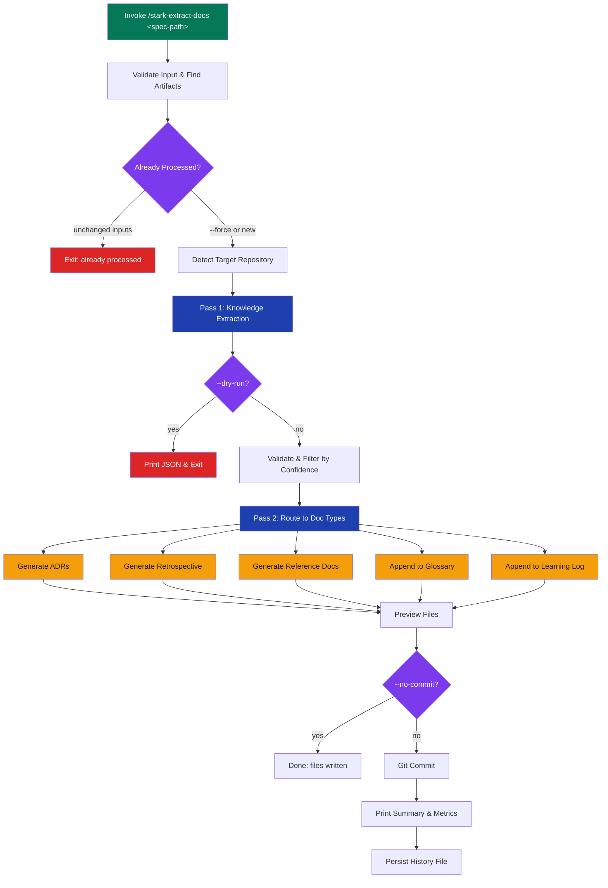

# stark-extract-docs

Extract durable knowledge from specs, plans, and reviews into project documentation — ADRs, retrospectives, reference docs, glossary, and a learning log. Use when the user says "extract docs", "generate ADRs", "extract knowledge", "create retrospective", "docs from spec", or invokes /stark-extract-docs.

## Workflow Overview

![Usage guide visualization for the stark-extract-docs skill showing a six-step vertical workflow from input validation through artifact discovery, knowledge extraction across 8 categories (decision, constraint, integration, data_model, evolution, agent_signal, glossary, decision_defended), routing to output document types (ADRs, retrospectives, reference docs, glossary, learning log), file writing, and git commit. Includes command-line invocation examples for single spec, dry run, batch, cross-repo, force, and include-low patterns, a routing table mapping each extraction category to its output location, and troubleshooting cards for common edge cases.](usage.png)

## When to Use

Extract durable knowledge from specs, plans, and reviews into project documentation — ADRs, retrospectives, reference docs, glossary, and a learning log. Use when the user says "extract docs", "generate ADRs", "extract knowledge", "create retrospective", "docs from spec", or invokes /stark-extract-docs.

## Prerequisites

Claude Code with stark-skills installed (`./install.sh`). Target repository must be cloned locally. Spec files must use `.md` extension and follow the naming convention `YYYY-MM-DD-name-design.md`.

## Arguments

`<path-to-spec> [--batch <dir>] [--dry-run] [--force]`

| Argument | Required | Description |
|----------|----------|-------------|
| `<path-to-spec>` | Yes (unless `--batch`) | Path to a `.md` spec/design file |
| `--batch <dir>` | No | Process all `*-design.md` files in directory |
| `--dry-run` | No | Show extraction JSON without writing files |
| `--no-commit` | No | Write files but skip git commit |
| `--force` | No | Re-extract even if previously processed |
| `--include-low` | No | Include low-confidence extractions |
| `--target-repo <path>` | No | Override target repo detection |

## Quick Start

/stark-extract-docs docs/specs/2026-03-19-auth-redesign-design.md

## Common Patterns

**Single spec extraction:** `/stark-extract-docs docs/specs/2026-03-19-foo-design.md` — extracts knowledge from spec + auto-discovered plan and review files.

**Dry run preview:** `/stark-extract-docs docs/specs/2026-03-19-foo-design.md --dry-run` — outputs intermediate JSON without writing files.

**Batch processing:** `/stark-extract-docs --batch docs/specs/` — processes all `*-design.md` files with cross-spec ADR deduplication.

## Troubleshooting

**"Spec already processed" exit** — Input hashes match a previous run. Use `--force` to re-extract.

**"Target repo not found locally"** — The skill checks sibling dirs and `~/git/{org}/{repo}`. Use `--target-repo <path>` to specify manually.

**Commit skipped warning** — Target repo has uncommitted changes. Commit existing work first or use `--no-commit`.

**Zero extractions** — Spec may be too thin. Add architectural context, constraints, or run a multi-agent review first to generate review artifacts.

## Related Skills

`/stark-review`, `/stark-review-plan`, `/stark-plan-to-tasks`, `/stark-init-docs`, `/stark-metrics`
