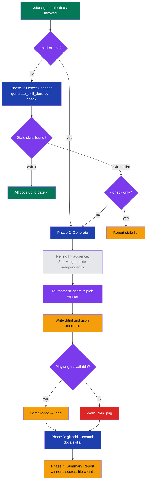

# stark-generate-docs — Internals

Generate or update skill documentation with multi-LLM visualizations. Detects which SKILL.md files changed, regenerates docs for those skills, and commits the results. Use when the user says "generate docs", "update skill docs", "regenerate viz", or invokes /stark-generate-docs. Proactively use when a SKILL.md has been modified in the current session.

## Architecture

![Architecture diagram for the stark-generate-docs skill showing a vertical four-phase execution flow: argument parsing feeds into a change-detection decision point, which routes to either an early exit (all fresh) or the multi-LLM generation phase where three LLMs compete in a tournament per skill and audience. The flow continues through file writing with optional Playwright screenshots, git commit, and a summary report. Below the flow, six cards detail internal components: the orchestrator script, LLM tournament engine, change detection mechanism, output structure, manifest and index files, and Playwright screenshots. Data flow and failure mode tables enumerate inputs, outputs, and recovery strategies at each stage. An extension points section covers adding audiences, swapping LLMs, customizing CSS, and modifying tournament scoring. A key file map lists the critical paths and when each should be modified.](internals.png)

## Phases

Phase 1 (Detect Changes): The script walks all skill/stark-*/SKILL.md files and compares content hashes against the last-generated docs in docs/skills/<name>/. If --skill or --all is provided, detection is skipped entirely. Exit code 0 means all fresh, exit code 1 outputs the list of stale skill names. In --check mode, the script stops here.

Phase 2 (Generate): For each stale skill (or specified skill), the orchestrator runs a multi-LLM tournament. Three LLMs (Claude, Codex, Gemini) each independently generate an HTML visualization, Mermaid diagram, doc-content JSON, and alt text for two audiences (usage and internals). A tournament evaluator scores each submission on accuracy, completeness, visual quality, and design-system compliance, then selects the winner per audience. The winning outputs are written to docs/skills/<name>/ as .html, .md, .json, and .mermaid files. If Playwright is available, the HTML is rendered to a .png screenshot.

Phase 3 (Commit): All changes under docs/skills/ are staged and committed with a message listing the regenerated skill names.

Phase 4 (Summary): A terminal report shows which skills were updated, which LLM won each tournament, scores, and file counts.

## Config

The skill itself has no dedicated config file — it operates via CLI flags passed through the SKILL.md argument-hint:

--skill <name>: Regenerate docs for one specific skill only. Bypasses change detection.
--all / --force: Regenerate all skills regardless of staleness. These are aliases.
--check: Only check staleness, report stale skills, do not generate. Returns exit code 0 (fresh) or 1 (stale).
(no flags): Auto-detect changed SKILL.md files and regenerate only stale ones.

The underlying generate_skill_docs.py reads the CSS design system inline from the script, discovers skills by globbing skill/stark-*/SKILL.md, and writes outputs to docs/skills/<name>/. The manifest at docs/skills/_manifest.json tracks generation metadata. Tournament scores append to docs/skills/_audit/scores.jsonl.

## Failure Modes

LLM call failure: If one LLM's API call fails or times out, that contestant is excluded from the tournament. The remaining LLMs continue. Minimum one successful response is needed per skill×audience pair.

Playwright missing: If Playwright is not installed or the browser fails to launch, PNG screenshot generation is skipped with a warning. All other output files (HTML, MD, JSON, Mermaid) are still written.

Malformed LLM output: If an LLM returns output missing required sections (HTML, Mermaid, JSON, or alt text), that submission is disqualified from the tournament. Parsing errors are logged.

All LLMs fail for a skill: If zero valid contestants remain for a skill×audience pair, that skill is skipped entirely with an error report. Previously generated docs remain in place (stale but present).

No changes detected: When running without flags and no SKILL.md files have changed, the script reports 'all up to date' and exits cleanly. This is a no-op, safe to run repeatedly.

## How to Modify This Skill

Add a new audience: Add a new audience identifier (e.g., 'ops') to the audience list in generate_skill_docs.py. Create a corresponding prompt template. The tournament runs independently per audience, so no scoring changes needed. Output files will be named <audience>.{html,md,json,mermaid,png}.

Add or swap an LLM: Update the contestant list in generate_skill_docs.py. Each contestant needs a callable accepting (skill_content, audience, css) and returning (html, mermaid, json, alt_text). The tournament evaluator handles any number of contestants.

Change CSS design system: Edit the shared CSS block that gets passed to LLMs in the generation prompt. LLMs are instructed to extend but not replace it. Breaking changes to class names require regenerating all existing docs with --all.

Change scoring criteria: Modify the tournament evaluation prompt in generate_skill_docs.py. Scores are logged to scores.jsonl, so changes will be visible in /stark-metrics trend analysis.

Change output directory: Update the output path constant in generate_skill_docs.py and the git add path in the SKILL.md commit phase.
