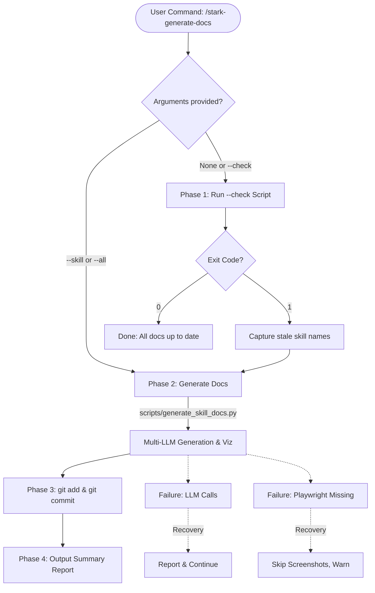
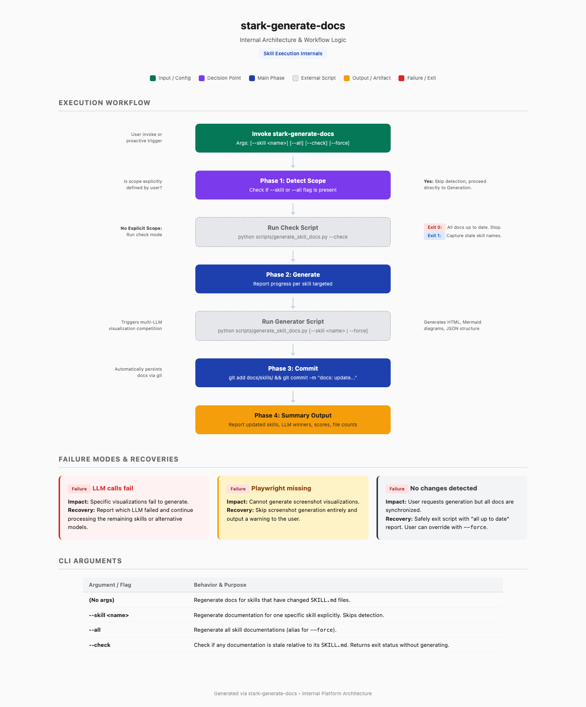

# stark-generate-docs — Internals

Generate or update skill documentation with multi-LLM visualizations. Detects which SKILL.md files changed, regenerates docs for those skills, and commits the results. Use when the user says "generate docs", "update skill docs", "regenerate viz", or invokes /stark-generate-docs. Proactively use when a SKILL.md has been modified in the current session.

## Architecture

## Phases

*See SKILL.md*

## Config

*No config*

## Failure Modes

*See SKILL.md*

## How to Modify This Skill

Edit `skill/stark-generate-docs/SKILL.md`, then run `/stark-generate-docs --skill stark-generate-docs` to regenerate documentation.
