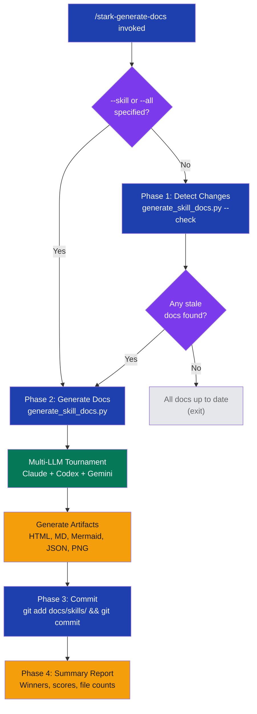

# stark-generate-docs

Generate or update skill documentation with multi-LLM visualizations. Detects which SKILL.md files changed, regenerates docs for those skills, and commits the results. Use when the user says "generate docs", "update skill docs", "regenerate viz", or invokes /stark-generate-docs. Proactively use when a SKILL.md has been modified in the current session.

## Workflow Overview

![Flowchart visualization of the stark-generate-docs skill workflow showing four phases: change detection (comparing SKILL.md hashes), multi-LLM documentation generation (Claude, Codex, Gemini tournament), git commit of results, and summary report. Includes argument reference table with five flags, six generated artifact types (HTML, Markdown, Mermaid, JSON, PNG, scores), three common workflow patterns (post-edit, full regen, CI check), and a failure modes table covering LLM failures, missing Playwright, and no-changes scenarios.](usage.png)

## When to Use

Generate or update skill documentation with multi-LLM visualizations. Detects which SKILL.md files changed, regenerates docs for those skills, and commits the results. Use when the user says "generate docs", "update skill docs", "regenerate viz", or invokes /stark-generate-docs. Proactively use when a SKILL.md has been modified in the current session.

## Prerequisites

stark-skills repo cloned and installed (`./install.sh`). Python 3 with dependencies from scripts/requirements.txt. Playwright installed for PNG screenshots (optional — skipped if missing). API keys configured for Claude, Codex, and Gemini LLMs.

## Arguments

`[--skill <name>] [--all] [--check] [--force]`

| Flag | Description | Default |
|------|-------------|---------|
| (none) | Auto-detect changed SKILL.md files, regenerate those | — |
| `--skill <name>` | Regenerate docs for one specific skill | — |
| `--all` | Regenerate all skill docs (alias for `--force`) | — |
| `--force` | Force regenerate all skill docs | — |
| `--check` | Check for stale docs, no changes made | — |

## Quick Start

/stark-generate-docs

## Common Patterns

**After editing a skill:** Run `/stark-generate-docs` with no args — auto-detects changed SKILL.md files and regenerates only those.

**Full regeneration:** Run `/stark-generate-docs --all` to rebuild all skill docs, e.g., after updating the CSS design system.

**CI staleness gate:** Run `/stark-generate-docs --check` in CI pipelines to fail builds when docs are out of date.

## Troubleshooting

**"All skill docs are up to date" but I changed a skill:** Ensure you saved the SKILL.md file and that the change detection script can see the diff (check git status).

**PNG screenshots missing:** Install Playwright (`pip install playwright && playwright install chromium`). The skill continues without screenshots but warns.

**LLM tournament has only 1-2 entries:** One or more LLM API calls failed. Check API key configuration and rate limits. The skill uses whichever responses succeed.

**Commit fails:** Ensure you have no conflicting staged changes in docs/skills/. The skill stages only that directory.

## Related Skills

`/stark-skill-analytics`, `/stark-review-improvement`, `/stark-init-docs`
