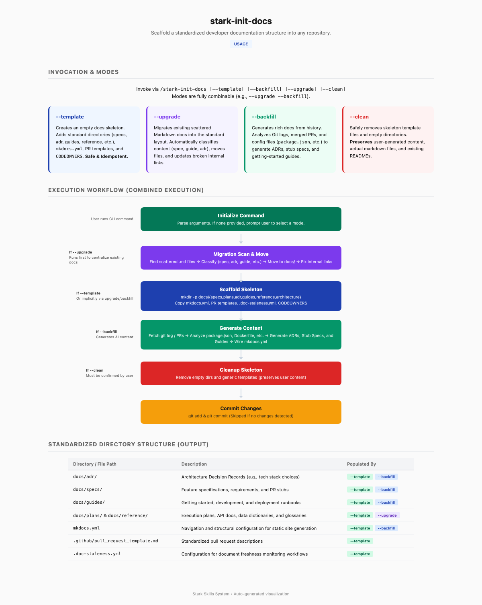

# stark-init-docs

Scaffold dev docs structure into any repo. Modes: --template (empty skeleton), --backfill (generate from git history), --upgrade (migrate existing docs), --clean (remove skeleton). Use when the user says "init docs", "setup docs", "scaffold docs", or invokes /stark-init-docs.

## Workflow Overview

```mermaid
graph TD
    A([User Input: /stark-init-docs]) --> B{Are arguments provided?}
    B -- No --> C[/Prompt user for mode/]
    B -- Yes --> D
    C --> D{Evaluate Modes}
    
    D --> E{Is --upgrade flag set?}
    E -- Yes --> F[Scan existing Markdown]
    F --> G[Classify into spec/adr/guide/ref]
    G --> H[Move to docs/ & Fix internal links]
    H --> I
    E -- No --> I{Is --template implicitly or explicitly needed?}
    
    I -- Yes --> J[Create docs/ directories]
    J --> K[Copy mkdocs.yml & templates]
    K --> L[Generate CODEOWNERS]
    L --> M
    I -- No --> M
    
    M{Is --backfill flag set?}
    M -- Yes --> N[Gather git log & PR history]
    N --> O[Analyze package/build files]
    O --> P[Generate ADRs for tech choices]
    P --> Q[Generate Stub Specs from PRs]
    Q --> R[Generate Guides]
    R --> S[Update mkdocs.yml navigation]
    S --> T
    M -- No --> T
    
    T{Is --clean flag set?}
    T -- Yes --> U[/Prompt for confirmation/]
    U --> V[Delete skeleton files & empty dirs]
    V --> W[Preserve user-generated content]
    W --> X
    T -- No --> X
    
    X{Are there any changes?}
    X -- Yes --> Y[Commit changes]
    Y --> Z([End])
    X -- No --> Z
```

## When to Use

Scaffold dev docs structure into any repo. Modes: --template (empty skeleton), --backfill (generate from git history), --upgrade (migrate existing docs), --clean (remove skeleton). Use when the user says "init docs", "setup docs", "scaffold docs", or invokes /stark-init-docs.

## Prerequisites

*See SKILL.md*

## Arguments

`[--template] [--backfill] [--upgrade] [--clean]`

## Quick Start

/stark-init-docs

## Common Patterns

## Troubleshooting

## Related Skills

