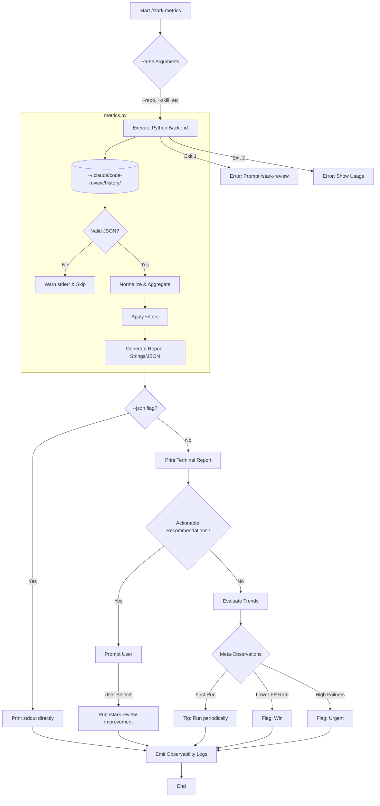
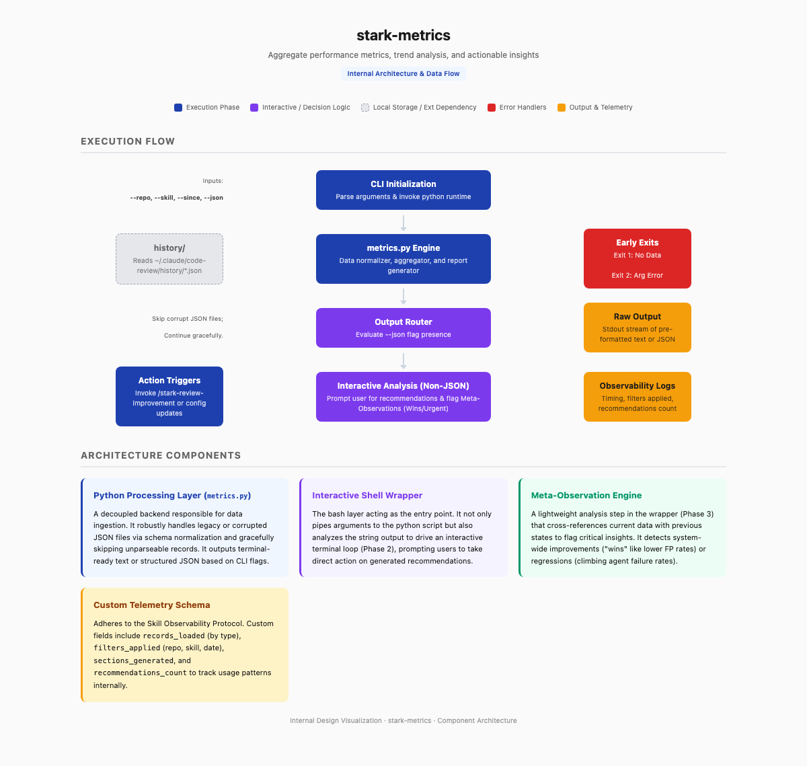

# stark-metrics — Internals

Aggregate performance metrics across all stark skill runs. Agent scorecards, finding quality, duration trends, prompt improvement impact, and actionable recommendations. Use when the user says "show metrics", "how are reviews performing", "agent stats", "review quality", or invokes /stark-metrics.

## Architecture

## Phases

*See SKILL.md*

## Config

*No config*

## Failure Modes

*See SKILL.md*

## How to Modify This Skill

Edit `skill/stark-metrics/SKILL.md`, then run `/stark-generate-docs --skill stark-metrics` to regenerate documentation.
