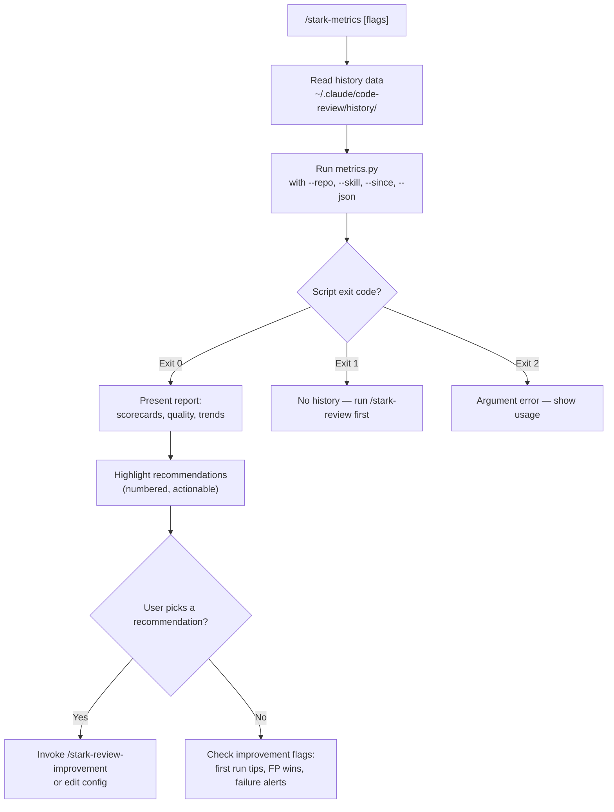

# stark-metrics

Aggregate performance metrics across all stark skill runs. Agent scorecards, finding quality, duration trends, prompt improvement impact, and actionable recommendations. Use when the user says "show metrics", "how are reviews performing", "agent stats", "review quality", or invokes /stark-metrics.

## Workflow Overview

![A usage guide for the stark-metrics skill showing a top-to-bottom workflow: invoke with optional flags, read history data, run metrics.py, check exit code (with failure branches for no data and bad arguments), present results with agent scorecards and recommendations, then check improvement flags. Below the flow are cards describing six report sections (agent scorecards, finding quality, duration trends, prompt improvement impact, recommendations, failure alerts), three common usage patterns (weekly check-in, after prompt tuning, repo deep-dive), a troubleshooting table, and links to four related skills.](usage.png)

## When to Use

Aggregate performance metrics across all stark skill runs. Agent scorecards, finding quality, duration trends, prompt improvement impact, and actionable recommendations. Use when the user says "show metrics", "how are reviews performing", "agent stats", "review quality", or invokes /stark-metrics.

## Prerequisites

stark-skills installed via `install.sh` (metrics.py and its venv must be at `~/.claude/code-review/scripts/`). At least one prior `/stark-review` run so history data exists in `~/.claude/code-review/history/`.

## Arguments

`[--repo REPO] [--skill SKILL] [--since DATE] [--json]`

| Flag | Type | Default | Description |
|------|------|---------|-------------|
| `--repo REPO` | string | all repos | Filter metrics to a specific repository |
| `--skill SKILL` | string | all skills | Filter to a specific skill (e.g. stark-review) |
| `--since DATE` | date (YYYY-MM-DD) | all time | Only include runs after this date |
| `--json` | flag | off | Output machine-readable JSON instead of terminal format |

## Quick Start

/stark-metrics

## Common Patterns

**Weekly check-in:** `/stark-metrics --since 2026-03-18` — review the past week's trends.

**After prompt tuning:** `/stark-metrics --skill stark-review` — verify false positive rates dropped after running `/stark-review-improvement`.

**Repo deep-dive with JSON:** `/stark-metrics --repo my-service --json` — pipe structured output into dashboards or scripts.

## Troubleshooting

**"No history found"** — No review runs exist yet. Run `/stark-review` on a PR first.

**"No records match filters"** — Your `--repo`, `--skill`, or `--since` filters are too narrow. Broaden them.

**Corrupt JSON warnings on stderr** — A history file is malformed. The script skips it and continues. Check stderr for the filename.

**"Script not found"** — Run `install.sh` from the stark-skills repo to set up symlinks.

## Related Skills

`/stark-review`, `/stark-review-improvement`, `/stark-skill-analytics`, `/stark-pr-status`
