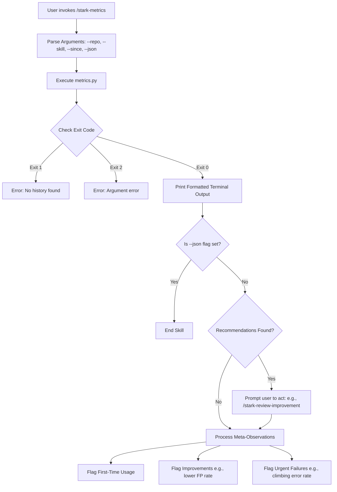
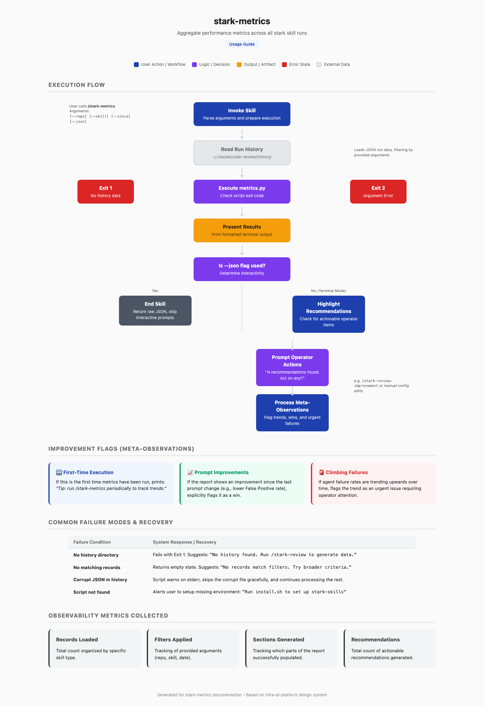

# stark-metrics

Aggregate performance metrics across all stark skill runs. Agent scorecards, finding quality, duration trends, prompt improvement impact, and actionable recommendations. Use when the user says "show metrics", "how are reviews performing", "agent stats", "review quality", or invokes /stark-metrics.

## Workflow Overview

## When to Use

Aggregate performance metrics across all stark skill runs. Agent scorecards, finding quality, duration trends, prompt improvement impact, and actionable recommendations. Use when the user says "show metrics", "how are reviews performing", "agent stats", "review quality", or invokes /stark-metrics.

## Prerequisites

*See SKILL.md*

## Arguments

`[--repo REPO] [--skill SKILL] [--since DATE] [--json]`

## Quick Start

/stark-metrics

## Common Patterns

## Troubleshooting

## Related Skills

