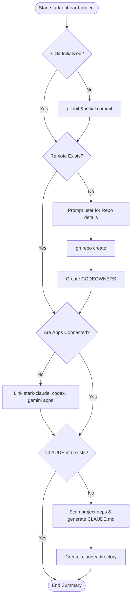
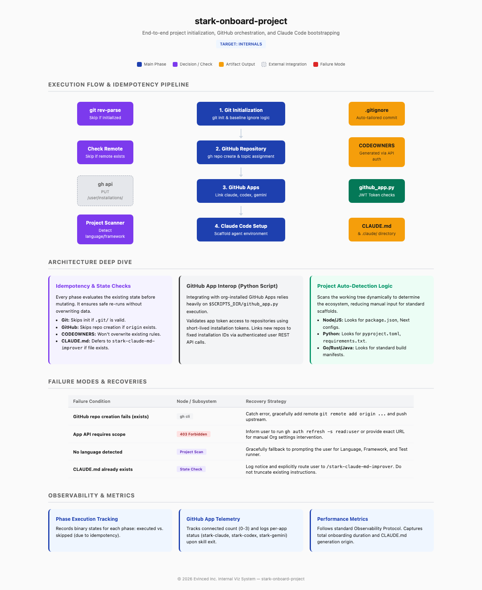

# stark-onboard-project — Internals

Bootstrap a new project end-to-end — initializes git, creates a GitHub repo in GetEvinced org, connects all 3 GitHub Apps (stark-claude, stark-codex, stark-gemini), then sets up Claude Code (CLAUDE.md, .claude/ directory, memory). Use when the user says "onboard project", "setup claude", "bootstrap claude", "init project", "create repo", "new project", or "stark-onboard-project". Also use when starting work in a directory that has no git repo and no CLAUDE.md.

## Architecture

## Phases

*See SKILL.md*

## Config

*No config*

## Failure Modes

*See SKILL.md*

## How to Modify This Skill

Edit `skill/stark-onboard-project/SKILL.md`, then run `/stark-generate-docs --skill stark-onboard-project` to regenerate documentation.
