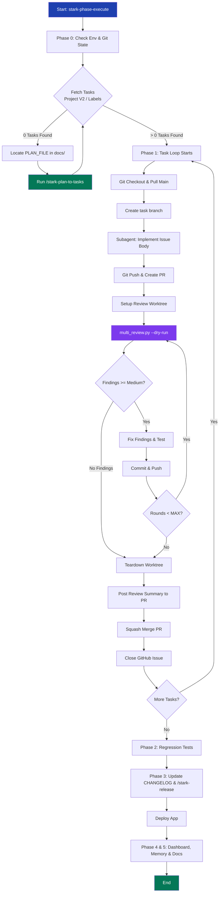

# stark-phase-execute — Internals

Autonomously execute all tasks in a development phase end-to-end — for each task: session start, implement, PR, multi-agent review with fix rounds, merge, session end. Then regression tests, version bump, deploy, dashboard, memory/docs update, and prompt improvement detection. Zero user intervention after trigger. If no GitHub issues exist for the plan slug, automatically runs /stark-plan-to-tasks first to decompose the plan into issues, then executes them. Use when the user says "execute phase", "run phase", "stark-phase-execute", "execute these tasks", "implement this phase", "run the plan", "autopilot", or any variation of wanting to autonomously execute a set of planned GitHub issues. Also triggers on `/stark-phase-execute`. Proactively suggest this skill when the user has just run `/stark-plan-to-tasks` and has open phase issues, OR when a plan file exists but hasn't been decomposed yet.

## Architecture

## Phases

*See SKILL.md*

## Config

*No config*

## Failure Modes

*See SKILL.md*

## How to Modify This Skill

Edit `skill/stark-phase-execute/SKILL.md`, then run `/stark-generate-docs --skill stark-phase-execute` to regenerate documentation.
