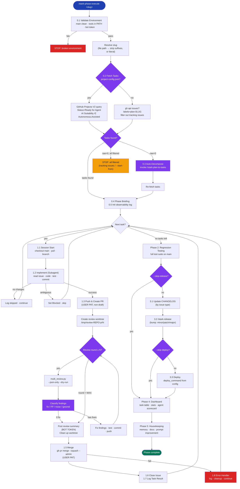

# stark-phase-execute — Internals

Autonomously execute all tasks in a development phase end-to-end — for each task: session start, implement, PR, multi-agent review with fix rounds, merge, session end. Then regression tests, version bump, deploy, dashboard, memory/docs update, and prompt improvement detection. Zero user intervention after trigger. If no GitHub issues exist for the plan slug, automatically runs /stark-plan-to-tasks first to decompose the plan into issues, then executes them. Use when the user says "execute phase", "run phase", "stark-phase-execute", "execute these tasks", "implement this phase", "run the plan", "autopilot", or any variation of wanting to autonomously execute a set of planned GitHub issues. Also triggers on `/stark-phase-execute`. Proactively suggest this skill when the user has just run `/stark-plan-to-tasks` and has open phase issues, OR when a plan file exists but hasn't been decomposed yet.

## Architecture

![Architecture diagram for stark-phase-execute showing a 6-phase pipeline. Phase 0 validates the environment, resolves plan slugs, and fetches tasks via GitHub Projects V2 or label-based API with auto-decomposition fallback. Phase 1 is a sequential task loop where each issue goes through branch creation, subagent implementation, PR creation with user PAT, multi-agent review in isolated worktrees (up to N rounds of 3 LLMs classifying findings as fix/FP/noise), merge with admin override, and issue closure. Phases 2-5 cover regression testing, CHANGELOG update with release delegation to /stark-release, a dashboard with task summary tables and agent scorecards, and housekeeping with memory updates and prompt improvement detection. Cards detail the auth token split (user PAT for PRs/merges, bot token for reviews/project mutations), task fetching strategies, review worktree isolation, and a failure mode matrix showing 10 failure types with automatic recovery actions. Extension points highlight config hierarchy, project integration, skill delegation, and observability protocol.](internals.png)

## Phases

Phase 0 (Initialize): Validates environment (clean main, tools in PATH, bot token), resolves the plan slug from CLI argument (file path or literal), fetches tasks via GitHub Projects V2 (preferred, queries Status=Ready for Agent with AI Suitability filter) or label-based gh API fallback (plan:{SLUG} label). Filters out phase tracking issues (no ## What section). If zero raw issues exist, auto-invokes /stark-plan-to-tasks to decompose the plan file, then re-fetches. Prints briefing table and initializes the observability JSON log.

Phase 1 (Task Loop): Executes each task sequentially — each must merge to main before the next begins. Per task: (1.1) checkout main, pull, create feature branch; if project config exists, validate spec completeness and transition status to Agent Working via bot token. (1.2) Spawn a foreground subagent (Agent tool) to implement the issue — reads issue, explores code, implements, tests, commits. Ambiguous tasks get set to Blocked and skipped. (1.3) Push and create a non-draft PR using user PAT; PR body written via temp file (never shell-interpolated). (1.4) Multi-agent review in an isolated worktree: for up to N rounds, run multi_review.py (--json-only --dry-run) for one round of 3 LLMs × 6 domains, classify findings (fix/FP/noise/ignored), fix actionable ones, test, commit, push. The round loop is managed by this skill, not multi_review.py. After loop, post consolidated review via bot token and clean up worktree. (1.5) Merge via gh pr merge --squash --admin (user PAT); CI failures logged as ci_bypassed but don't block. (1.6) Verify issue auto-closed or close explicitly. (1.7) Append task result to observability JSON. (1.8) On any failure: log, cleanup branches/worktrees, continue to next task.

Phase 2 (Regression Testing): Checkout main, pull, detect test command from config hierarchy, run full suite. Log pass/fail/skip. Failures don't block.

Phase 3 (Release & Deploy): Update CHANGELOG by issue type (Feature→Added, Bug→Fixed, Task→Changed). Determine version bump (Feature→minor, Bug/Task→patch, breaking→major). Delegate to /stark-release. Run deploy_command if configured. Skippable via --skip-release and --skip-deploy.

Phase 4 (Dashboard): Task summary table, aggregate stats (duration, completion rate, finding counts, fix rate, noise rate), agent scorecard (findings/fixed/noise/unique/accuracy per LLM), failed task details with recovery suggestions.

Phase 5 (Housekeeping): Save project memory summarizing phase execution. Update architecture docs if docs/ exists. Detect prompt improvement opportunities: FP rate >20%, repeated finding types (3+), agent blind spots (2+ misses), unparseable output. Suggest /stark-review-improvement if thresholds exceeded.

## Config

Constants: SCRIPTS=~/.claude/code-review/scripts, PYTHON=$SCRIPTS/.venv/bin/python3, HISTORY=~/.claude/code-review/history. Config hierarchy: .code-review/config.json (repo-level) → ~/.claude/code-review/config.json (global). Config fields used: test_command (fallback: detect from package.json/pyproject.toml/Makefile), deploy_command (optional, skip if not set). CLI arguments: <plan-slug> (required, matches plan:{SLUG} label or resolves from file path), --dry-run (walk plan without changes), --skip-deploy, --skip-release, --start-from <N> (resume from issue number), --rounds <N> (default 3, max review-fix rounds per PR), --repo ORG/REPO (override auto-detect). Project integration: .github/project-config.json enables GitHub Projects V2 (project_id, status transitions, AI Suitability filtering, spec completeness gates). Slug derivation from file paths: strip dir + .md extension, strip trailing -design/-spec/-plan suffix, keep date prefix, truncate >50 chars to 47 + 3-char MD5 hash.

## Failure Modes

Environment: dirty working tree → auto-stash with warning; not on main → checkout main && pull; missing tools → stop immediately. Implementation: subagent produces no changes → log as skipped, continue; subagent reports ambiguity → set Blocked status via bot, skip task; subagent timeout → log, skip, continue. PR lifecycle: PR creation fails → retry once after push, then log and continue; CI fails before merge → merge with --admin, flag ci_bypassed:true; merge conflict → rebase on main, resolve, re-push, retry; merge fails after retry → log and continue. Review: multi_review.py dispatch fails → proceed with available findings; worktree already exists (crashed session) → reuse existing. Post-loop: test suite fails → log failures, continue to dashboard; release fails (no CHANGELOG, tag exists) → log and skip deploy; GitHub API rate limit → wait 60s, retry once. Critical design principle: NEVER block the phase on a single task failure. Log everything, continue to next task. The dashboard surfaces all failures for human review.

## How to Modify This Skill

Task fetching: To add a new task source, extend Phase 0.2 — add a new branch alongside project-based and label-based fetching. The task list interface is {number, title, labels, body}. Review rounds: The round loop (Phase 1.4) is owned by this skill, not multi_review.py. To change classification logic, modify the fix/FP/noise/ignored rules. To add review agents, update multi_review.py's agent config. Auth split: All auth switching happens via explicit unset GH_TOKEN / export GH_TOKEN patterns. To add a new bot app, add it to github_app.py and add the keychain entry. Skill delegation: Phase 3 delegates to /stark-release, Phase 0.3 delegates to /stark-plan-to-tasks. To change release behavior, modify the target skill, not this one. Observability: The log schema (Phase 0.5, 1.7) is consumed by /stark-metrics. Extending it requires updating both. Improvement thresholds (Phase 5.3) are hardcoded — to tune them, edit the threshold table in the skill. New phases: Add between existing phases or append before Phase 5. Each phase should follow the pattern: detect config → execute → log results → handle failures gracefully.
