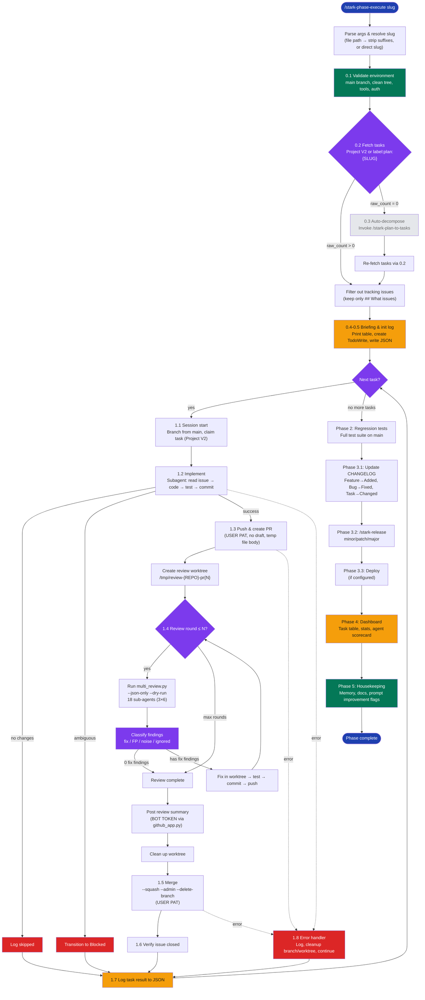

# stark-phase-execute — Internals

Autonomously execute all tasks in a development phase end-to-end — for each task: session start, implement, PR, multi-agent review with fix rounds, merge, session end. Then regression tests, version bump, deploy, dashboard, memory/docs update, and prompt improvement detection. Zero user intervention after trigger. If no GitHub issues exist for the plan slug, automatically runs /stark-plan-to-tasks first to decompose the plan into issues, then executes them. Use when the user says "execute phase", "run phase", "stark-phase-execute", "execute these tasks", "implement this phase", "run the plan", "autopilot", or any variation of wanting to autonomously execute a set of planned GitHub issues. Also triggers on `/stark-phase-execute`. Proactively suggest this skill when the user has just run `/stark-plan-to-tasks` and has open phase issues, OR when a plan file exists but hasn't been decomposed yet.

## Architecture

![Architecture diagram of the stark-phase-execute skill showing six phases in a vertical flow. Phase 0 (Initialize) covers argument parsing, environment validation, task fetching via GitHub Projects V2 or labels with an auto-decompose fallback to /stark-plan-to-tasks. Phase 1 (Task Loop) is highlighted as a sequential loop processing each task through branch creation, subagent implementation, PR creation with user PAT auth, review in an isolated git worktree using multi_review.py (18 sub-agents across 3 LLMs and 6 domains) with up to N fix rounds, squash merge, and task logging — with error handling that never blocks. Post-loop phases cover regression testing, CHANGELOG generation with release delegation to /stark-release, a dashboard with task summary table and agent scorecard, and housekeeping with memory updates and prompt improvement detection. Six detail cards explain the auth split (user PAT vs bot token), subagent architecture, worktree isolation, config cascade, error handling philosophy, and observability format. Extension points table and failure mode reference table provide developer guidance for modification and recovery.](internals.png)

## Phases

Phase 0 (Initialize): Parse the plan slug from a file path or direct string, validate the environment (clean main, tools in PATH, auth working), fetch tasks via GitHub Projects V2 or label-based API query. If no issues exist, auto-invoke /stark-plan-to-tasks to decompose the plan. Print a briefing table and initialize the observability JSON log.

Phase 1 (Task Loop): For each task sequentially: checkout main and create a feature branch, optionally claim the task in Project V2 (transition to 'Agent Working'). Spawn a foreground subagent to implement the issue (read, code, test, commit). Push and create a PR using the user's PAT (never draft). Create an isolated worktree for review. Run up to N review rounds — each dispatches multi_review.py (18 sub-agents: 3 LLMs × 6 domains) returning JSON findings, classifies each finding by reading the actual file:line (fix/FP/noise/ignored), fixes actionable findings in the worktree, tests, commits, and pushes. Post the consolidated review via stark-claude[bot]. Clean up the worktree. Squash-merge with --admin and --delete-branch using the user's PAT. Verify issue closure. Log the task result. On any error: log, clean up branch/worktree, continue to next task.

Phase 2 (Regression): Checkout main, run the full test suite (detected from config hierarchy or auto-detected). Log pass/fail/skip counts. Failures don't block.

Phase 3 (Release & Deploy): Generate CHANGELOG entries per task type (Feature→Added, Bug→Fixed, Task→Changed). Determine version bump (Feature→minor, Bug/Task→patch, breaking→major). Delegate to /stark-release. Optionally run deploy_command from config. Skippable via --skip-release and --skip-deploy.

Phase 4 (Dashboard): Print task summary table, aggregate stats (tasks completed/failed, findings by severity, fix rate, noise rate), agent scorecard (findings/fixed/noise/accuracy per agent), and failed task details with recovery suggestions.

Phase 5 (Housekeeping): Save project memory for non-obvious decisions. Update architecture docs if docs/ exists. Detect prompt improvement signals (FP rate >20%, recurring findings 3+, agent misses 2+, unparseable output) and suggest /stark-review-improvement if thresholds exceeded.

## Config

Arguments:
- <plan-slug> (required): Plan slug matching plan:{SLUG} label, or file path (auto-resolved to slug)
- --dry-run: Walk plan without executing (no branches, PRs, or changes)
- --skip-deploy: Skip deployment after release
- --skip-release: Skip version bump and release entirely
- --start-from <N>: Resume from a specific issue number
- --rounds <N> (default: 3): Max review-fix rounds per PR
- --repo ORG/REPO: Override repo detection from git remote

Config files (cascade: repo → org → global):
- .code-review/config.json: test_command, deploy_command, review domains
- .github/project-config.json: project_id for GitHub Projects V2 integration
- ~/.claude/code-review/config.json: global defaults

Constants:
- SCRIPTS = ~/.claude/code-review/scripts
- PYTHON = $SCRIPTS/.venv/bin/python3
- HISTORY = ~/.claude/code-review/history

Prompt improvement thresholds:
- False positive rate per agent: >20%
- Recurring finding type: 3+ occurrences
- Agent consistently missing issues: 2+ misses
- Unparseable output: any occurrence

## Failure Modes

Never-block philosophy: every failure is logged and execution continues to the next task or phase.

- Not on main / dirty tree: auto-checkout and stash, log warning
- No implementation changes: log as skipped, continue
- Ambiguous requirements (with Project V2): transition to Blocked status, post comment, skip
- PR creation fails: retry once after re-push, then log and continue
- multi_review.py dispatch fails: log agent-level failures, proceed with available findings
- Worktree already exists (crashed session): reuse existing worktree
- Merge conflict: rebase on main, resolve, re-push, retry merge
- CI fails / merge blocked: force merge with --admin, flag ci_bypassed:true in log
- GitHub API rate limit: wait 60s, retry once, log and continue
- Subagent timeout: log timeout, skip task, continue
- Release fails (no changelog, tag already exists): log and skip deploy
- Stale remote branch from failed task: cleaned up in error handler via git push origin --delete

All failures recorded in the observability JSON with full error context. Dashboard (Phase 4) surfaces improvement flags: bottleneck phases (>70% of time), high task failure rate (>30%), agent failure rate (>20%), zero-actionable review rounds.

## How to Modify This Skill

The skill is a single SKILL.md file at skill/stark-phase-execute/SKILL.md. It's a prompt-driven orchestration — there's no compiled code, just instructions the AI follows.

Task fetching: Add a new strategy path in §0.2 alongside Project V2 and label-based. The skill checks for .github/project-config.json first, then falls back to labels.

Review domains: Add/remove markdown prompt files in global/prompts/{claude,codex,gemini}/. multi_review.py auto-discovers domain files by glob pattern.

Finding classification: The fix/FP/noise/ignored logic is inline in §1.4. Adjust severity thresholds or add new categories there.

Review rounds: The round loop is managed in this skill (§1.4), NOT in multi_review.py. multi_review.py has no --rounds flag — it always runs one round of 18 agents.

Release workflow: Phase 3 delegates to /stark-release. To customize version files, tag formats, or CI triggers, override /stark-release at the repo level.

Deploy: Set deploy_command in .code-review/config.json. If not set, deploy is silently skipped.

Slug derivation: The algorithm in the argument parsing section MUST stay in sync with /stark-plan-to-tasks. If you change one, change both, or labels won't match.

Observability: The JSON schema in §0.5 and §1.7 defines the log structure. Follow standards/observability.md for conventions. The 5-minute checkpoint interval is hardcoded in the observability section.

Prompt improvement thresholds: Adjust the table in §5.3 (FP >20%, recurring 3+, agent misses 2+).

Auth split: The USER PAT / BOT TOKEN boundary is a security invariant. Never use bot tokens for PR/merge/issue ops, and never use the user PAT for review comment posting.
