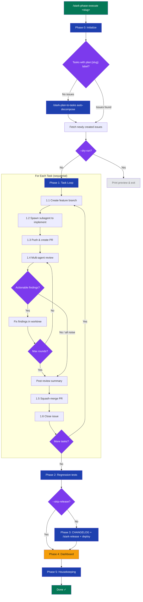

# stark-phase-execute

Autonomously execute all tasks in a development phase end-to-end — for each task: session start, implement, PR, multi-agent review with fix rounds, merge, session end. Then regression tests, version bump, deploy, dashboard, memory/docs update, and prompt improvement detection. Zero user intervention after trigger. If no GitHub issues exist for the plan slug, automatically runs /stark-plan-to-tasks first to decompose the plan into issues, then executes them. Use when the user says "execute phase", "run phase", "stark-phase-execute", "execute these tasks", "implement this phase", "run the plan", "autopilot", or any variation of wanting to autonomously execute a set of planned GitHub issues. Also triggers on `/stark-phase-execute`. Proactively suggest this skill when the user has just run `/stark-plan-to-tasks` and has open phase issues, OR when a plan file exists but hasn't been decomposed yet.

## Workflow Overview

![Usage guide visualization for the stark-phase-execute skill showing a terminal-style quick start section with five invocation examples, a six-phase execution pipeline from Initialize through Housekeeping, a detailed flowchart with nested task loop and review loop, four output cards (Merged PRs, Dashboard Report, GitHub Release, Observability Log), four common workflow cards (Fresh Plan, Resume After Failure, Dry Run, Skip Deploy), a pipeline context diagram showing where the skill fits after stark-plan-to-tasks, prerequisite cards for tools and permissions, and a key behaviors table covering autonomous operation, failure isolation, and auth splitting.](usage.png)

## When to Use

Autonomously execute all tasks in a development phase end-to-end — for each task: session start, implement, PR, multi-agent review with fix rounds, merge, session end. Then regression tests, version bump, deploy, dashboard, memory/docs update, and prompt improvement detection. Zero user intervention after trigger. If no GitHub issues exist for the plan slug, automatically runs /stark-plan-to-tasks first to decompose the plan into issues, then executes them. Use when the user says "execute phase", "run phase", "stark-phase-execute", "execute these tasks", "implement this phase", "run the plan", "autopilot", or any variation of wanting to autonomously execute a set of planned GitHub issues. Also triggers on `/stark-phase-execute`. Proactively suggest this skill when the user has just run `/stark-plan-to-tasks` and has open phase issues, OR when a plan file exists but hasn't been decomposed yet.

## Prerequisites

Claude Code with full tool permissions, `gh` authenticated with user PAT, `claude`/`codex`/`gemini` CLI tools in PATH, GitHub Apps (stark-claude, stark-codex, stark-gemini) installed on target repo, clean git working tree on main branch, bot private keys in macOS Keychain.

## Arguments

`<plan-slug-or-path> [--dry-run] [--skip-deploy] [--skip-release] [--start-from <issue-number>] [--rounds <N>] [--repo ORG/REPO]`

| Argument | Required | Default | Description |
|----------|----------|---------|-------------|
| `<plan-slug-or-path>` | Yes | — | Plan slug or path to plan file. Matches `plan:{slug}` label on GitHub issues. |
| `--dry-run` | No | off | Preview tasks and actions without executing |
| `--skip-deploy` | No | off | Skip deployment after release |
| `--skip-release` | No | off | Skip version bump and release entirely |
| `--start-from <N>` | No | 1st issue | Resume from a specific issue number |
| `--rounds <N>` | No | 3 | Max review-fix rounds per PR |
| `--repo ORG/REPO` | No | auto-detect | Override repo detection from git remote |

## Quick Start

/stark-phase-execute 2026-03-27-my-feature

## Common Patterns

**Fresh plan to shipped code:** `/stark-phase-execute docs/plans/2026-03-27-my-feature.md` — auto-decomposes plan into issues if needed, then executes all tasks.

**Resume after failure:** `/stark-phase-execute my-feature --start-from 47` — picks up from issue #47, skipping already-merged tasks.

**Preview mode:** `/stark-phase-execute my-feature --dry-run` — shows all tasks, planned branches, review config, and release type without making any changes.

## Troubleshooting

**"No issues with label plan:{slug}"** — Either the slug doesn't match any plan file, or the plan file couldn't be found in `docs/`. Check that the slug matches your plan filename.

**Task fails mid-execution** — The phase continues with remaining tasks. Check the dashboard output for error details and use `--start-from` to re-run the failed task after fixing the root cause.

**Review loop never converges** — Reduce rounds with `--rounds 1` or `--rounds 2`. The default (3) may be excessive for simple changes.

**CI bypass warnings in dashboard** — A PR was merged despite failing CI checks. Review the observability log for which checks failed and verify manually.

**Auth errors on PR creation** — Ensure `GH_TOKEN` is unset (the skill uses `gh` native auth for PRs). Bot tokens are only for review comments.

## Related Skills

`/stark-plan-to-tasks`, `/stark-review`, `/stark-release`, `/stark-design-to-plan`, `/stark-pr-flow`, `/stark-session`
