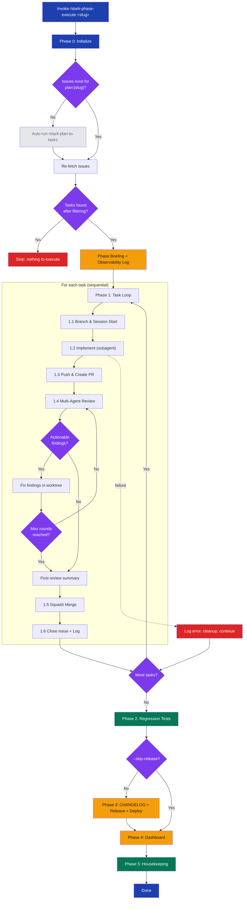

# stark-phase-execute

Autonomously execute all tasks in a development phase end-to-end — for each task: session start, implement, PR, multi-agent review with fix rounds, merge, session end. Then regression tests, version bump, deploy, dashboard, memory/docs update, and prompt improvement detection. Zero user intervention after trigger. If no GitHub issues exist for the plan slug, automatically runs /stark-plan-to-tasks first to decompose the plan into issues, then executes them. Use when the user says "execute phase", "run phase", "stark-phase-execute", "execute these tasks", "implement this phase", "run the plan", "autopilot", or any variation of wanting to autonomously execute a set of planned GitHub issues. Also triggers on `/stark-phase-execute`. Proactively suggest this skill when the user has just run `/stark-plan-to-tasks` and has open phase issues, OR when a plan file exists but hasn't been decomposed yet.

## Workflow Overview

![Usage guide for the stark-phase-execute skill showing a vertical workflow diagram with six phases (Initialize, Task Loop, Regression Testing, Release & Deploy, Dashboard, Housekeeping), invocation examples using plan slugs and file paths, an arguments table with seven flags including dry-run and start-from, six output cards (Merged PRs, Review Comments, Release, Observability Log, Dashboard, Improvement Flags), common usage patterns with terminal command examples, a sample terminal output showing timestamped task execution with success and failure indicators, a failure handling table listing eight failure modes and their automatic recovery behaviors, and six related skill cards linking to plan-to-tasks, review, release, pr-flow, review-improvement, and metrics skills.](usage.png)

## When to Use

Autonomously execute all tasks in a development phase end-to-end — for each task: session start, implement, PR, multi-agent review with fix rounds, merge, session end. Then regression tests, version bump, deploy, dashboard, memory/docs update, and prompt improvement detection. Zero user intervention after trigger. If no GitHub issues exist for the plan slug, automatically runs /stark-plan-to-tasks first to decompose the plan into issues, then executes them. Use when the user says "execute phase", "run phase", "stark-phase-execute", "execute these tasks", "implement this phase", "run the plan", "autopilot", or any variation of wanting to autonomously execute a set of planned GitHub issues. Also triggers on `/stark-phase-execute`. Proactively suggest this skill when the user has just run `/stark-plan-to-tasks` and has open phase issues, OR when a plan file exists but hasn't been decomposed yet.

## Prerequisites

Claude Code with full permissions (`--dangerouslySkipPermissions` or equivalent). CLI tools in PATH: `gh`, `claude`, `codex`, `gemini`. Active `gh auth` PAT. GitHub Apps (stark-claude, stark-codex, stark-gemini) installed on the target repo. Clean working tree on `main` branch.

## Arguments

`<plan-slug-or-path> [--dry-run] [--skip-deploy] [--skip-release] [--start-from <issue-number>] [--rounds <N>] [--repo ORG/REPO]`

| Argument | Default | Description |
|----------|---------|-------------|
| `<plan-slug-or-path>` | **required** | Plan slug (matches `plan:{slug}` label) or path to plan `.md` file |
| `--dry-run` | off | Preview execution without making changes |
| `--skip-deploy` | off | Skip deployment after release |
| `--skip-release` | off | Skip version bump and release |
| `--start-from <N>` | 1st issue | Resume from a specific issue number |
| `--rounds <N>` | 3 | Max review-fix rounds per PR |
| `--repo ORG/REPO` | auto-detect | Override repo detection from git remote |

## Quick Start

/stark-phase-execute observability-v2

## Common Patterns

**Preview before running:** `/stark-phase-execute my-plan --dry-run` — shows task list, planned branches, review config, and release plan without making changes.

**Resume after failure:** `/stark-phase-execute my-plan --start-from 47` — skips already-merged tasks and resumes from issue #47.

**Plan file to full execution:** `/stark-phase-execute docs/plans/2026-03-auth-rewrite.md` — auto-derives slug from filename, decomposes into issues if needed, then executes all tasks end-to-end.

## Troubleshooting

**"No issues with label plan:{slug}"** — Either the slug doesn't match (check exact label on GitHub) or issues haven't been created yet. Pass the plan file path instead and the skill will auto-run `/stark-plan-to-tasks`.

**"All issues filtered out"** — Issues exist but are all phase tracking issues or below the `--start-from` threshold. This is normal if all tasks are already done.

**CI bypassed warnings** — The skill merges with `--admin` even when CI fails. Check the observability log for `ci_bypassed: true` entries and verify those PRs manually.

**Review agent failures** — If one of the 3 LLMs is down, the skill proceeds with findings from the working agents. Check the agent scorecard in the dashboard for gaps.

## Related Skills

`/stark-plan-to-tasks`, `/stark-review`, `/stark-release`, `/stark-pr-flow`, `/stark-review-improvement`, `/stark-metrics`
