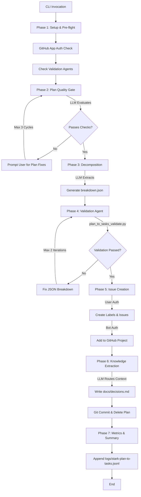
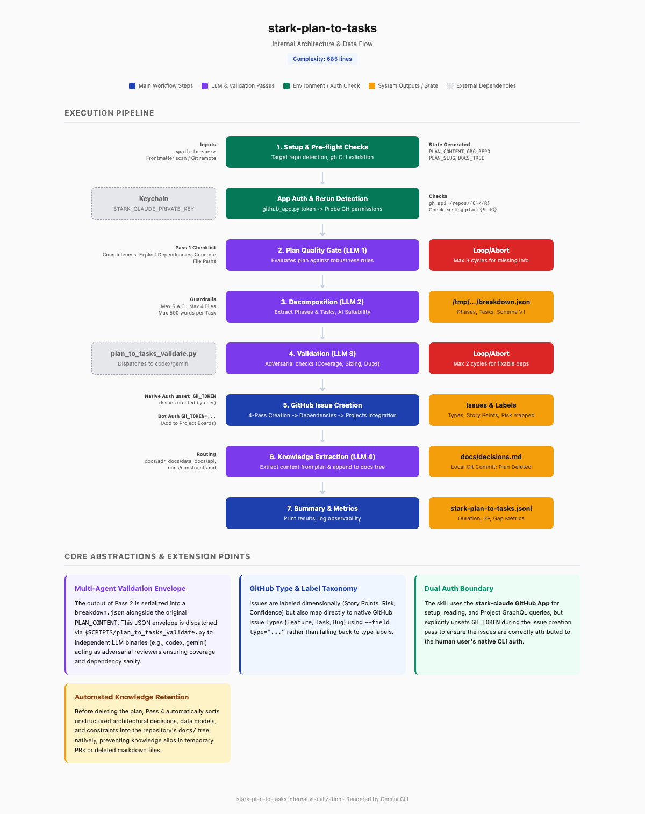

# stark-plan-to-tasks — Internals

Decompose a spec/design document into phased GitHub issues with story points, risk, and confidence labels. Extracts domain knowledge to project docs and deletes the plan. Use when the user says "plan to tasks", "decompose plan", "break down this plan", "create issues from spec", "create tasks from plan", or invokes /stark-plan-to-tasks.

## Architecture

## Phases

*See SKILL.md*

## Config

*No config*

## Failure Modes

*See SKILL.md*

## How to Modify This Skill

Edit `skill/stark-plan-to-tasks/SKILL.md`, then run `/stark-generate-docs --skill stark-plan-to-tasks` to regenerate documentation.
