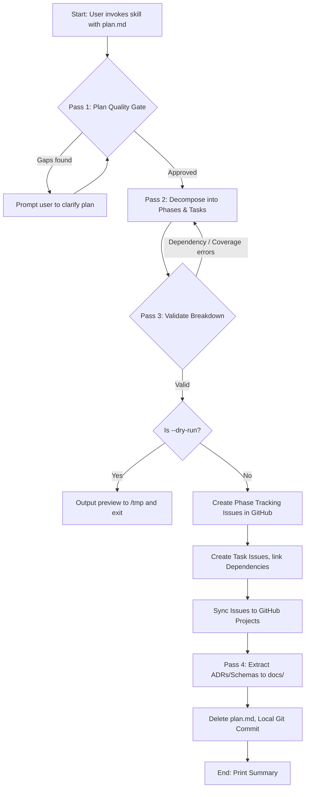
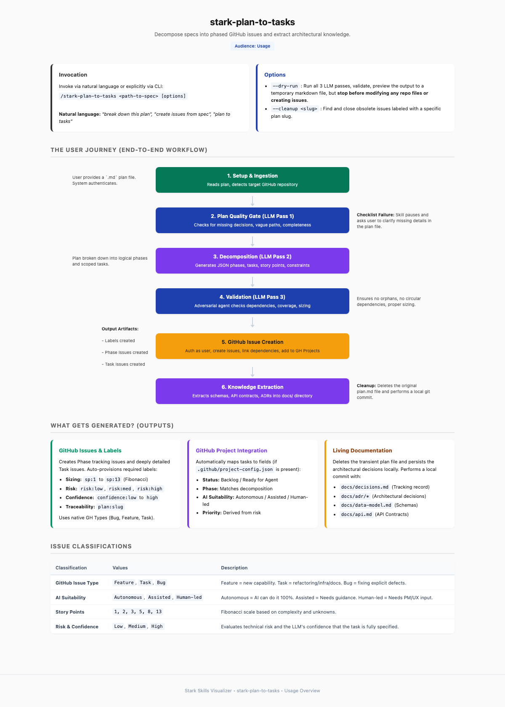

# stark-plan-to-tasks

Decompose a spec/design document into phased GitHub issues with story points, risk, and confidence labels. Extracts domain knowledge to project docs and deletes the plan. Use when the user says "plan to tasks", "decompose plan", "break down this plan", "create issues from spec", "create tasks from plan", or invokes /stark-plan-to-tasks.

## Workflow Overview

## When to Use

Decompose a spec/design document into phased GitHub issues with story points, risk, and confidence labels. Extracts domain knowledge to project docs and deletes the plan. Use when the user says "plan to tasks", "decompose plan", "break down this plan", "create issues from spec", "create tasks from plan", or invokes /stark-plan-to-tasks.

## Prerequisites

*See SKILL.md*

## Arguments

`<path-to-spec> [--dry-run] [--cleanup <slug>]`

## Quick Start

/stark-plan-to-tasks

## Common Patterns

## Troubleshooting

## Related Skills

