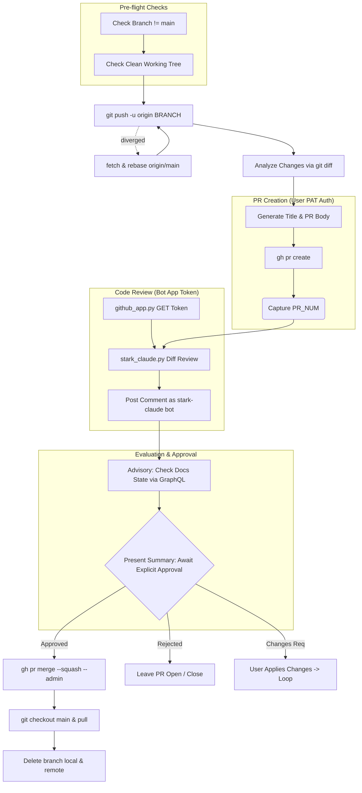

# stark-pr-flow — Internals

End-to-end PR workflow for GetEvinced repos — push, create PR, post self-review via stark-claude bot, present summary, and squash-merge with --admin on approval. Use when the user says "open PR", "create PR", "merge this", "ship it", or "stark-pr-flow".

## Architecture

## Phases

*See SKILL.md*

## Config

*No config*

## Failure Modes

*See SKILL.md*

## How to Modify This Skill

Edit `skill/stark-pr-flow/SKILL.md`, then run `/stark-generate-docs --skill stark-pr-flow` to regenerate documentation.
