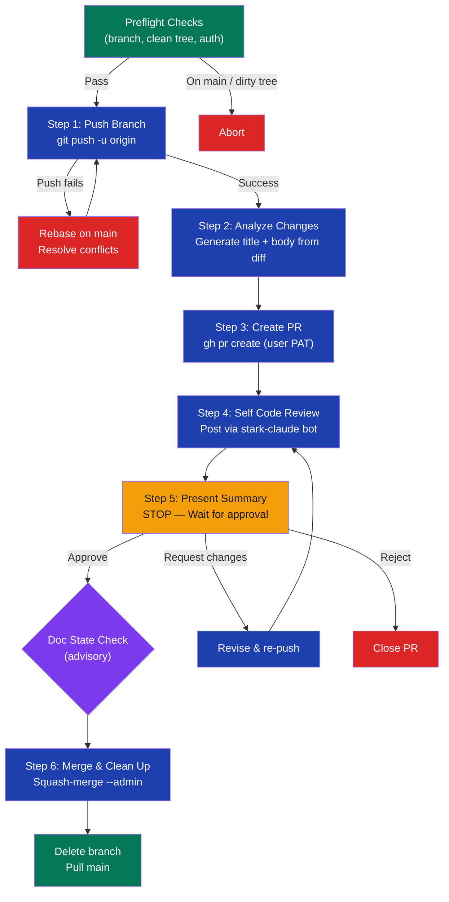

# stark-pr-flow

End-to-end PR workflow for GetEvinced repos — push, create PR, post self-review via stark-claude bot, present summary, and squash-merge with --admin on approval. Use when the user says "open PR", "create PR", "merge this", "ship it", or "stark-pr-flow".

## Workflow Overview

![Flowchart visualization of the stark-pr-flow skill showing a six-step end-to-end PR workflow: preflight checks for branch and auth validation, pushing the branch to GitHub, analyzing changes to generate a PR title and body, creating the PR via gh CLI with the user's PAT, posting a self code review via the stark-claude bot, presenting a summary and waiting for user approval at a decision gate, then squash-merging with admin bypass and cleaning up the branch. Side annotations explain the auth split between user PAT and bot token, failure recovery paths for diverged pushes and merge conflicts, and cards describing quick start examples, key behaviors, and a failure recovery table.](usage.png)

## When to Use

End-to-end PR workflow for GetEvinced repos — push, create PR, post self-review via stark-claude bot, present summary, and squash-merge with --admin on approval. Use when the user says "open PR", "create PR", "merge this", "ship it", or "stark-pr-flow".

## Prerequisites

Must have `gh` CLI authenticated with a personal access token. Must have `stark-claude` GitHub App installed on the repo (for bot reviews). Python venv at `~/git/Evinced/scripts/.venv/` with PyJWT, requests, and cryptography installed. Must be on a feature branch (not main) with a clean working tree.

## Arguments

`<optional: PR title override or "draft" to create as draft>`

| Argument | Required | Description |
|----------|----------|-------------|
| `<title>` | No | Override the auto-generated PR title |
| `"draft"` | No | Create PR as draft (default: non-draft) |

## Quick Start

`/stark-pr-flow` — pushes the current branch, creates a PR with auto-generated title and body, posts a self-review via stark-claude[bot], presents a summary, and waits for your approval to squash-merge.

## Common Patterns

**Ship current work:** `/stark-pr-flow` — fully automatic, generates title from commits.

**Custom title:** `/stark-pr-flow feat: add webhook retry logic` — overrides the auto-generated title.

**Draft PR for early feedback:** `/stark-pr-flow draft` — creates as draft, self-review still posts.

## Troubleshooting

**"Not on a feature branch"** — You're on main. Create a branch first with `git checkout -b feat/my-change`.

**"Dirty working tree"** — Commit or stash uncommitted changes before running.

**gh auth failure** — Run `gh auth status` to check. If expired, run `gh auth login`.

**Bot review not posting** — Re-run with fresh bot token. Check that `~/git/Evinced/scripts/.venv/bin/python3` has required deps (PyJWT, requests, cryptography).

**Push diverged** — The skill auto-rebases on main. If conflicts arise, resolve them manually and the skill retries.

## Related Skills

`/stark-review`, `/stark-session`, `/stark-release`
