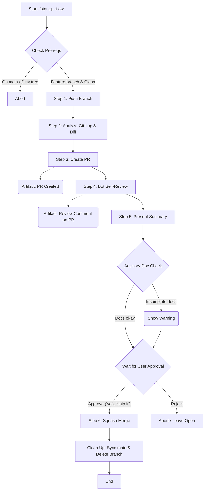
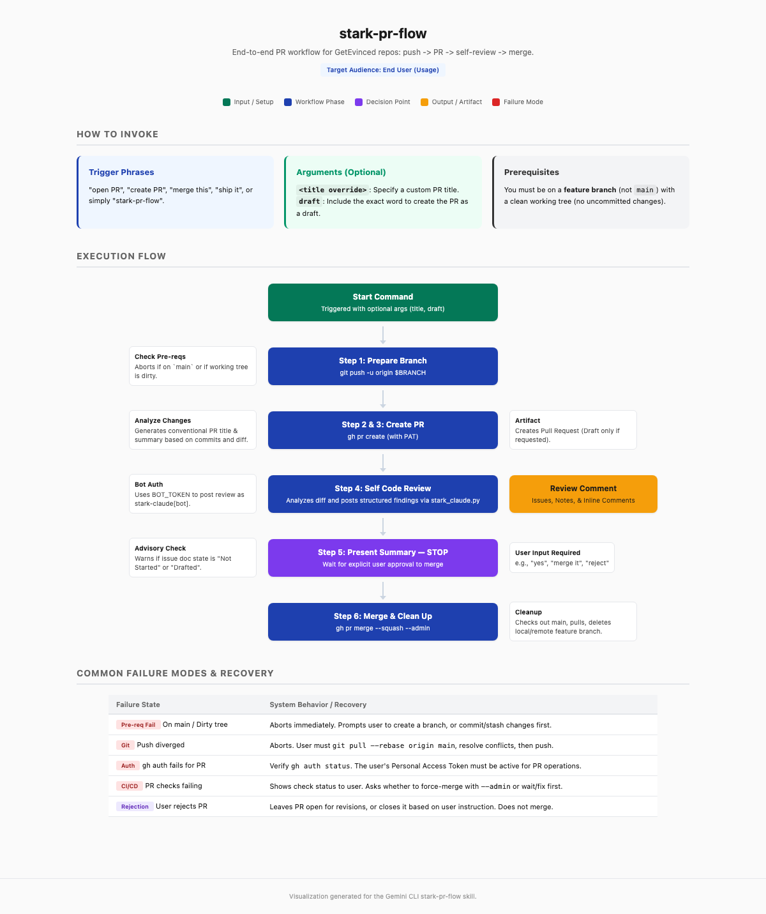

# stark-pr-flow

End-to-end PR workflow for GetEvinced repos — push, create PR, post self-review via stark-claude bot, present summary, and squash-merge with --admin on approval. Use when the user says "open PR", "create PR", "merge this", "ship it", or "stark-pr-flow".

## Workflow Overview

## When to Use

End-to-end PR workflow for GetEvinced repos — push, create PR, post self-review via stark-claude bot, present summary, and squash-merge with --admin on approval. Use when the user says "open PR", "create PR", "merge this", "ship it", or "stark-pr-flow".

## Prerequisites

*See SKILL.md*

## Arguments

`<optional: PR title override or "draft" to create as draft>`

## Quick Start

/stark-pr-flow

## Common Patterns

## Troubleshooting

## Related Skills

