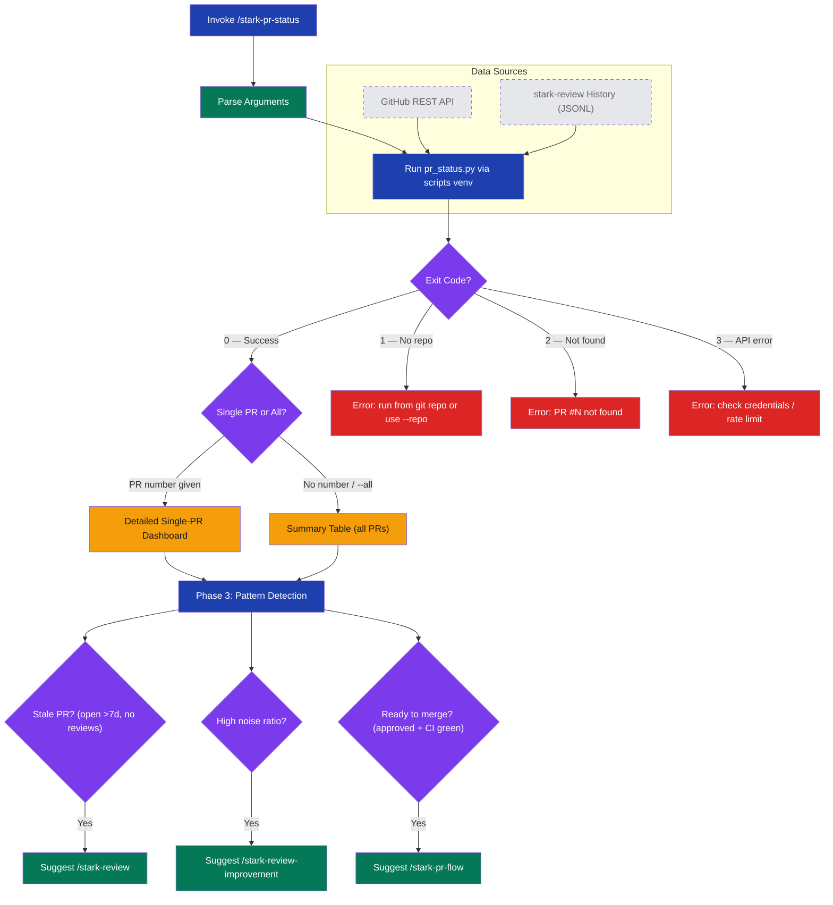

# stark-pr-status — Internals

PR analytics dashboard — review rounds, findings by severity, signal-vs-noise, time-to-merge, participants, and most impactful comments. Combines GitHub API data with stark-review history. Use when the user says "PR status", "show PR stats", "how is this PR doing", "PR dashboard", "what happened on PR 15", or invokes /stark-pr-status. Also use when the user asks about review cycles, merge times, or finding quality for specific PRs.

## Architecture

![Architecture diagram for stark-pr-status skill internals showing a three-phase execution flow. Phase 1 parses CLI arguments and runs pr_status.py via the scripts venv, pulling data from two external sources: GitHub REST API and stark-review history JSONL files. A decision diamond checks the exit code, branching to error states (red nodes for no repo, PR not found, API error) or success. On success, a second decision determines single-PR detailed dashboard versus all-PRs summary table output (amber nodes). Phase 3 applies pattern detection heuristics, checking for stale PRs, high noise ratio, and merge readiness, then suggests relevant stark skills. Below the flow, tables detail single-PR dashboard sections with their data sources, failure modes with exit codes and recovery steps, observability metrics, extension points for adding flags/heuristics/data sources/formats, and constants configuration.](internals.png)

## Phases

Phase 1 (Run Script): The skill parses CLI arguments — optional PR number, --repo, --state, --json, --limit — and forwards them to pr_status.py executed via the scripts venv Python interpreter ($SCRIPTS/.venv/bin/python3). The script fetches PR data from the GitHub REST API (metadata, reviews, comments, timeline events) and loads matching stark-review history from local JSONL files, then fuses both sources into a unified analytics model. Exit codes 1/2/3 map to specific failures with user-actionable recovery messages.

Phase 2 (Present Results): The script's output is pre-formatted for terminal display and printed directly. In single-PR mode, sections include: header (title, status, author, dates, time-to-merge), review rounds (count, findings per round, improvement delta), findings breakdown (by severity and outcome), participants (humans + bots with action counts), signal analysis (most impactful finding, biggest noise source), and chronological timeline. In all-PRs mode, output is a summary table with per-PR stats. The --json flag switches to machine-readable output.

Phase 3 (Actionable Suggestions): After presenting results, the skill applies heuristics to detect patterns: PRs open >7 days with no reviews trigger a /stark-review suggestion, PRs with high noise ratio trigger /stark-review-improvement, and PRs that are approved with CI green trigger /stark-pr-flow.

## Config

Constants:
- SCRIPTS: ~/.claude/code-review/scripts (base path for all scripts)
- PYTHON: $SCRIPTS/.venv/bin/python3 (isolated interpreter)

CLI Flags:
- Positional number or --pr N: single PR mode (default: all PRs)
- --all: explicit all-PRs mode
- --repo org/name: override auto-detected repo (default: current git remote)
- --state open|closed|merged|all: filter by PR state (default: all)
- --json: machine-readable JSON output (default: terminal-formatted text)
- --limit N: max PRs in all-PRs mode (default: 20)

No external config files — all configuration is via CLI arguments. The script inherits GitHub auth from the environment (gh CLI auth or GH_TOKEN).

## Failure Modes

Exit 1 — No repo detected: pr_status.py cannot determine the repository from git remote. Recovery: run from inside a git repo or pass --repo org/name explicitly.

Exit 2 — PR not found: The specified PR number does not exist in the target repository. Recovery: verify the PR number and repo.

Exit 3 — GitHub API error: Authentication failure or rate limiting. Recovery: run install.sh to refresh credentials, check GitHub App private keys in Keychain, or wait for rate limit reset.

Graceful degradation — No history: When no stark-review JSONL records exist for a PR, the dashboard shows GitHub API data only and notes 'No stark-review history'. Findings breakdown and signal analysis sections will be empty.

Rate limiting: GitHub API returns 403 with rate limit headers. The script surfaces a backoff message rather than retrying.

## How to Modify This Skill

Adding new CLI flags: Add the flag to pr_status.py's argparse — the skill forwards all arguments via $ARGUMENTS, so no SKILL.md changes needed.

Adding suggestion heuristics: Edit the Phase 3 section in SKILL.md to add new pattern rules. Format: condition → recommended skill. These are evaluated by the LLM at runtime, not coded in Python.

Adding data sources: Extend pr_status.py's data loading to fetch from new sources (e.g., CI provider API). Add a new observability enum value for the data sources metric.

Adding output formats: Extend pr_status.py's rendering layer with new formatters (CSV, HTML). The skill's Phase 2 prints output verbatim regardless of format.

Changing dashboard sections: Modify pr_status.py's output rendering for single-PR mode. Each section (header, review rounds, findings, participants, signal, timeline) is a discrete rendering function.

Observability: The skill follows the Skill Observability Protocol at ~/.claude/code-review/standards/observability.md. Custom metrics (PRs analyzed, API calls, history records, data sources) are emitted by pr_status.py.
