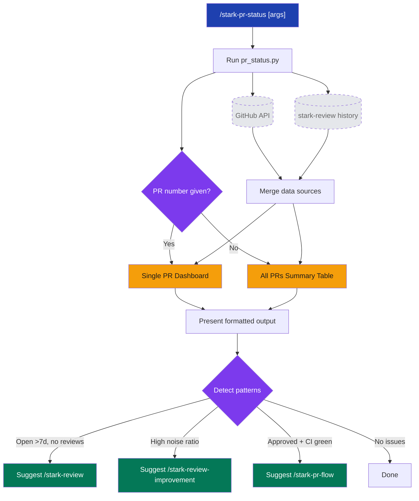

# stark-pr-status

PR analytics dashboard — review rounds, findings by severity, signal-vs-noise, time-to-merge, participants, and most impactful comments. Combines GitHub API data with stark-review history. Use when the user says "PR status", "show PR stats", "how is this PR doing", "PR dashboard", "what happened on PR 15", or invokes /stark-pr-status. Also use when the user asks about review cycles, merge times, or finding quality for specific PRs.

## Workflow Overview

![Usage guide for stark-pr-status skill showing a workflow diagram with three phases (run script, present results, actionable suggestions), a decision point for single vs all-PR mode, argument reference table with 6 flags, example terminal output for a single PR dashboard displaying review rounds and findings breakdown, four common usage pattern cards, four error handling cards for exit codes 1-3 and missing history, a data sources section showing GitHub API and stark-review history, and a related skills table linking to stark-review, stark-pr-flow, stark-review-improvement, and stark-metrics.](usage.png)

## When to Use

PR analytics dashboard — review rounds, findings by severity, signal-vs-noise, time-to-merge, participants, and most impactful comments. Combines GitHub API data with stark-review history. Use when the user says "PR status", "show PR stats", "how is this PR doing", "PR dashboard", "what happened on PR 15", or invokes /stark-pr-status. Also use when the user asks about review cycles, merge times, or finding quality for specific PRs.

## Prerequisites

stark-skills installed via `install.sh` (symlinks scripts and config to ~/.claude/code-review/). GitHub App credentials configured (stark-claude, stark-codex, stark-gemini). Python venv at ~/.claude/code-review/scripts/.venv/ with dependencies installed.

## Arguments

`[PR_NUMBER | --all] [--repo REPO] [--state STATE] [--json]`

| Argument | Type | Default | Description |
|----------|------|---------|-------------|
| `PR_NUMBER` | positional | — | Show full dashboard for a single PR |
| `--all` | flag | implied | Show summary of all PRs (default when no number) |
| `--repo ORG/NAME` | option | auto-detect | Override repository detection |
| `--state STATE` | option | all | Filter: open, closed, merged, all |
| `--limit N` | option | 20 | Max PRs in summary mode |
| `--json` | flag | off | Machine-readable JSON output |

## Quick Start

/stark-pr-status 42

## Common Patterns

**Check all open PRs:** `/stark-pr-status --state open` — surfaces stale PRs needing attention.

**Deep-dive a specific PR:** `/stark-pr-status 42` — full lifecycle: reviews, findings by severity, participants, signal analysis, timeline.

**Cross-repo query:** `/stark-pr-status --repo GetEvinced/platform --state merged --limit 10` — query any repo without switching directories.

## Troubleshooting

**"No repo detected"** — You're not in a git directory. Either `cd` into a repo or pass `--repo org/name`.

**"PR not found"** — Verify the PR number exists in the target repo. Use `--repo` if querying a different repo than your cwd.

**"GitHub API auth failure"** — Re-run `install.sh` to verify credentials. Check that GitHub App private keys are in macOS Keychain.

**"No stark-review history"** — Not an error. The PR hasn't been reviewed with `/stark-review` yet. GitHub API data is still shown.

## Related Skills

`/stark-review`, `/stark-pr-flow`, `/stark-review-improvement`, `/stark-metrics`
