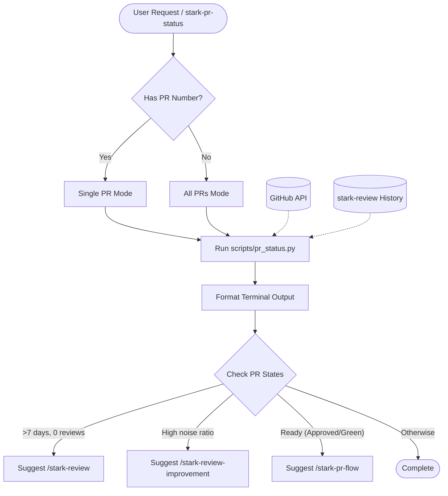
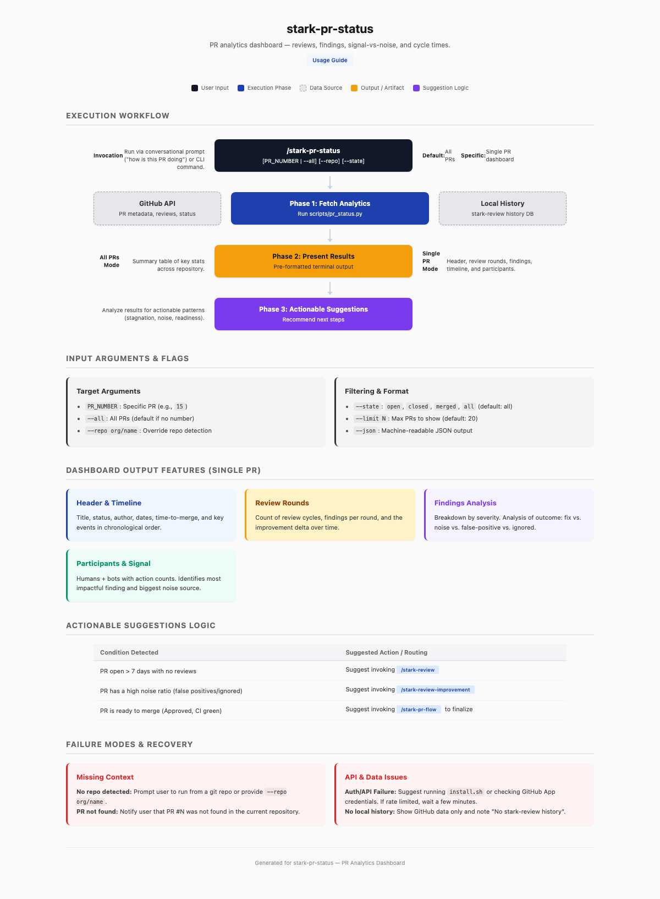

# stark-pr-status

PR analytics dashboard — review rounds, findings by severity, signal-vs-noise, time-to-merge, participants, and most impactful comments. Combines GitHub API data with stark-review history. Use when the user says "PR status", "show PR stats", "how is this PR doing", "PR dashboard", "what happened on PR 15", or invokes /stark-pr-status. Also use when the user asks about review cycles, merge times, or finding quality for specific PRs.

## Workflow Overview

## When to Use

PR analytics dashboard — review rounds, findings by severity, signal-vs-noise, time-to-merge, participants, and most impactful comments. Combines GitHub API data with stark-review history. Use when the user says "PR status", "show PR stats", "how is this PR doing", "PR dashboard", "what happened on PR 15", or invokes /stark-pr-status. Also use when the user asks about review cycles, merge times, or finding quality for specific PRs.

## Prerequisites

*See SKILL.md*

## Arguments

`[PR_NUMBER | --all] [--repo REPO] [--state STATE] [--json]`

## Quick Start

/stark-pr-status

## Common Patterns

## Troubleshooting

## Related Skills

