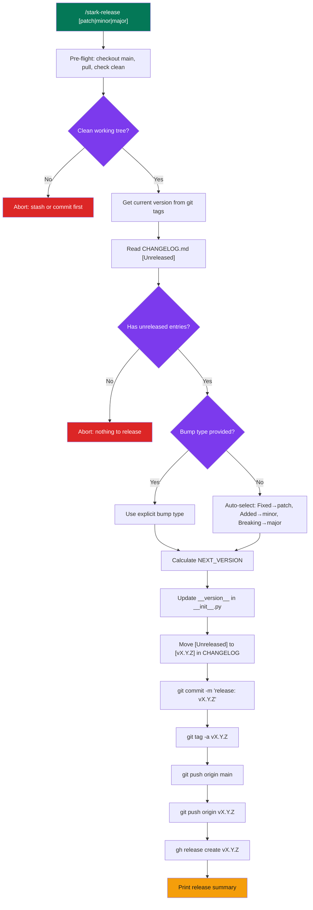

# stark-release — Internals

Cut a new release — reviews unreleased CHANGELOG entries, bumps version (patch/minor/major), creates git tag, and optionally creates a GitHub Release with notes. Use when the user says "release", "cut a version", "tag a release", "bump version", or invokes /stark-release.

## Architecture

![Flowchart showing the stark-release skill's 10-step internal pipeline. Starting with pre-flight checks (clean main branch, git tag version resolution), flowing through CHANGELOG analysis and bump type decision (patch/minor/major), then through mutation steps (version file update, CHANGELOG restructuring, git commit), and finally publish steps (annotated tag creation, branch and tag push, GitHub Release creation) ending with a summary output. Side annotations show auth model (user PAT only, GH_TOKEN unset), failure abort points (dirty tree, missing CHANGELOG, empty unreleased), and recovery paths. Below the flow: cards detailing version resolution logic, authentication model, data flow table, failure modes table, critical ordering constraints, and six extension points for customization.](internals.png)

## Phases

The release pipeline has 10 sequential steps. **Pre-flight** (Steps 1-2) ensures a clean main branch and resolves the current version from git tags (falling back to 0.1.0 baseline). **Analysis** (Steps 3-4) extracts the [Unreleased] section from CHANGELOG.md, categorizes entries as Fixed/Added/Changed, and determines the bump type — either from an explicit argument or auto-selected based on change categories (Fixed-only→patch, any Added→minor, breaking Changed→major). **Mutation** (Steps 5-6) updates the runtime __version__ in src/infra_pulse/__init__.py and restructures CHANGELOG.md by moving [Unreleased] content into a dated version section, then commits both files in a single release commit. **Publish** (Steps 7-9) creates an annotated git tag pointing at the release commit, pushes both branch and tag to origin, and creates a GitHub Release with the CHANGELOG notes via gh CLI. **Summary** (Step 10) outputs version info, change counts, release URL, and commit hash.

## Config

The skill has minimal explicit configuration — most behavior is convention-driven. **Version source**: git tags in vX.Y.Z format (not pyproject.toml). **Version file**: src/infra_pulse/__init__.py __version__ string — hardcoded path. **CHANGELOG format**: Keep a Changelog with ## [Unreleased] and ### Fixed/Added/Changed subsections. **Auth**: uses user's native gh PAT (GH_TOKEN is unset). **Bump argument**: optional [patch|minor|major] via $ARGUMENTS — auto-selects if omitted. **Observability**: follows ~/.claude/code-review/standards/observability.md protocol with skill-specific metrics (version diff, bump type, entry counts, tag/release booleans, push duration). **GitHub Release**: always created (no opt-out flag). **Repo detection**: via gh repo view --json nameWithOwner.

## Failure Modes

Seven failure modes with defined recovery: (1) **Not on main** — detected by branch check, recovery is checkout main. (2) **Dirty working tree** — detected by git status --porcelain, recovery is stash or commit. (3) **No CHANGELOG.md** — file not found, hard abort. (4) **Empty [Unreleased]** — section exists but has no entries, hard abort. (5) **Tag collision** — git tag -a fails because version already exists, suggests next available version. (6) **Push rejected** — remote has diverged, recovery is git pull --rebase then retry. (7) **gh auth failure** — gh release create errors, recovery is verify gh auth status and ensure PAT is active. The first four are pre-commit aborts (safe), while the last three occur after local changes are made and require careful recovery to avoid orphaned tags or partial releases.

## How to Modify This Skill

**Change version file location**: Edit Step 5 to point to a different file path and adjust the __version__ regex pattern. **Add dynamic versioning**: Integrate setuptools-scm to derive version from git tags at build time, eliminating Step 5 entirely. **Add new CHANGELOG categories**: Update the bump auto-selection logic in Step 4 to handle Deprecated, Removed, or Security categories and their mapping to semver bumps. **Add post-release hooks**: Extend after Step 9 to trigger CI/CD pipelines, Slack notifications, or follow-up issue creation. **Support monorepos**: Fork the skill to handle per-package CHANGELOGs, scoped tags (pkg/vX.Y.Z), and independent version files. **Make GitHub Release optional**: Add a --no-release flag check before Step 9. **Change auth model**: Remove the unset GH_TOKEN guard if bot-authored releases are acceptable. **Customize commit message format**: Edit the git commit template in Step 6 (currently 'release: vX.Y.Z' with co-author trailer).
