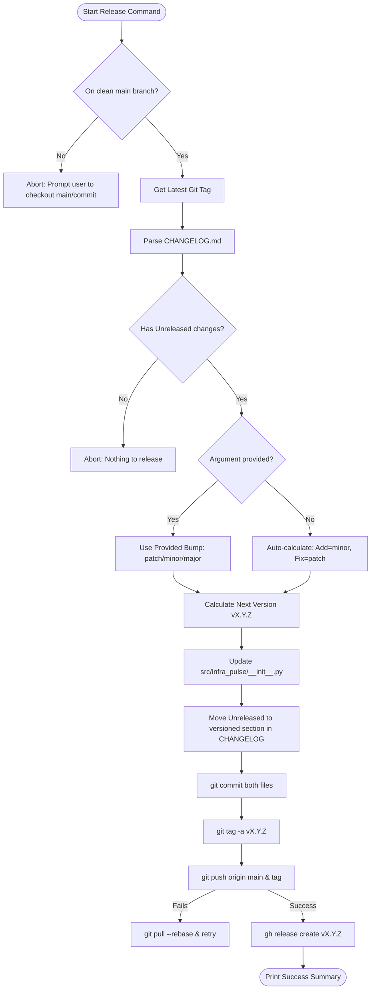
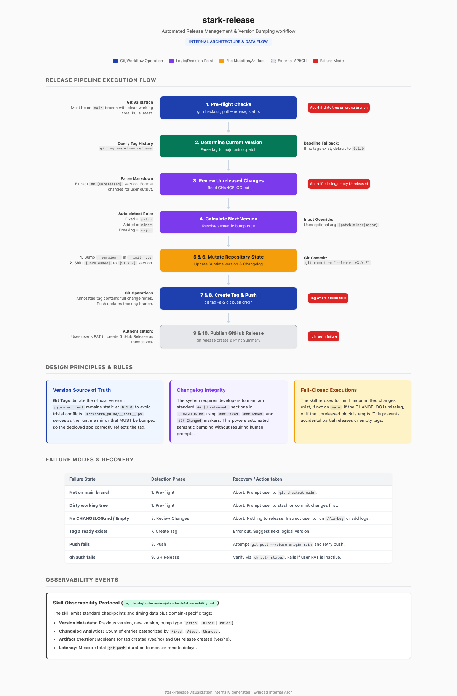

# stark-release — Internals

Cut a new release — reviews unreleased CHANGELOG entries, bumps version (patch/minor/major), creates git tag, and optionally creates a GitHub Release with notes. Use when the user says "release", "cut a version", "tag a release", "bump version", or invokes /stark-release.

## Architecture

## Phases

*See SKILL.md*

## Config

*No config*

## Failure Modes

*See SKILL.md*

## How to Modify This Skill

Edit `skill/stark-release/SKILL.md`, then run `/stark-generate-docs --skill stark-release` to regenerate documentation.
