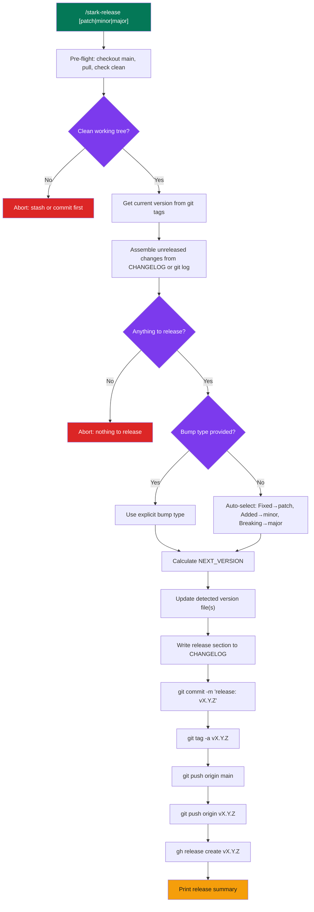

# stark-release — Internals

Cut a new release — reviews unreleased `CHANGELOG.md` entries, auto-generates them from git log when needed, bumps version (patch/minor/major), creates git tag, and optionally creates a GitHub Release with notes. Use when the user says "release", "cut a version", "tag a release", "bump version", or invokes /stark-release.

## Architecture

![Flowchart showing the stark-release skill's 10-step internal pipeline. It starts with pre-flight checks and git-tag resolution, then assembles release notes from CHANGELOG or commit history, chooses the bump type, updates detected version files, rewrites CHANGELOG, commits, tags, pushes, and creates the GitHub Release before printing a summary. The abort path only triggers when there is no CHANGELOG file, the branch is dirty, or there are no releaseable changes after checking both CHANGELOG and git history.](internals.png)

## Phases

The release pipeline has 10 sequential steps. **Pre-flight** (Steps 1-2) ensures a clean main branch and resolves the current version from git tags, while also tracking whether a real last tag exists. **Analysis** (Steps 3-4) first reads `CHANGELOG.md` and uses `[Unreleased]` entries when present; if that section is empty, it falls back to commit history since the last tag, including commit bodies so `BREAKING CHANGE:` markers can still trigger a major bump. **Mutation** (Steps 5-6) updates every detected version file that matches the repository ecosystem rules, writes the new release section into `CHANGELOG.md`, and commits the result in a single release commit. **Publish** (Steps 7-9) creates an annotated git tag pointing at the release commit, pushes both branch and tag to origin, and creates a GitHub Release with the release notes via gh CLI. **Summary** (Step 10) outputs version info, change counts, release URL, and commit hash.

## Config

The skill has minimal explicit configuration — most behavior is convention-driven. **Version source**: git tags in vX.Y.Z format, with a 0.1.0 baseline only when no tags exist yet. **Version files**: auto-detected across supported ecosystems (`__init__.py`, `pyproject.toml`, `package.json`, `Cargo.toml`), with Go using tags only. **CHANGELOG format**: `CHANGELOG.md` must exist and keep an `## [Unreleased]` section, but that section may be empty because the skill can synthesize release notes from git history. **Auth**: uses the user's native gh PAT (`GH_TOKEN` unset). **Bump argument**: optional `[patch|minor|major]` via `$ARGUMENTS`, otherwise auto-selected. **Observability**: follows `~/.claude/code-review/standards/observability.md` with skill-specific metrics for version diff, bump type, entry counts, and publish outcomes. **GitHub Release**: always created. **Repo detection**: via `gh repo view --json nameWithOwner`.

## Failure Modes

Seven failure modes with defined recovery: (1) **Not on main** — detected by branch check, recovery is checkout main. (2) **Dirty working tree** — detected by `git status --porcelain`, recovery is stash or commit. (3) **No CHANGELOG.md** — file not found, hard abort. (4) **No release notes and no commits** — `[Unreleased]` is empty and there are no commits to synthesize since the last tag, so the release aborts cleanly. (5) **Tag collision** — `git tag -a` fails because the version already exists, suggests next available version. (6) **Push rejected** — remote has diverged, recovery is `git pull --rebase` then retry. (7) **gh auth failure** — `gh release create` errors, recovery is verify `gh auth status` and ensure PAT is active. The first four are pre-commit aborts, while the last three occur after local changes are made and require careful recovery to avoid orphaned tags or partial releases.

## How to Modify This Skill

**Change version-file detection**: Edit Step 5's ecosystem scan order or regexes if the repo uses a different version source. **Add dynamic versioning**: Integrate `setuptools-scm` or an equivalent tag-driven tool to eliminate most direct version-file edits. **Add new CHANGELOG categories**: Update Step 4 to map new categories such as Deprecated, Removed, or Security into semver bump rules. **Add post-release hooks**: Extend after Step 9 to trigger CI/CD pipelines, Slack notifications, or follow-up issue creation. **Support monorepos**: Fork the skill to handle per-package CHANGELOGs, scoped tags (`pkg/vX.Y.Z`), and multiple independent version files. **Make GitHub Release optional**: Add a `--no-release` flag gate before Step 9. **Change auth model**: Remove the `GH_TOKEN` guard if bot-authored releases are acceptable. **Customize commit message format**: Edit the release commit template in Step 6.
