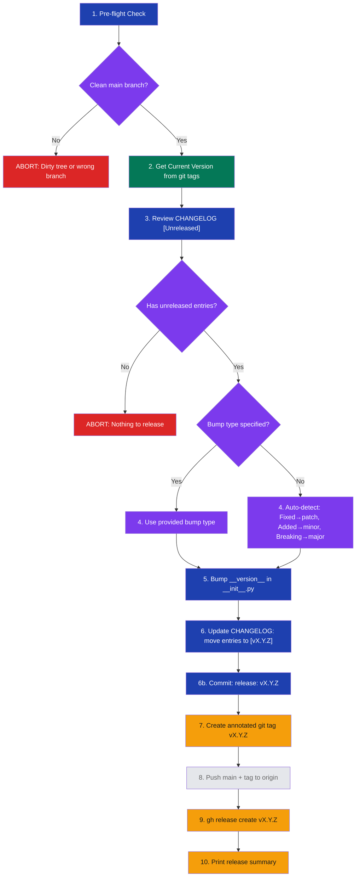

# stark-release

Cut a new release — reviews unreleased CHANGELOG entries, bumps version (patch/minor/major), creates git tag, and optionally creates a GitHub Release with notes. Use when the user says "release", "cut a version", "tag a release", "bump version", or invokes /stark-release.

## Workflow Overview

![Usage guide for the stark-release skill showing a 10-step vertical workflow diagram. Steps flow from pre-flight checks (verify clean main branch) through version detection from git tags, CHANGELOG review, bump type selection (auto-detect or explicit patch/minor/major), runtime version update, CHANGELOG commit, annotated tag creation, push to remote, GitHub Release creation, and a final release summary. Side annotations show inputs, failure conditions (dirty tree, empty changelog, existing tag), and key rules. Below the flow are cards for common patterns (quick patch, feature release, major bump), output artifacts (git tag, release commit, GitHub Release), a failure recovery table, and important rules about not bumping pyproject.toml, committing before tagging, and using user identity not bot tokens.](usage.png)

## When to Use

Cut a new release — reviews unreleased CHANGELOG entries, bumps version (patch/minor/major), creates git tag, and optionally creates a GitHub Release with notes. Use when the user says "release", "cut a version", "tag a release", "bump version", or invokes /stark-release.

## Prerequisites

Must be on a clean `main` branch with no uncommitted changes. `gh` CLI must be authenticated with the user's PAT (not a bot token). A `CHANGELOG.md` file must exist with an `[Unreleased]` section containing entries. Git tags must follow semver format `vX.Y.Z`.

## Arguments

`[patch|minor|major] (optional — will ask if not provided)`

| Argument | Required | Description |
|----------|----------|-------------|
| `patch` | No | Bug fixes, small corrections (0.1.2 → 0.1.3) |
| `minor` | No | New features, session deliverables (0.1.3 → 0.2.0) |
| `major` | No | Breaking changes, major milestones (0.2.0 → 1.0.0) |
| *(omitted)* | — | Auto-detects from CHANGELOG categories |

## Quick Start

`/stark-release` — auto-detects bump type from CHANGELOG entries and cuts the release.

## Common Patterns

**Patch release after bug fix:**
`/stark-release patch`
Bumps patch version (e.g., 0.2.1 → 0.2.2), tags, and creates GitHub Release.

**Feature release with auto-detection:**
`/stark-release`
Reads CHANGELOG — if it has `### Added` entries, bumps minor automatically.

**Explicit major bump:**
`/stark-release major`
For breaking changes or major milestones (e.g., 0.3.0 → 1.0.0).

## Troubleshooting

**"Not on main" error:** Run `git checkout main && git pull --rebase origin main` first.

**"Empty [Unreleased]" abort:** Add changelog entries under `## [Unreleased]` before releasing.

**"Tag already exists" error:** The version was already released — the skill will suggest the next available version.

**Push fails:** Run `git pull --rebase origin main` and retry. The tag and commit exist locally.

**GitHub Release not created:** Verify `gh auth status`. Ensure `GH_TOKEN` is unset so `gh` uses your native PAT.

## Related Skills

`/stark-pr-flow`, `/stark-session`, `/stark-phase-execute`
