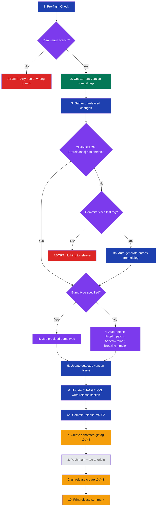

# stark-release

Cut a new release — reviews unreleased `CHANGELOG.md` entries, auto-generates them from git log when needed, bumps version (patch/minor/major), creates git tag, and optionally creates a GitHub Release with notes. Use when the user says "release", "cut a version", "tag a release", "bump version", or invokes /stark-release.

## Workflow Overview

## When to Use

Cut a new release — reviews unreleased `CHANGELOG.md` entries, auto-generates them from git log when needed, bumps version (patch/minor/major), creates git tag, and optionally creates a GitHub Release with notes. Use when the user says "release", "cut a version", "tag a release", "bump version", or invokes /stark-release.

## Prerequisites

Must be on a clean `main` branch with no uncommitted changes. `gh` CLI must be authenticated with the user's PAT (not a bot token). A `CHANGELOG.md` file must exist with an `[Unreleased]` section. Git tags must follow semver format `vX.Y.Z`, but the skill can fall back to full history when no tag exists yet.

## Arguments

`[patch|minor|major] (optional — auto-detected if omitted)`

| Argument | Required | Description |
|----------|----------|-------------|
| `patch` | No | Bug fixes, small corrections (0.1.2 → 0.1.3) |
| `minor` | No | New features, session deliverables (0.1.3 → 0.2.0) |
| `major` | No | Breaking changes, major milestones (0.2.0 → 1.0.0) |
| *(omitted)* | — | Auto-detects from assembled CHANGELOG or git-log categories |

## Quick Start

`/stark-release` — assembles release notes from CHANGELOG entries or git log, auto-detects the bump type, and cuts the release.

## Common Patterns

**Patch release after bug fix:**
`/stark-release patch`
Bumps patch version (e.g., 0.2.1 → 0.2.2), tags, and creates GitHub Release.

**Feature release with auto-detection:**
`/stark-release`
Reads `CHANGELOG.md` first; if `[Unreleased]` is empty, it backfills notes from git log before choosing the bump.

**Explicit major bump:**
`/stark-release major`
For breaking changes or major milestones (e.g., 0.3.0 → 1.0.0).

## Troubleshooting

**"Not on main" error:** Run `git checkout main && git pull --rebase origin main` first.

**"Empty [Unreleased]" case:** If there are commits since the last tag, the skill auto-generates release notes from git log. If there are no changelog entries and no commits, it aborts with nothing to release.

**"Tag already exists" error:** The version was already released — the skill will suggest the next available version.

**Push fails:** Run `git pull --rebase origin main` and retry. The tag and commit exist locally.

**GitHub Release not created:** Verify `gh auth status`. Ensure `GH_TOKEN` is unset so `gh` uses your native PAT.

## Related Skills

`/stark-pr-flow`, `/stark-session`, `/stark-phase-execute`
