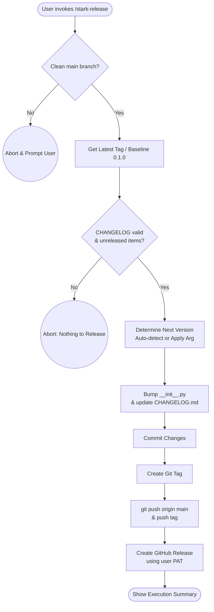
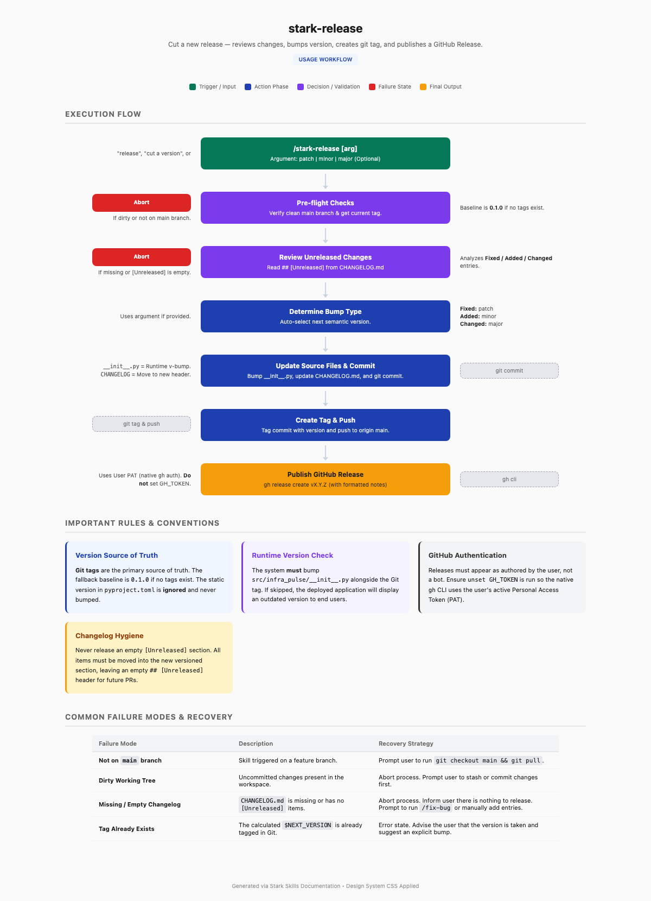

# stark-release

Cut a new release — reviews unreleased CHANGELOG entries, bumps version (patch/minor/major), creates git tag, and optionally creates a GitHub Release with notes. Use when the user says "release", "cut a version", "tag a release", "bump version", or invokes /stark-release.

## Workflow Overview

## When to Use

Cut a new release — reviews unreleased CHANGELOG entries, bumps version (patch/minor/major), creates git tag, and optionally creates a GitHub Release with notes. Use when the user says "release", "cut a version", "tag a release", "bump version", or invokes /stark-release.

## Prerequisites

*See SKILL.md*

## Arguments

`[patch|minor|major] (optional — will ask if not provided)`

## Quick Start

/stark-release

## Common Patterns

## Troubleshooting

## Related Skills

