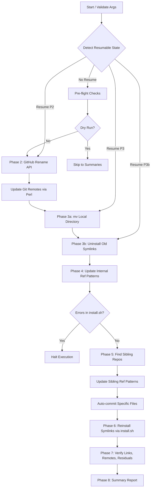
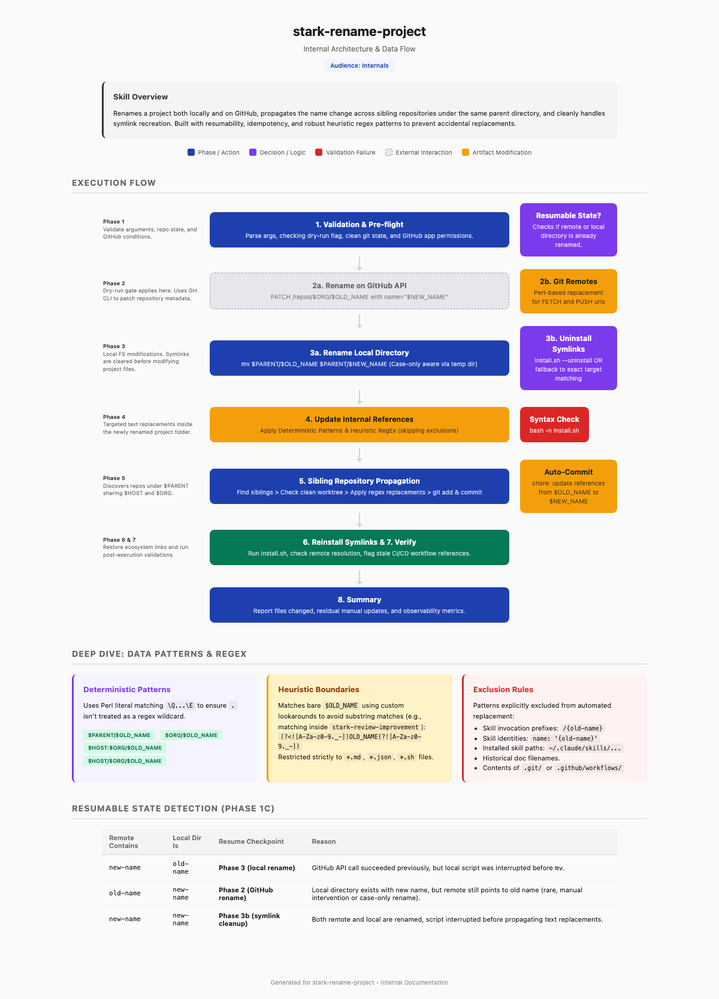

# stark-rename-project — Internals

Rename a project locally and on GitHub, update all references in sibling repos, and reinstall symlinks. Use when the user says "rename project", "rename repo", "rename this to", or invokes /stark-rename-project.

## Architecture

## Phases

*See SKILL.md*

## Config

*No config*

## Failure Modes

*See SKILL.md*

## How to Modify This Skill

Edit `skill/stark-rename-project/SKILL.md`, then run `/stark-generate-docs --skill stark-rename-project` to regenerate documentation.
