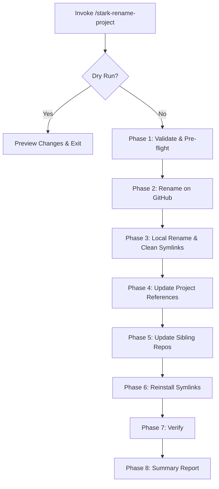
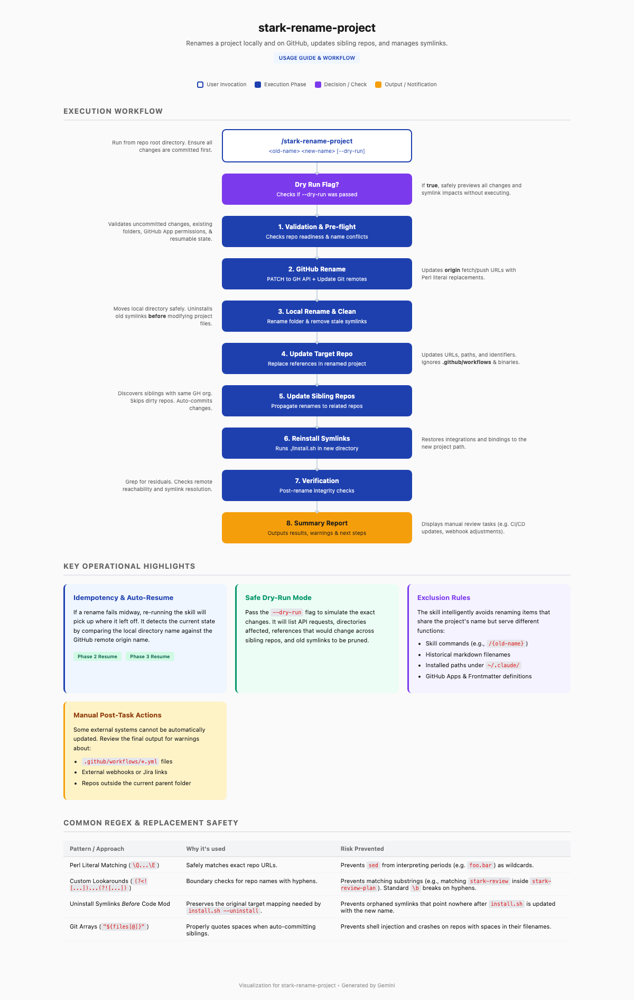

# stark-rename-project

Rename a project locally and on GitHub, update all references in sibling repos, and reinstall symlinks. Use when the user says "rename project", "rename repo", "rename this to", or invokes /stark-rename-project.

## Workflow Overview

## When to Use

Rename a project locally and on GitHub, update all references in sibling repos, and reinstall symlinks. Use when the user says "rename project", "rename repo", "rename this to", or invokes /stark-rename-project.

## Prerequisites

*See SKILL.md*

## Arguments

`<old-name> <new-name> [--dry-run]`

## Quick Start

/stark-rename-project

## Common Patterns

## Troubleshooting

## Related Skills

