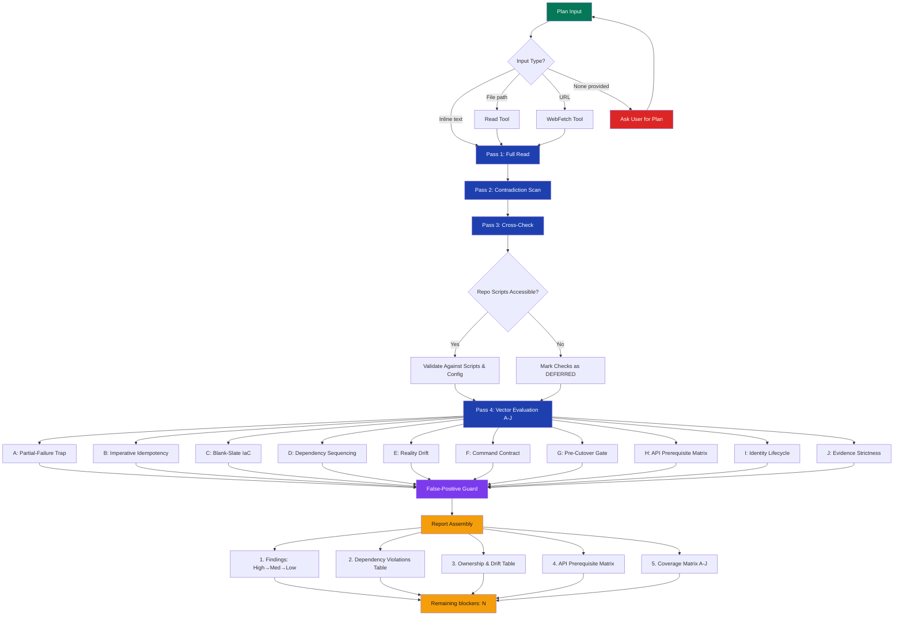

# stark-review-deployment-plan — Internals

Adversarial infrastructure and deployment plan review from a Principal Cloud Architect + SRE perspective. Finds material flaws prioritized by blast radius across 10 failure vectors (partial-failure traps, idempotency, IaC completeness, dependency sequencing, drift, command validation, cutover gates, API prerequisites, identity lifecycle, evidence strictness). Use when the user says "review deployment plan", "review infra plan", "review migration plan", "audit deployment", "review infrastructure", "check my deployment", "review this plan", or any variation involving reviewing/auditing cloud infrastructure, migration, or deployment documents. Also triggers on `/stark-review-deployment-plan`. Proactively use this skill whenever the user shares an infrastructure or migration plan and wants feedback, even casually like "does this plan look right" or "poke holes in this".

## Architecture

![Internals architecture diagram for the stark-review-deployment-plan skill showing a 4-pass review pipeline (Full Read, Contradiction Scan, Cross-Check, Vector Evaluation) flowing from plan input through a context budget gate and false-positive guard to structured report assembly. Below the pipeline, a grid displays all 10 required failure vectors (A through J): Partial-Failure Trap, Imperative Idempotency, Blank-Slate IaC, Dependency Sequencing, Reality Drift, Command Contract, Pre-Cutover Gate, API Prerequisite Matrix, Identity Lifecycle, and Evidence Strictness. Additional sections detail the severity and confidence rubrics, 5 required output sections, hard constraints and quality guards, extension points table, and observability metrics.](internals.png)

## Phases

The skill operates as a 4-pass pipeline. **Pass 1 (Full Read)** ingests the entire plan document to build a mental model of phases, resources, commands, and dependencies. **Pass 2 (Contradiction Scan)** performs an adversarial second read looking for contradictions between sections, hidden assumptions (e.g., 'this assumes VPC already exists'), and missing gates between phases. **Pass 3 (Cross-Check)** attempts to validate the plan against actual repo scripts and runtime config; if these are inaccessible, affected checks are marked DEFERRED with explicit reasons. **Pass 4 (Vector Evaluation)** systematically evaluates all 10 failure vectors (A through J), each producing a PASS/FAIL/DEFERRED verdict with evidence. After all vectors are evaluated, a false-positive guard filters out stylistic or theoretical findings. The final report assembles 5 structured sections: findings sorted by severity, dependency violations table, ownership & drift table, API prerequisite matrix, and coverage matrix. The closing line states the count of High-severity findings as remaining blockers.

## Config

This skill has no external config file. All behavior is controlled by the skill prompt itself. Key configurable aspects within the prompt: **Failure vectors** (currently A–J, 10 total) — add new vectors by appending to the Required Failure Vectors section. **Severity rubric** (High/Medium/Low) — criteria defined inline. **Confidence rubric** (High/Medium/Low) — criteria defined inline. **Output format** — 5 required sections with fixed column schemas. **Observability** — follows the shared Skill Observability Protocol at ~/.claude/code-review/standards/observability.md, with additional per-pass duration tracking. The skill accepts one argument: a plan document as inline text, file path, or URL.

## Failure Modes

**No plan provided:** The skill halts and asks the user for a plan document — it will not proceed without input. **Context limit hit during vector evaluation:** The skill prioritizes completing all High findings and all required tables before Medium/Low findings, as specified in the context budget gate. **Inaccessible repo scripts:** Pass 3 (Cross-Check) marks all script-dependent checks as DEFERRED rather than guessing. **Uncertain CLI/API semantics:** Findings are marked UNCERTAIN with risk explanation rather than fabricating behavior. **False-positive inflation:** The false-positive guard requires every High finding to include a concrete production failure sequence — abstract or stylistic concerns are filtered out. **Incomplete vector coverage:** The prompt requires all 10 vectors to be evaluated; if any is skipped, it should appear as DEFERRED in the coverage matrix, never omitted silently.

## How to Modify This Skill

**Adding a new failure vector:** Add the vector (e.g., K) to the 'Required Failure Vectors' section with an ID, name, and evaluation criteria. Update the coverage matrix template to include the new vector. Update the vector count references ('all 10' → 'all 11'). **Changing severity criteria:** Edit the Severity Rubric table. Consider updating the false-positive guard if adding a new severity level. **Adding new output sections:** Add a new section (e.g., section 6) to the Output Format with column definitions. Update '5 required sections' references. **Modifying pass behavior:** Each pass is described in the Review Process section — edit the description and evaluation rules for the target pass. **Adjusting the false-positive guard:** Edit the False-Positive Guard section to tighten or loosen the quality bar. Currently requires concrete production failure sequences for High findings. **Adding input sources:** Extend the Arguments section to support new input types (e.g., Jira tickets, Confluence pages) alongside the existing inline/file/URL options.
