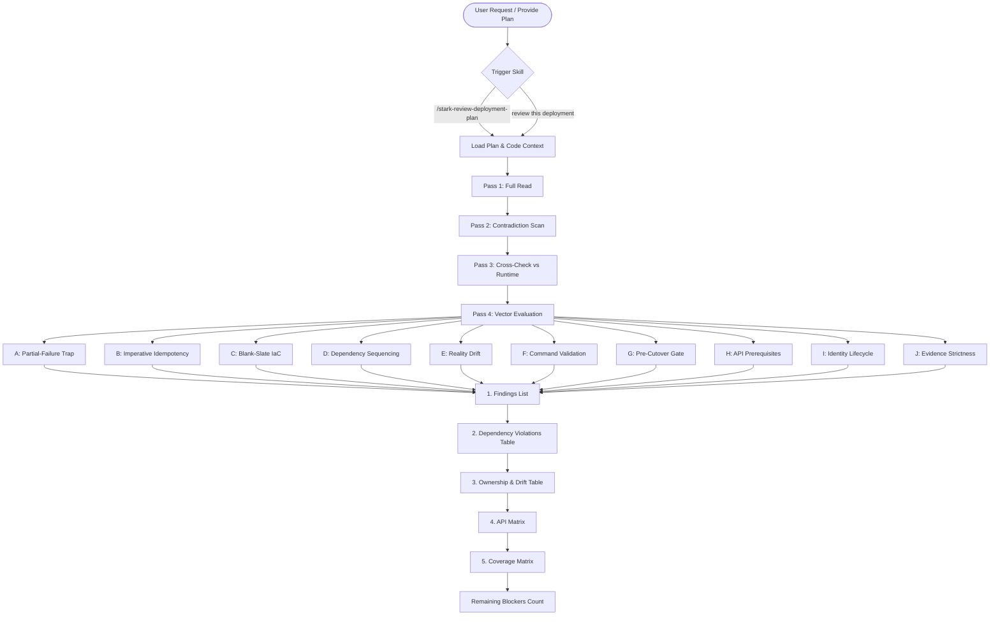
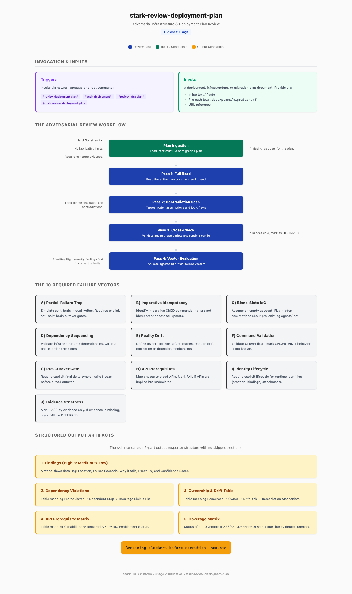

# stark-review-deployment-plan

Adversarial infrastructure and deployment plan review from a Principal Cloud Architect + SRE perspective. Finds material flaws prioritized by blast radius across 10 failure vectors (partial-failure traps, idempotency, IaC completeness, dependency sequencing, drift, command validation, cutover gates, API prerequisites, identity lifecycle, evidence strictness). Use when the user says "review deployment plan", "review infra plan", "review migration plan", "audit deployment", "review infrastructure", "check my deployment", "review this plan", or any variation involving reviewing/auditing cloud infrastructure, migration, or deployment documents. Also triggers on `/stark-review-deployment-plan`. Proactively use this skill whenever the user shares an infrastructure or migration plan and wants feedback, even casually like "does this plan look right" or "poke holes in this".

## Workflow Overview

## When to Use

Adversarial infrastructure and deployment plan review from a Principal Cloud Architect + SRE perspective. Finds material flaws prioritized by blast radius across 10 failure vectors (partial-failure traps, idempotency, IaC completeness, dependency sequencing, drift, command validation, cutover gates, API prerequisites, identity lifecycle, evidence strictness). Use when the user says "review deployment plan", "review infra plan", "review migration plan", "audit deployment", "review infrastructure", "check my deployment", "review this plan", or any variation involving reviewing/auditing cloud infrastructure, migration, or deployment documents. Also triggers on `/stark-review-deployment-plan`. Proactively use this skill whenever the user shares an infrastructure or migration plan and wants feedback, even casually like "does this plan look right" or "poke holes in this".

## Prerequisites

*See SKILL.md*

## Arguments

`<path or inline plan>`

## Quick Start

/stark-review-deployment-plan

## Common Patterns

## Troubleshooting

## Related Skills

