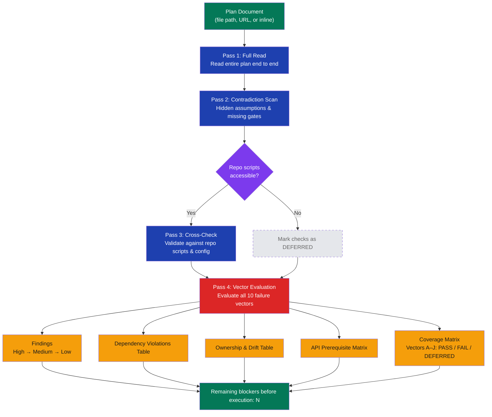

# stark-review-deployment-plan

Adversarial infrastructure and deployment plan review from a Principal Cloud Architect + SRE perspective. Finds material flaws prioritized by blast radius across 10 failure vectors (partial-failure traps, idempotency, IaC completeness, dependency sequencing, drift, command validation, cutover gates, API prerequisites, identity lifecycle, evidence strictness). Use when the user says "review deployment plan", "review infra plan", "review migration plan", "audit deployment", "review infrastructure", "check my deployment", "review this plan", or any variation involving reviewing/auditing cloud infrastructure, migration, or deployment documents. Also triggers on `/stark-review-deployment-plan`. Proactively use this skill whenever the user shares an infrastructure or migration plan and wants feedback, even casually like "does this plan look right" or "poke holes in this".

## Workflow Overview

![Usage guide for the stark-review-deployment-plan skill showing a vertical flow diagram with four review passes (Full Read, Contradiction Scan, Cross-Check with decision diamond for repo accessibility, and Vector Evaluation across 10 failure vectors), followed by a structured output of findings, dependency violations, ownership and drift, API prerequisite matrix, and coverage matrix. Includes cards for invocation methods (slash command, inline plan, natural language), a grid of 10 labeled failure vectors (A through J), output structure table, severity and confidence rubrics in colored summary cards, and common workflow patterns.](usage.png)

## When to Use

Adversarial infrastructure and deployment plan review from a Principal Cloud Architect + SRE perspective. Finds material flaws prioritized by blast radius across 10 failure vectors (partial-failure traps, idempotency, IaC completeness, dependency sequencing, drift, command validation, cutover gates, API prerequisites, identity lifecycle, evidence strictness). Use when the user says "review deployment plan", "review infra plan", "review migration plan", "audit deployment", "review infrastructure", "check my deployment", "review this plan", or any variation involving reviewing/auditing cloud infrastructure, migration, or deployment documents. Also triggers on `/stark-review-deployment-plan`. Proactively use this skill whenever the user shares an infrastructure or migration plan and wants feedback, even casually like "does this plan look right" or "poke holes in this".

## Prerequisites

No special installation required. The skill is available globally via `/stark-review-deployment-plan`. For cross-checking against repo scripts (Pass 3), be in a directory with the relevant repo checked out.

## Arguments

`<path or inline plan>`

| Argument | Required | Description |
|----------|----------|-------------|
| `<path>` | Yes* | File path to the deployment/migration/infrastructure plan |
| `<URL>` | Yes* | URL to fetch the plan from |
| `<inline>` | Yes* | Paste the plan content directly |

\* One of path, URL, or inline text is required. If omitted, the skill prompts for input.

## Quick Start

/stark-review-deployment-plan docs/migration-plan.md

## Common Patterns

**Pre-execution gate:** Run the review before any cutover. The closing line reports the exact blocker count — zero means safe to proceed.

**Iterative refinement:** Fix High findings, re-run on the updated plan. Repeat until `Remaining blockers: 0`.

**Combined review:** Use `/stark-review-plan` for design-level feedback first, then `/stark-review-deployment-plan` for infrastructure-specific adversarial analysis.

## Troubleshooting

**All vectors DEFERRED:** The skill couldn't access repo scripts for cross-checking. Run from within the relevant repo directory, or provide file paths explicitly.

**No findings reported:** The plan passed all 10 vectors with evidence. This is a valid outcome — not an error.

**UNCERTAIN markers in findings:** The skill wasn't confident about specific CLI/API behavior. Verify those commands manually before proceeding.

## Related Skills

`/stark-review-plan`, `/stark-review`, `/stark-pr-flow`, `/stark-extract-docs`
