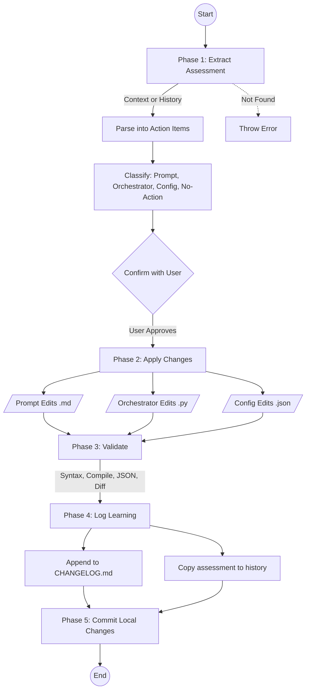

# stark-review-improvement — Internals

Improve stark-skills prompts based on the Prompt Improvement Assessment from a completed /stark-review run. Reads the assessment from conversation context (or history files), edits the relevant prompt files in ~/git/Evinced/stark-skills/, patches multi_review.py if needed, and logs the learning. Use when the user says "improve review prompts", "start review improvement", "fix review prompts", or invokes /stark-review-improvement.

## Architecture

## Phases

*See SKILL.md*

## Config

*No config*

## Failure Modes

*See SKILL.md*

## How to Modify This Skill

Edit `skill/stark-review-improvement/SKILL.md`, then run `/stark-generate-docs --skill stark-review-improvement` to regenerate documentation.
