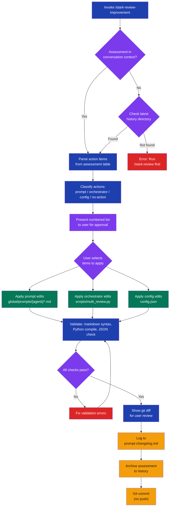

# stark-review-improvement

Improve stark-skills prompts based on the Prompt Improvement Assessment from a completed /stark-review run. Reads the assessment from conversation context (or history files), edits the relevant prompt files in ~/git/Evinced/stark-skills/, patches multi_review.py if needed, and logs the learning. Use when the user says "improve review prompts", "start review improvement", "fix review prompts", or invokes /stark-review-improvement.

## Workflow Overview

![Usage guide for the stark-review-improvement skill showing a five-phase vertical workflow: Extract Assessment from conversation context or history files, classify action items into prompt/orchestrator/config categories with user confirmation, apply targeted edits across three parallel tracks (prompt files, multi_review.py, config.json), validate all changes with syntax checks, then log to prompt-changelog.md and git commit. Includes invocation methods table, three common workflow steps (run review, improve prompts, verify and ship), output summary cards for modified prompts, changelog, and git commit, and safety constraints emphasizing minimal edits, backward compatibility, and user review before commit.](usage.png)

## When to Use

Improve stark-skills prompts based on the Prompt Improvement Assessment from a completed /stark-review run. Reads the assessment from conversation context (or history files), edits the relevant prompt files in ~/git/Evinced/stark-skills/, patches multi_review.py if needed, and logs the learning. Use when the user says "improve review prompts", "start review improvement", "fix review prompts", or invokes /stark-review-improvement.

## Prerequisites

A completed `/stark-review` run that produced a Prompt Improvement Assessment. The stark-skills repo must be cloned at `~/git/Evinced/stark-skills/`. No additional installation needed beyond the standard stark-skills setup.

## Arguments

`(reads assessment from context or latest history)`

| Argument | Required | Description |
|----------|----------|-------------|
| *(none)* | — | Reads assessment automatically from conversation context or latest history file |

## Quick Start

Run `/stark-review 42` on a PR, then in the same session run `/stark-review-improvement`. The skill reads the assessment from context, proposes changes, and lets you approve before committing.

## Common Patterns

**After a review session:** Run `/stark-review` then `/stark-review-improvement` in the same conversation to immediately act on assessment findings.

**From history:** In a new session, run `/stark-review-improvement` — it automatically finds the most recent assessment from `~/.claude/code-review/history/`.

**Selective application:** When presented with action items, choose specific ones (e.g., "apply 1, 3, 5") to skip changes you disagree with or want to handle manually.

## Troubleshooting

**"No prompt improvement assessment found"** — You need to run `/stark-review` first. The improvement skill requires an assessment to work from.

**Validation failures after edits** — The skill runs syntax checks automatically. If a check fails, it will fix the issue and re-validate before showing you the diff.

**Changes seem too broad** — The skill is constrained to minimal, targeted edits. If a proposed change looks like a rewrite, reject it during the confirmation step and ask for a narrower fix.

## Related Skills

`/stark-review`, `/stark-pr-flow`, `/stark-metrics`, `/stark-generate-docs`
