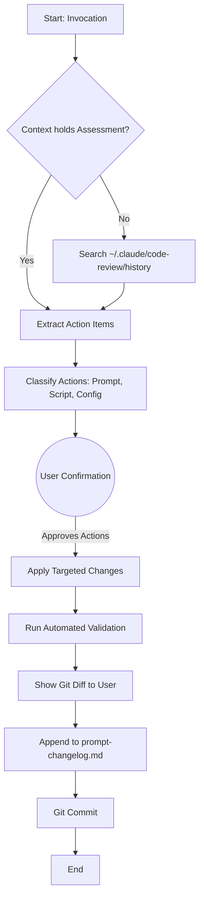
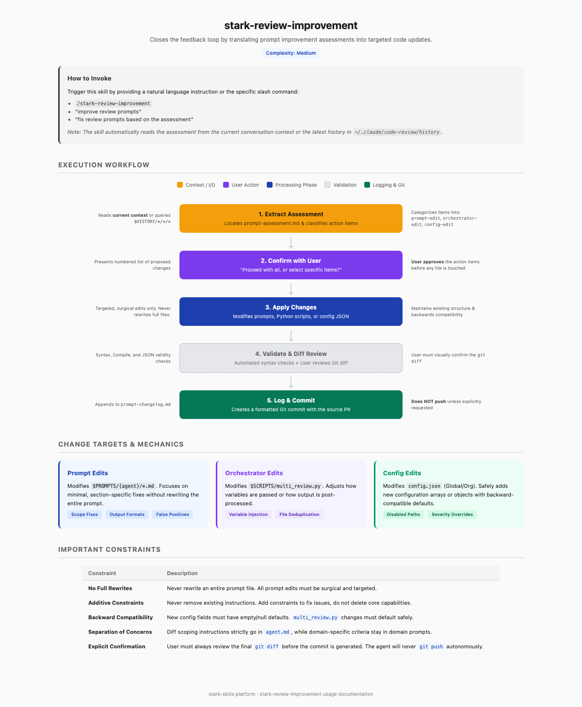

# stark-review-improvement

Improve stark-skills prompts based on the Prompt Improvement Assessment from a completed /stark-review run. Reads the assessment from conversation context (or history files), edits the relevant prompt files in ~/git/Evinced/stark-skills/, patches multi_review.py if needed, and logs the learning. Use when the user says "improve review prompts", "start review improvement", "fix review prompts", or invokes /stark-review-improvement.

## Workflow Overview

## When to Use

Improve stark-skills prompts based on the Prompt Improvement Assessment from a completed /stark-review run. Reads the assessment from conversation context (or history files), edits the relevant prompt files in ~/git/Evinced/stark-skills/, patches multi_review.py if needed, and logs the learning. Use when the user says "improve review prompts", "start review improvement", "fix review prompts", or invokes /stark-review-improvement.

## Prerequisites

*See SKILL.md*

## Arguments

`(reads assessment from context or latest history)`

## Quick Start

/stark-review-improvement

## Common Patterns

## Troubleshooting

## Related Skills

