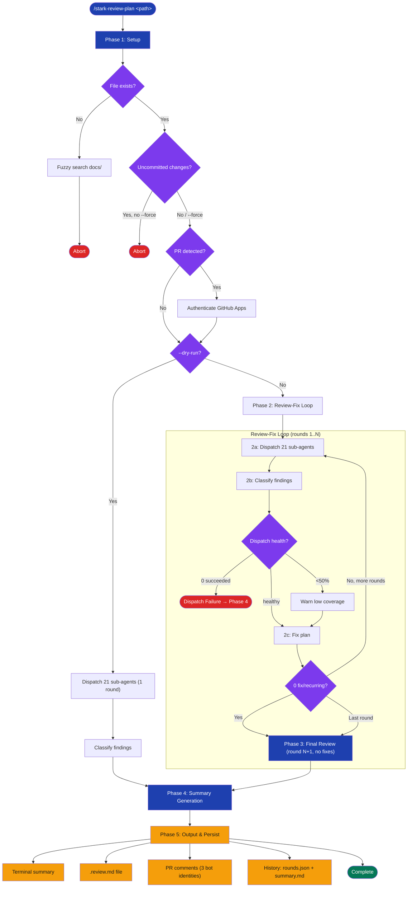

# stark-review-plan — Internals

Multi-agent design document review using 3 LLMs × 7 domains with autonomous fix loop. Use when the user says "review this plan", "review this spec", "review design doc", or invokes /stark-review-plan. Also triggers on `/stark-review-plan <path>`.

## Architecture

![Architecture diagram for stark-review-plan skill showing a 5-phase vertical flow: Setup (validate path, detect PR, authenticate), Review-Fix Loop (dispatch 21 sub-agents across 3 LLMs and 7 domains, classify findings into fix/recurring/noise/false-positive/ignored, fix plan, check early termination), Final Review (one more dispatch round with no fixes), Summary Generation (consolidated markdown with signal-to-noise metrics and prompt improvement assessment), and Output (terminal, .review.md file, PR comments under 3 bot identities, history JSON). Includes dispatch architecture detail showing Claude/Codex/Gemini CLI invocations, finding classification pipeline with 5 categories plus high-confidence cross-reference boost, data flow table mapping artifacts to filesystem locations, failure mode cards for dispatch failure and auth issues, and extension points for adding domains, tuning thresholds, and overriding prompts.](internals.png)

## Phases

Phase 1 (Setup): Validates the plan file path — fuzzy-searches docs/ if not found. Checks for uncommitted changes (aborts unless --force). Detects open PR via `gh pr view` and authenticates GitHub Apps if PR exists. Reads max_rounds from config (default 3). Stores original_content for final diff.

Phase 2 (Review-Fix Loop): Iterates up to max_rounds times. Each round: (2a) calls plan_review_dispatch.py which spawns 21 sub-agents (3 LLMs × 7 domains) in parallel via ThreadPoolExecutor with 300s timeout. (2b) Classifies each finding as fix/recurring/false_positive/noise/ignored by reading the referenced plan section and cross-referencing across agents (2+ agents = high_confidence). (2c) Edits the plan file to address fix and recurring findings. (2d) Checks dispatch health — 0 succeeded triggers dispatch-failure abort with diagnostics; <50% triggers low-coverage warning. Early terminates if no actionable findings remain.

Phase 3 (Final Review): One additional dispatch round (review-only, no fixes) to validate the plan's final state. Skipped entirely if Phase 2 ended in dispatch failure.

Phase 4 (Summary): Generates consolidated markdown with: headline counts (issues vs noise, signal-to-noise ratio), full findings table, fixed/recurring/unresolved/noise sections, misalignment root-cause analysis, diff of all changes, and prompt improvement assessment recommending global vs repo-level prompt tuning.

Phase 5 (Output & Persist): Prints summary to terminal. Writes .review.md adjacent to plan file. Posts per-agent raw findings to PR under each bot's identity (stark-claude, stark-codex, stark-gemini) plus orchestrator summary under stark-claude. Saves rounds.json and summary.md to history directory. Removes in-progress.json.

## Config

plan_review.max_rounds (int, default: 3) — Maximum fix cycles before final review round. Override with --rounds N CLI arg.

plan_review.fix_threshold (string, default: 'medium') — Minimum severity for auto-fix. Values: low, medium, high. Findings below threshold classified as 'ignored'.

plan_review.timeout (int, default: 300) — Per-sub-agent timeout in seconds passed to plan_review_dispatch.py.

plan_review.disabled_domains (array of strings, default: []) — Domain slugs to skip during dispatch. Set at repo level in .code-review/config.json.

Config hierarchy: global (~/.claude/code-review/config.json) → org (.code-review/config.json) → CLI args. Lower levels override higher.

## Failure Modes

Total Dispatch Failure (0/21 succeeded): Runs diagnostics — checks CLI availability (which claude/codex/gemini), runs single-agent probe. Aborts remaining rounds and Phase 3. Generates dispatch-failure summary template with error table and recommendation.

Low Coverage (<50% succeeded): Warns but continues. Results may be incomplete — final summary notes coverage gap.

Auth Failure: If github_app.py token fails when PR exists, warns and skips PR posting. Review still runs locally.

Crash Mid-Round: in-progress.json persisted per round enables manual inspection. Re-run starts fresh.

PR Comment Posting Failure: Per-agent — failure for one bot doesn't block others. Terminal output always available as fallback.

Uncommitted Changes: Aborts unless --force passed. Prevents reviewing stale content.

Empty/Missing Plan: File not found triggers fuzzy search in docs/. No candidates = abort with error.

## How to Modify This Skill

Add a review domain: Create NN-domain.md in global/prompts/plan-review/ for each agent (claude/, codex/, gemini/). The dispatch script auto-discovers domains from filenames. Domain ID derived from filename slug (e.g., 08-performance.md → performance).

Disable a domain per-repo: Add domain slug to disabled_domains array in {repo}/.code-review/config.json.

Change fix threshold: Set plan_review.fix_threshold in config. 'high' = fewer auto-fixes (conservative), 'low' = more auto-fixes (aggressive).

Modify agent CLI flags: Edit scripts/plan_review_dispatch.py — each agent has separate invocation code. Run test_plan_review_dispatch.py::TestCLIFlagsSmoke after changes.

Override prompts per-repo: Place prompt files in {repo}/.code-review/plan-prompts/{agent}/{domain}.md. These override global prompts for that repo.

Change finding classification logic: The classification (fix/recurring/false_positive/noise/ignored) is implemented in the skill's Phase 2b inline logic, not in the dispatch script. Modify the skill definition to change criteria.

Add a new LLM agent: Add CLI invocation in plan_review_dispatch.py, create prompt directory global/prompts/plan-review/{new-agent}/, add GitHub App entry in github_app.py for bot-identity PR posting.
